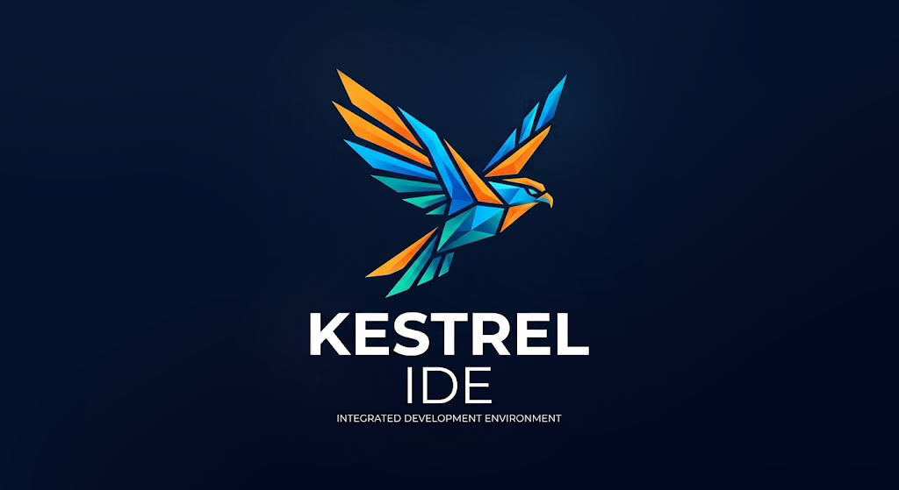
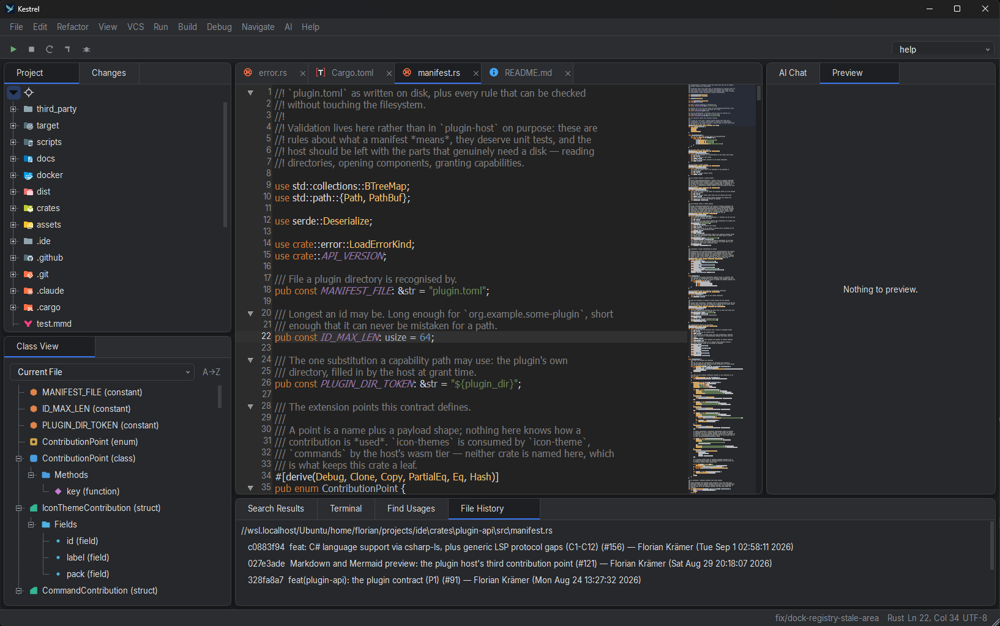

# Kestrel IDE



A fast, open-source, multi-language IDE **experiment** — built as a Rust core with a Qt6 Widgets UI, bridged via [cxx-qt](https://github.com/KDAB/cxx-qt) (QML planned later).

The goal is a JetBrains-like experience without the subscription but with the _performance_ of a native Rust core: low typing latency, large files that stay smooth, and business logic that is fully testable without a display. VS Code is nice but its UX is not everyones cup of tea either.



## What it can do


- Open a project folder, browse the tree, edit and save tabs.
- Tree-sitter syntax highlighting, folding, and a Structure outline — including first-class Carve markup support.
- Project-wide text and symbol index: search, Go to Declaration, Find Usages, Go to Implementation, jump history.
- An LSP client with diagnostics, hover, completion, and refactoring (rename, Extract Method/Class via code actions).
- Live Markdown, Mermaid, and Carve document previews.
- Find and replace, an embedded terminal, ADS-based docking, theming, settings and keymap.
- A built-in MCP server, so an AI agent can read and drive the editor and query the project index.

## How it is built

The workspace is 13 crates in a strict layered architecture: only the UI shell touches Qt, everything else is plain Rust that runs under `cargo test` with no display server.

- New here? Start with the [architecture overview](docs/architecture/overview.md) and the [project structure](docs/architecture/project-structure.md).
- The binding dependency rules live in [docs/architecture/layering.md](docs/architecture/layering.md).
- All architecture, decision, plan, and product docs are indexed in [docs/README.md](docs/README.md).

## Building

Development happens inside Docker containers, driven by the Makefile:

```sh
make linux-image     # build/refresh the builder image
make test            # cargo test --workspace inside it
make lint            # clippy -D warnings + rustfmt --check
```

If you prefer the bare host and have a Qt6 dev toolchain installed:

```sh
cargo build --workspace
cargo test --workspace
```

## License

GPLv3, see [LICENSE](LICENSE).

### Third-party assets

File and folder icons come from the [Material Icon Theme](https://github.com/material-extensions/vscode-material-icon-theme), MIT licensed, copyright (c) 2025 Material Extensions.
The 1251 SVGs and the mapping table converted from them are vendored under [third_party/material-icon-theme/](third_party/material-icon-theme/), with the upstream licence and the pinned version and checksum beside them.
They are not edited by hand: `scripts/import-material-icons.py` downloads the pinned package, verifies its SHA-256 and regenerates the whole directory, so updating to a newer upstream release is a two-line edit and a re-run.
