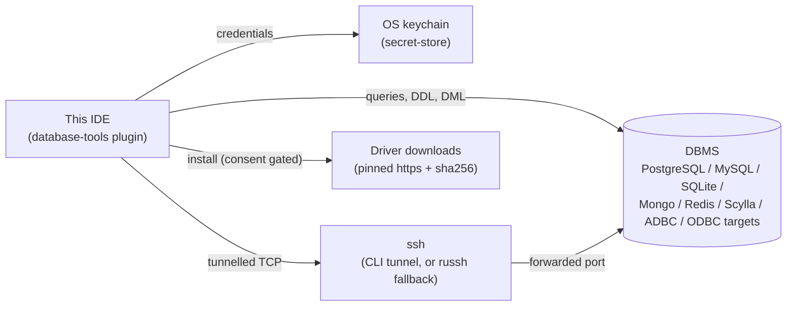
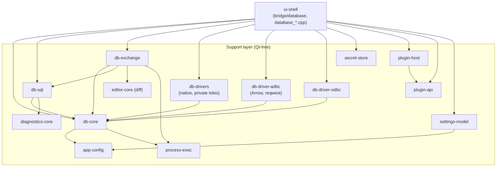
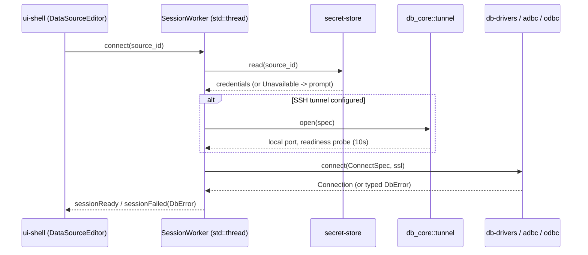
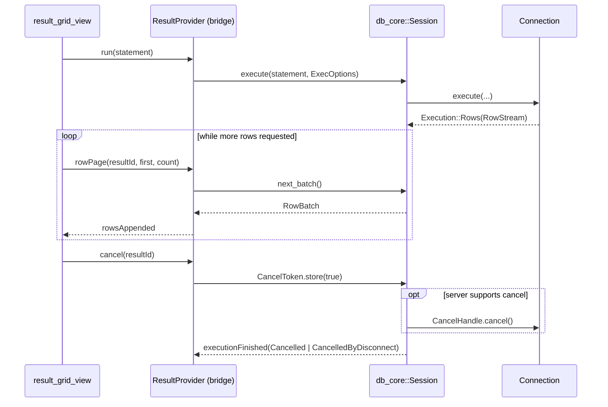
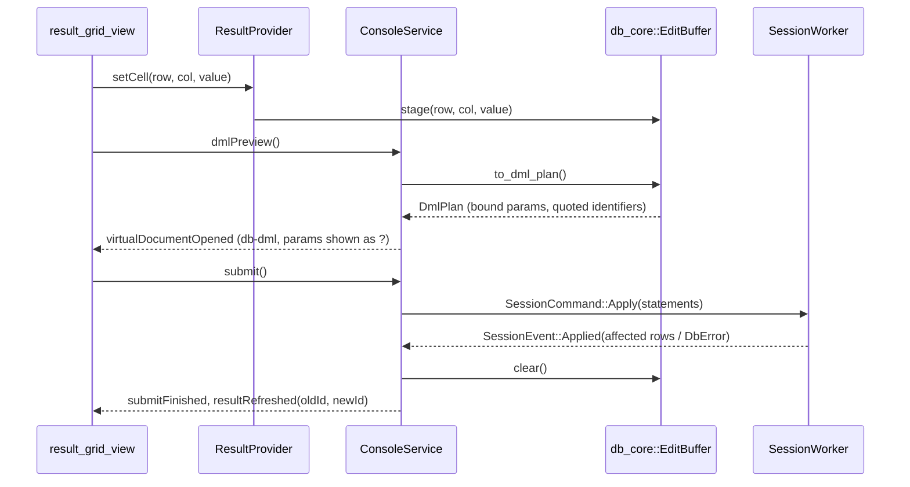
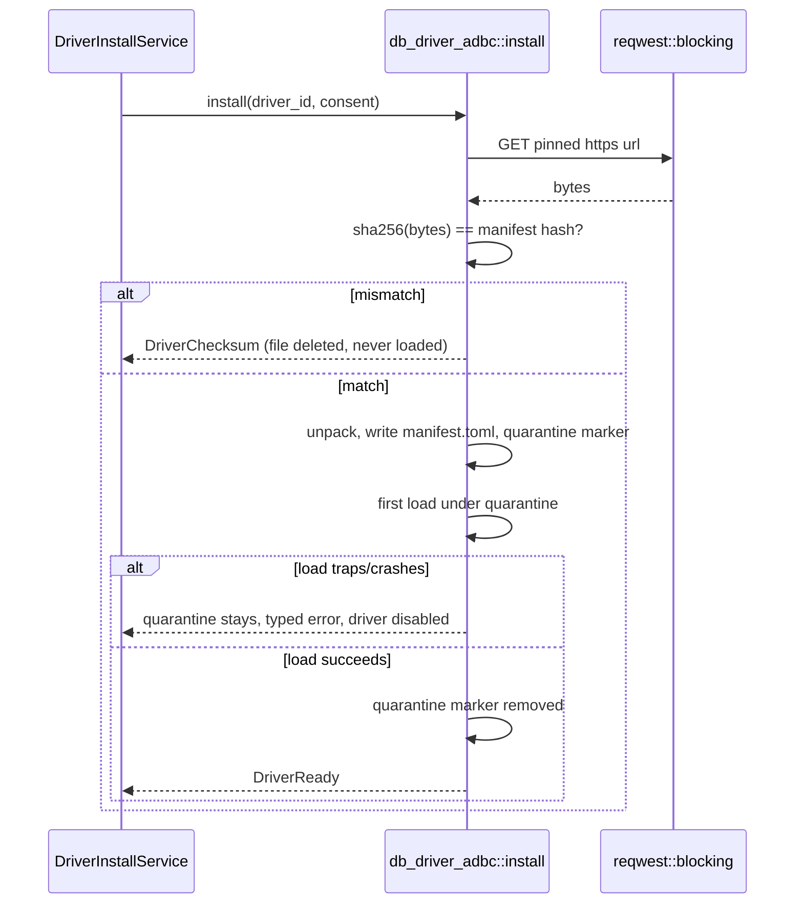

# Database Tools architecture

Target design; kept truthful to the code as each phase lands (CLAUDE.md "fix drift when you see it").
A section describing not-yet-built code carries a one-line note to that effect; F9 does the final truth-up against the shipped code.
See [`database-tools-plan.md`](database-tools-plan.md) for the phased delivery, the parity matrix, the NFR table and the risk register this document does not repeat, and ADR-0058..0061 for the *why* behind the decisions this document states as *what*.

## 1. Context and scope

*Target design; updated by phase F1-F8.*

Database Tools is a built-in plugin, `database-tools`, giving this IDE JetBrains-parity database tooling: data sources, a Database tool window, query consoles, a result grid and data editor, import/export, ER diagrams, schema/data compare, object dialogs, and schema-aware SQL assistance — across relational engines (native drivers, ADBC, ODBC) and NoSQL stores (MongoDB, Redis, Cassandra/Scylla).
Out of scope: a PL/SQL debugger (an Ultimate-only JetBrains feature with no equivalent planned here), a geo viewer and charts in the result grid, grid-level data-compare (text diff only), Kerberos/IAM/proxy authentication, and CQL parsing (Scylla gets keyword+schema completion only, no query parser).

The plugin boundary (C4 level 1):



## 2. Building blocks

*Target design; updated by phase F1-F8.
F1 landed `secret-store`, `db-core`, `db-drivers` (sqlite+postgres), the `plugin-api`/`plugin-host` contribution points, and the `ui-shell::bridge::database` slice this phase needs (`AppSettings` source-list accessors, `DataSourceEditor`, `data_source_dialog.cpp`, `database_settings_page.cpp`) — no dock/console/result-grid yet (F3/F4).
F2 landed `db_core::tree` (flattening/grouping/filters/actions matrix), `db_core::ddl` (DDL synthesis + SQL generator), level/scope-aware introspection in `db-drivers`, `SessionWorker` (one thread per connected source, its own per-scope snapshot cache), `DatabaseService`, and `database_panel.cpp` — the dock itself.
F3.2 landed `db-sql` (split/classify/parse/format/completion/inspections/navigation).
F5/F6 landed `db-exchange` — the Qt-free crate half only: export (csv/tsv/json/sql/html/markdown/xlsx), import (csv/xlsx, preview → mapping → plan → run), `dump` (argv builders for `pg_dump`/`pg_restore`/`psql`, `mysqldump`/`mysql`, `mongodump`/`mongorestore`, `sqlite3 .dump`, credentials never on argv), `copy_table`, `er_diagram` (Mermaid `erDiagram`), `schema_compare` and `data_compare`.
Its own `schema_model` (`TableDef`/`ColumnDef`/`ForeignKey`/`IndexDef`/`ConstraintDef`/`TextObject`) is a second, fully-fetched schema shape the ER diagram/compare pair needs — separate from `db_core::schema::SchemaSnapshot`'s lazily-expanded, names-only dock tree (§6) — until a richer live-`Connection` introspection (F2/F7) can build one from a real driver.
`ConsoleService`, `ResultProvider`, `DriverInstallService`, `ExchangeService`, the exchange/dump/diagram/compare dialogs, the Run-dock hookup for `dump`'s `spawn`, and their own `cpp/` views remain target design (F3b/F4/F5b/F6b/F8b).*

Seven new Qt-free crates, additions to `plugin-api`/`plugin-host`, and a `ui-shell::bridge::database` module tree plus `database_*.cpp` views.
The component diagram mirrors `layering.md`'s rows exactly — the same dependency edges, drawn once here for orientation:



`app-core` gains no dependency: a console's source-of-tab join is a pure path rule in `db_core::console`, and an ER diagram rides `app_core::preview::PreviewService::render` with a synthetic `.mmd` path rather than a new join crate needing to know about databases.

Module trees (see `database-tools-plan.md` §4 for the authoritative, kept-in-sync copy):

```
crates/db-core/src/      value.rs  schema.rs  driver.rs  dialect.rs  dml.rs  result.rs
                         datasource.rs  tunnel.rs  console.rs  history.rs  session.rs  readonly.rs  error.rs
crates/db-sql/src/       lib.rs  split.rs  classify.rs  parse.rs  completion.rs  inspections.rs  format.rs
                         navigation.rs  dialects.rs  scan.rs  refs.rs (F3.2, real) — ddl.rs  mongo.rs (not yet built, later phases)
crates/db-exchange/src/  (F5/F6, real) export/{csv,tsv,json,sql,html,markdown,xlsx}.rs  import/{mod,csv,xlsx}.rs
                         dump.rs  copy_table.rs  schema_model.rs  er_diagram.rs  schema_compare.rs  data_compare.rs
crates/db-drivers/src/   lib.rs  postgres.rs  mysql.rs  sqlite.rs  mongodb.rs  redis.rs  cassandra.rs  introspect/*.sql  testsupport.rs  tunnel.rs
crates/db-driver-adbc/src/  driver.rs  arrow.rs  install.rs  locate.rs
crates/db-driver-odbc/src/  driver.rs  introspect.rs
```

`ui-shell::bridge::database`: `mod.rs` (`DatabaseService`), `sessions.rs` (`SessionWorker`), `console.rs` (`ConsoleService`), `results.rs` (`ResultProvider`), `settings.rs` (`DataSourceEditor`), `drivers.rs` (`DriverInstallService`), `exchange.rs` (`ExchangeService`), `bridge/language/database.rs`.
`cpp/`: `database_panel`, `database_results_panel`, `result_table_model`, `result_grid_view`, `value_editor_dialog`, `database_console_bar`, `data_source_dialog`, `database_settings_page`, `db_object_dialogs`, `db_exchange_dialogs`, `database_wiring`, `database_menu`.

## 3. Driver seam

*Target design; updated by phase F1, F7, F8.*

`db_core::driver` defines the contract every backend implements:

- `Driver { id, capabilities, connect }` — a driver descriptor plus the entry point that produces a `Connection`.
- `Connection { dialect, server_info, introspect, execute, begin/commit/rollback, set_read_only, cancel_handle, ddl_of, apply(DmlPlan), close }` — blocking; every method returns once its work (or its first batch) is ready.
- `Execution { Rows(RowStream) | Affected | Multi | Ok }`, `RowStream::next_batch` — a statement's result shape and how rows are pulled, page by page.
- `CancelHandle` (obtained before `execute`, server-side cancel: PG `cancel_query`, MySQL `KILL QUERY` on a second connection, SQLite `interrupt`, Mongo `killOp`) and `CancelToken` (`Arc<AtomicBool>`, consumer-side, stops pulling regardless of server support).
- `Capabilities` — a bitflag set (transactions, `RETURNING`, server-side cancel, schemas-within-catalog, …) a consumer checks before offering a UI affordance the backend cannot honour, the same "an unsupported capability is absent" rule `dap-core` already applies.
- `ExecOptions { fetch_size: 200, max_rows, timeout, read_only }`.

Three backends implement it (ADR-0058):

| Backend | Crate | Serves |
|---|---|---|
| native | `db-drivers` | PostgreSQL, SQLite (F1); MongoDB, Redis, Cassandra/Scylla (F7, implemented — see below); MySQL/MariaDB still planned (F8) |
| adbc | `db-driver-adbc` (F8.1, implemented) | any driver `adbc_driver_manager::ManagedDriver` can load; the F8.3 spike found a pinnable artifact for DuckDB, Snowflake and BigQuery only (rows moved from the spike's `catalogue.toml` into `builtin/database-tools/plugin.toml`, F8b) — mssql/clickhouse/trino have no pinnable ADBC artifact today and carry an `install-hint` pointing at the `odbc` row instead |
| odbc | `db-driver-odbc` (F8.2, implemented) | anything with a system DSN or ODBC driver entry, e.g. SQL Server, ClickHouse, Trino, SQLite — one generic `odbc` manifest row (F8b), the Data Source dialog's URL field carrying the DSN or connection string |

**Wired (F8b)**: `ui-shell`'s `bridge/database/backend.rs` maps a `database-drivers` row's `backend` field to which of the three crates above actually builds the `Connection` — `backend_for` resolves the row (plain-data, unit-tested), `connect`/`connect_with_backend` (`bridge/database/mod.rs`) dispatch to `db_drivers::DriverRegistry`/`db_driver_adbc::AdbcDriver`/`db_driver_odbc::OdbcDriver`, and both `DataSourceEditor::test_connection` and `DatabaseService::connect_source` go through it — no more native-only lookup.

`db_core::value::Value` is the one row/document shape every backend converts into: `Null, Bool, Int, Float, Decimal(String), Text, Bytes, Date, Time, DateTime, DateTimeTz, Uuid, Json, Array, Document(Vec<(String,Value)>), Other{type_name,display}`.
Per-driver type mapping tables (e.g. PostgreSQL `numeric` → `Decimal(String)`, MongoDB `ObjectId` → `Text` (hex), Redis's typed keys → `Value` variants keyed by `RedisType`, Cassandra `List`/`Set`/`Map` → `Array`/`Document`) live beside each driver's own module and are fixture-tested against real wire samples, not hand-derived.

F7 backends, implemented (`crates/db-drivers/src/{mongodb,redis,cassandra}.rs`, `crates/db-drivers/src/ssh.rs`):

- **MongoDB** (feature `mongodb`, default-on) — async, `mongodb` 3.9.1 (`rustls-tls`+`bson-3`+`compat-3-3-0`, R11 spike resolved this way, see database-tools-plan.md §13). Statement text is either a raw `runCommand` JSON document, or `db.<collection>.<method>(<json>[, <json>])` sugar for `find`/`findOne`/`aggregate`/`insertOne`/`insertMany`/`updateOne`/`updateMany`/`deleteOne`/`deleteMany`/`countDocuments`/`distinct`, parsed by `db_sql::mongo` (pure, no JS engine). `find`/`aggregate` results are one `Value::Document` column per row, plus `flatten_documents` for a table display mode. Multi-document transactions and `killOp`-based server-side cancel are not wired up (`NotSupported`/`CancelToken`-only, both documented in the source).
- **Redis** (feature `redis`, default-on) — synchronous (`redis` 0.27, `tls-rustls`, bypasses the private runtime entirely). One `RedisCommand` per line, tokenized by `db_sql::resp` (quote/escape-aware). DBs 0–15 as `Catalog` nodes; keys `SCAN`-walked (capped, default 10 000) and grouped one level deep by `key_separator` (default `:`) into `KeyNamespace`/`Key(RedisType)`, TTL carried in `NodeDetail::ttl_seconds`. Read-only classification by a command-name table (`db_sql::resp::is_read_only_command`), fail-closed on an unrecognised command.
- **Cassandra/Scylla** (feature `cassandra`, default-on) — async, `scylla` 1.9, built **without** its `rustls-023` feature: scylla's own `Cargo.toml` gives a dependent no way to select rustls's `ring` provider over its default `aws_lc_rs` one (unlike postgres/mongodb/redis/russh, whose manifests each expose that choice), so this driver stays plaintext-only rather than let `aws-lc-rs` into the tree — `SslMode` other than `Disable` returns `NotSupported` with `"TLS for Cassandra/Scylla is not available yet (scylla's rustls feature forces aws-lc-rs)"` (tested). Introspects `system_schema.{keyspaces,tables,views,types,functions,columns}` directly. Statements split by `db_sql::split` (`Dialect::Cassandra`, semicolon-based), classified read/write by leading keyword. `crates/db-drivers/Cargo.toml`'s `[dependencies.scylla]` comment has the full account, verified against the published manifest for 1.7.0/1.8.0/1.9.0.
- **SSH tunnelling** (`db_core::tunnel::{Tunnel, SshAuthMode, SshConfig, select}` + `db_drivers::ssh::RusshTunnel`) — `db_core::tunnel::select` picks `CliTunnel` (shells out to `ssh`, free config/agent/`ProxyJump` support) when `ssh` is on `PATH` and the auth mode is agent/key-file/ssh-config, else `RusshTunnel` (in-process, `russh` 0.63 `ring`+`rsa`) — always for password auth, since `ssh -o BatchMode=yes` cannot prompt for one. Host key verification against `~/.ssh/known_hosts` (`russh::keys::known_hosts::check_known_hosts`) never auto-accepts: unknown → `DbErrorCode::HostKeyUnknown`, changed → `HostKeyMismatch`; trusting a new key is F7b's consent UI, not this layer's job.

## 4. Runtime views

*Target design; updated by phase F1, F2, F3, F4, F7, F8.*

**F2 implementation note**: the Connect diagram below is target design still (no SSH tunnel/TLS wiring in `SessionWorker` yet — F1/F7's own territory); what F2 actually built is the *tree* half of it — `DatabaseService::connect_source` spawns the driver's blocking `connect()` off the Qt thread, and on success builds a `db_core::session::Session` + `SessionWorker` and dispatches an initial `Names`-level `Introspect`.
**Go to DDL** (F2.3, shipped): `DatabasePanel`/context-menu → `DatabaseService::go_to_ddl` → `object_ref_for(row)` (the row's own kind/ancestry) → `SessionWorker::send(DdlOf)` → the worker's `Session::ddl_of` (the engine's own DDL text, e.g. SQLite's `sqlite_master.sql`; `db_core::ddl::synthesize`'s `Node`-detail fallback is wired into `db-core` but not yet called from a backend that has no native DDL text of its own) → `apply_event`'s `Ddl` branch opens it through `AppSession::open_virtual_document("db-ddl", …)` and emits `virtualDocumentOpened`, which `editor_tabs.cpp` wires exactly like `ContainerService`'s.
Deviation: the virtual document's key ends in `.sql` (for the editor's language-by-extension detection), so the opened tab's title is `<object>.sql`, not the literal `"<object> DDL"` a key with no extension would have given it.

**Connect** (secrets → tunnel → TLS → session thread):



**Execute, page, cancel** (two cancellation layers, generation counter):



A `generation` counter on the session guards a race between a cancel and a result that was already in flight: a batch tagged with a stale generation is dropped rather than appended, the same "late answer to a question nobody's asking anymore" guard `search-everywhere`'s own popup already uses for its ranked tiers.

**F3 implementation note**: shipped — `ConsoleService`/`ResultProvider` (`crates/ui-shell/src/bridge/database/console.rs`), one dedicated `SessionWorker` per attached console tab (never the Database dock's tree worker, so a long grid page and a tree expand cannot queue behind each other).
`execute`/`executeFile` split the text with `db_sql::split`, check every statement against a `db_core::readonly::Guard` built from `db_sql::classify::SqlClassifier` (replacing F1's `NaiveClassifier` at this seam), log it to history (text only) if the source's `history` flag is set, then dispatch statements one at a time; `StopOnError`/`Continue`/`Ask` govern what happens after a failing one, `Ask` pausing via `askContinue`/`resume`.
Cancellation is real, not simulated: `SessionWorker::cancel_now` holds the connection's `CancelHandle` (obtained once at spawn, per `db_core::driver`'s own doc comment) outside the command channel entirely, so it can interrupt a blocked `execute` from the Qt thread while the worker thread is still inside it — proven by `db-drivers/src/sqlite.rs`'s new `map_err` case (`SQLITE_INTERRUPT` → `DbErrorCode::Cancelled`, a real pre-existing gap this phase found and fixed, F1 having always mapped every sqlite failure to `Unknown`).
`executionFinished` fires once, on a result's *first* batch/outcome — not once every row is fetched — so a script's next statement is never blocked on however many pages a user later pulls through `ResultProvider::fetchMore`.
`ResultProvider::rowPage` walks `ResultSet::batches()` in row-count order rather than flattening the whole result first, so its own FFI time stays bounded by the batches actually touched, not by how many rows the result has accumulated so far.
**Known gap, found and since fixed**: `db-drivers`' `SqliteConnection`/`PgConnection::execute` both eagerly drained the *entire* `Rows` result into memory before returning (`RowStream::next_batch` only re-chunked an already-fully-materialised buffer) — a pre-existing P0/F1-era gap, out of this phase's file list, that defeated the "first batch ≤ 500 ms, later pages cheap" NFR at real scale.
F3c fixed `SqliteConnection::execute` (a second, dedicated read-only connection driving a live `rusqlite::Statement`/`Rows` cursor); F3d fixed `PgConnection::execute` the same way, over `Client::query_raw`'s own live, wire-backed stream — no second connection needed there, since tokio-postgres pipelines concurrent commands on one `Client` transparently. §11 no longer tracks this as open debt.

**F3.7 implementation note (SQL assistance)**: shipped — `crates/ui-shell/src/bridge/language/database.rs` injects completion, inspections and two intentions into `LanguageService`, before the language-server gate, exactly the way `containers.rs` injects image-name completion (SQL has no language server in this codebase).
A path attaches to a data source through `db_core::console::source_of` (a console file under `consoles_dir`) or `[database] file_sources` (a plain project `.sql` file); `database_completion`/`database_intentions`/`refresh_database_inspections_now` all resolve that once per path and cache it.
`db_sql::completion`/`inspections`/`navigate`/`format`/`split`/`parse` do the real work over a `SchemaSnapshot` fetched at `Columns` level and a `db_core::dialect::Dialect`, both cached per source id; a request before the first snapshot lands triggers one background introspection (deduplicated per source id) and answers with keywords only in the meantime.
Inspections publish under `database:inspections` through the shared `DiagnosticStore`, on save and on a 500ms idle debounce per path (a generation counter per path drops a superseded run rather than coalescing into one re-armed timer, the simpler of the two shapes `mod.rs`'s watched-file debounce and this one both solve); a `db_sql::parse` grammar error joins them as `Warning` rather than `Error` when the dialect maps to `sqlparser`'s `GenericDialect` (SQL Server, Cassandra, Mongo, Redis) — a weaker signal there than for a dialect `sqlparser` actually models.
"Format SQL" carries its own `WorkspaceEdit` over the statement at the caret (via `db_sql::split`) and applies through the ordinary code-action path, the same way D7's build-file "Update to X" quick fix does; "Go to DDL" resolves the identifier under the caret with `db_sql::navigate` and opens its DDL as a `db-ddl` virtual document — the same scheme `DatabaseServiceRust::go_to_ddl` uses, so re-navigating to the same object from the Database dock's tree or from a console file focuses the same tab.
Deviation from the plan text: this module opens its own short-lived connection per source id for both introspection and DDL fetch, rather than reusing `bridge::database::console`'s already-open `SessionWorker` — that state is private to `console.rs`, owned by the phase (F3e) developed in parallel with this one, and this module's owned file list did not include it.
Selection-scoped "Format SQL" (the plan's other stated trigger, alongside "the statement at caret") is not wired: `requestIntentions` carries only a caret position, no selection range, in this codebase's current FFI.

**F3e implementation note**: shipped — the console UX gaps F3 left open. `EditorOps::caretOffset` exposes the primary caret's byte offset (already tracked internally, no unit conversion), so the console bar's Run button now runs `FfiDbExecWhat::Statement` at the caret instead of falling back to the whole buffer; a new "Run script" button/`database.runScript` action (Ctrl+Shift+Return) always runs the whole buffer.
`askContinue` now carries the failing statement's error message, answered by a real `QMessageBox` (`cpp/database_dialogs.cpp`); the console bar's Stop/Continue/Ask combo persists per source through a new `DataSourceSetting::script_policy` field.
The schema picker reads a `Names`-level `Introspect` `attach` now kicks off on its own; `setSchema` runs `Dialect::set_schema_statement`'s `SET search_path`/`USE` (`db_sql::classify` already treats it as session control, not a write, so the read-only guard lets it through) like any other statement.
`ResultProvider::applyClauses` calls `db_sql::clauses::apply` instead of always wrapping: a plain `SELECT` gets its own `WHERE`/`ORDER BY` extended in place, falling back to the derived-table wrapper only for a CTE, a set operation, or a clash with an existing `ORDER BY`/`LIMIT`.
`DatabaseResultsPanel` is now a `QTabWidget` with one page per attached console (its own Output/Result sub-tabs), created lazily on that console's first output/execution and removed on `DocumentManager::tabClosed` — which now also detaches the console instead of leaking its `SessionWorker` thread, a gap F3 left in place.
F3.6's `sql-script` run configuration (`bridge::run::sql_script`) runs off a plain background thread, no `Supervisor`/PTY process, reporting through the same `consoleStarted`/`consoleOutput`/`consoleFinished` signals with its own console-id range.
**Known gap, found not fixed**: `db_core::readonly::Guard::check` refuses every `Write`/`Ddl`/`Unknown` statement unconditionally — it has no notion of whether the *source* is actually read-only, despite this module's own doc comment describing it as a read-only-source check. `bridge::run::sql_script` gates its own guard check on the source's `read_only` flag; `bridge::database::console`'s `attach()` (F3, unchanged this phase) does not, so every console — on a read-only source or not — currently refuses any write/DDL statement. §11 tracks this as new debt.

**Data-editor submit** (EditBuffer → DmlPlan → apply → refresh) — shipped
(F4.2), on `ConsoleService` rather than `ResultProvider` for `dmlPreview`/
`submit`: both need the console's own worker/session (`submit`) or the
shared `AppSession` (`dmlPreview`, to open the virtual document), neither
of which `ResultProvider` holds (this document's own doc comment on why
the two QObjects split as they do); every cell-staging call
(`setCell`/`setNull`/`setDefault`/`revertCell`/`addRow`/`cloneRow`/
`deleteRows`/`revert`) still lives on `ResultProvider`, pure buffer state:



**Driver install** (download → sha256 → quarantine → probe):



**Import/export** (F5.1/F5.2, real): export takes the columns a result already fetched plus a `RowBatch` iterator and writes one of seven formats through `db_core::value::Value::display`.
SQL and XLSX are the two exceptions — SQL renders a bindable literal, never `display` text, since a paste-into-console statement has no parameter slot; XLSX keeps numbers/dates as Excel's own typed cells and falls back to `display` text for everything else, including `Bytes` as full hex, which XLSX has no binary cell type for.
Import runs the reverse: `preview` samples a source and guesses each column's type, a user-edited `Mapping` says what to keep/rename/skip, and `plan` compiles the full row set into a `CREATE TABLE` plus batched, parameterised multi-row `INSERT`s — never an inlined literal.
`run` then applies that plan through a live `Connection`, stopping between batches on a `CancelToken`.

**F5b.1/F5b.3 implementation note**: shipped — `crates/ui-shell/src/bridge/database/exchange.rs`'s `ExchangeService`, one QObject for every F5/F6 operation.
`exportTable`/`importRun`/`copyTable`/`dump` each allocate a job id up front and run on a `std::thread`, reporting through `jobProgress(jobId, done, total, message)`/`jobFinished(jobId, ok, message, outputPath)`; a synchronous pre-flight failure (unknown source, empty destination) still allocates and immediately finishes a job rather than a separate error shape, so a caller never special-cases "failed before it started".
`exportTable` resolves the source id to a fresh `Connection` (`bridge::database::connect`, the same seam `bridge::run::sql_script` already uses) and streams `SELECT *`; every batch is buffered before one `export::write_format` call rather than one call per batch — `write_format`'s JSON-array and XLSX outputs are each a single whole document (a `[...]` array, one zip archive) with no batch-append story, so per-batch calls would corrupt exactly those two formats. This trades `exportTable`'s originally-stated "never materialises" ideal for correctness across every format it offers; CSV/TSV/JSON-Lines/Markdown/HTML/SQL could still stream incrementally if a huge table's memory footprint ever becomes a real problem.
`exportRowsToFile`/`exportRowsToText` serve the results-grid toolbar's "Export…"/"Copy as ▸" instead: the rows are already fetched and rendered (`FfiDbRow`, the same shape `ResultProvider::rowPage` returns), so this reformats already-rendered text through the same `export::write_format`, treating every cell as `Value::Text`/`Value::Null` — a `SqlInsert`/`SqlUpdate` export this way quotes every value as text rather than its real type, a recorded gap (§11) to close once a typed row accessor exists on the result.
`importPreview`/`importRun` read a CSV/XLSX file directly (`db_exchange::import::{csv,xlsx}`), compile an `ImportPlan` against a fresh connection to the target source, and apply it.

**F5b.2 dialogs**: one file, `crates/ui-shell/cpp/database_exchange_actions.{h,cpp}`, rather than one per dialog — each is a small, single-use `QDialog` built from a handful of widgets sharing one job-progress view (`runJobModally`) and one export-options form; every choice (formats, dump-tool availability, mapping validity) is read from `ExchangeService`, never encoded as a C++ `if`.

**Dump/restore** (F5.3, real): `dump` builds one `Command` (argv, env, an optional 0600 credentials temp file) per tool — `pg_dump`/`pg_restore`/`psql`, `mysqldump`/`mysql`, `mongodump`/`mongorestore`, `sqlite3 .dump` — never a password as an argv word (`/proc/<pid>/cmdline` is world-readable).
PostgreSQL gets `PGPASSWORD` via `process_exec::spawn_with_env` (added in F5, see `layering.md`'s `process-exec` row); MySQL and Mongo get a `--defaults-extra-file`/`--config` temp file instead, since neither tool has an env-var equivalent as clean as `PGPASSWORD`.
`preview()` renders the shell-quoted command line for the confirmation dialog (F5b); `tool_available`/`install_hint` back the "not installed" affordance.

**F5b.1 dump deviation (recorded, not a technical wall)**: the plan text said "into the Run dock console like a run configuration, reuse `RunService`'s console signals the way F3e's `sql_script` did". `ExchangeService::dump` instead spawns the tool itself (`process_exec::spawn_with_env`, non-PTY), streams stdout to the chosen output file and stderr lines through its own `jobProgress`, and the dialog shows that log in its own `runJobModally` view — never touching `bridge::run::mod.rs`'s `Supervisor`/`ConsoleState` machinery. Reason: `sql_script.rs`'s reuse of `RunService`'s signals works because it runs SQL *in-process* through `Session::execute`, never spawning an OS process at all — there is no existing "wrap a plain `db_exchange::dump::Command` as a `run_core::config::LaunchSpec` and send it through the same job-queue `Supervisor::launch` a real run configuration uses" path today, and building one safely (thread-safety of the job queue, `ConsoleState`'s `path_map`/`finished` bookkeeping) was judged a larger, riskier change than this phase's remaining scope allowed. `ExchangeService`'s own signals satisfy the literal F5b.1 deliverable; only *which dock* a dump's output lands in differs from the plan's stated intent. Restore (`pg_restore`/`psql`/`mysql`/`mongorestore`) is not implemented in this pass at all — `mysql`'s restore reads its script from stdin, and `process_exec::spawn_with_env` always sets the child's stdin to `Stdio::null()`, a real gap in `process-exec` itself, not something to work around locally. §11 tracks both as open debt.

**Copy table** (F5.4, real): stream `SELECT *` from the source `Connection`, synthesize a `CREATE TABLE` from the first batch's `ColumnMeta` for the target dialect (`copy_table::map_type`'s source-type-name → target-dialect-type table) unless the caller says the table already exists, then batch parameterised `INSERT`s, one transaction per batch, checking a `CancelToken` between batches — never mid-batch, so a cancelled copy never leaves a half-committed batch.
**F5b.3 wiring**: `ExchangeService::copyTable`, a job like `exportTable`, driven from the table row's "Copy Table to…" context-menu entry (`db_copy_table_dialog`'s functional equivalent inside `database_exchange_actions.cpp`) — destination source/table, create-if-missing, batch size, all read from `DatabaseService::sources()`.

**ER diagram** (F6.1, real): `er_diagram::to_mermaid` walks a `schema_model::SchemaSnapshot` (optionally scoped to one table plus its FK neighbours) into Mermaid `erDiagram` text — entities with `type name PK/FK` columns, relationships with cardinality derived from FK column nullability, deterministic (name-sorted) ordering so two runs over the same snapshot never flicker.
Rendered through `PreviewService::render` with a synthetic `.mmd` path (§2's note on why `app-core` gains no new dependency for this), never a file on disk.

**F6b.1 implementation + deviation**: `ExchangeService::erDiagramMermaid`/`erDiagramImage` build the `schema_model::SchemaSnapshot` this phase's own mapping walks from a `db_core::schema::SchemaSnapshot` fetched at `IntrospectLevel::Full` — `to_table_def`'s own doc comment records the resulting gap: `NodeDetail` (F2's own shape) carries a column's `type_name`/`nullable`/`default`/`primary_key` but no structured FK target or index column list yet, so a diagram renders every table's own columns correctly but no relationship lines, and a compare's index/constraint diff (below) is name-only. The ceiling is entirely in `db-core`, not this mapping. Shown in its own `db_er_diagram_dialog`-equivalent (`showErDiagramDialog`, rasterised via `PreviewService::render`'s existing Mermaid path and displayed as a `QPixmap`) rather than through the generic tab-following Preview dock: a virtual document has no real file path, and the dock's `MarkdownPreviewPanel::setCurrentTab` needs one for extension-based provider lookup — routing a virtual tab through it would have needed a change to `editor_tabs_preview.cpp`'s path-resolution call sites, judged riskier than a small dedicated dialog for this phase's remaining budget. "View as Mermaid Text" still opens the raw `.mmd` as a real, focusable tab via a new, generalised `DocumentManager::openVirtualDocument(scheme, key, text)` (the same C12 mechanism `AppSession::open_virtual_document` already provided, exposed generically rather than once per feature the way `DatabaseService::goToDdl`'s own `db-ddl` scheme was).

**Schema/data compare** (F6.2/F6.3, real): `schema_compare::compare` diffs two `SchemaSnapshot`s into added/dropped/changed tables, field-level column/index/constraint changes, and view/routine text diffs (no structural view/routine diff — the plan's recorded debt).
`migration_script` renders that as forward DDL, with view/routine changes as commented text blocks; `ddl_pairs` hands the DiffView a left/right DDL text pair per changed object.
`data_compare::compare` key-aligns two already-fetched row sets (sorted in Rust — a merge-walk needs a total order regardless of whether the driver could `ORDER BY` for it), producing a `DataDiffSummary` plus a canonical, key-sorted TSV per side.
`editor_core::diff::diff_lines` renders that pair exactly like any other two-text diff — the existing DiffView, no bespoke grid-diff widget.

**F6b.2/F6b.3 wiring**: `ExchangeService::schemaCompare` builds both sides' `schema_model::SchemaSnapshot` (same `IntrospectLevel::Full` walk and FK/index gap as the ER diagram above) and caches the resulting `SchemaDiff` keyed by the exact `(left, right)` source pair; `ddlDiffTexts`/`migrationScript` read that cache back rather than re-introspecting on every list click. The dialog opens a DDL diff through `DocumentManager::openDiffTab` (already a public invokable, unchanged) and a migration script through the same generalised `openVirtualDocument` the ER diagram uses. `ExchangeService::dataCompare` fetches both tables' full row sets over two fresh connections and returns the summary plus both canonical TSVs in one round trip; the dialog's "Show Row Diff" opens them the same way.

## 5. Threading and lifetimes

*Target design; updated by phase F1, F2, F3.*

F2 shipped `SessionWorker` (`crates/ui-shell/src/bridge/database/sessions.rs`): one `std::thread` per connected source, an `mpsc::Receiver<SessionCommand>` loop, and a per-scope `SchemaSnapshot` cache keyed by `(IntrospectScope, IntrospectLevel)` with `level_covers` (a `Full`-level cache entry answers a `Names`-level request; the reverse does not).
`Refresh` drops one scope's cache entry, `Force refresh` clears the whole cache and calls `SessionWorker::invalidate()` first, bumping `db_core::session::Session`'s own generation counter — reused as the stale-reply guard rather than a second counter, since every `SessionEvent` already carries the generation `Session::generation()` reported when its command was dispatched.
Idle-close (30 minutes) is not yet implemented — every connected source's worker stays alive until `disconnectSource` is called by hand; tracked as an F2 follow-up alongside the SSH tunnel/TLS wiring `SessionWorker` still lacks.

**F3**: `ConsoleService::attach` spawns a second, independent `SessionWorker` per console tab (`ConsoleState`, keyed by `TabId`), extending `sessions.rs`'s `SessionCommand`/`SessionEvent` rather than inventing a second worker type — `Execute`/`FetchMore` park/page a `RowStream` in the worker's own local state (never crossing threads), and `BeginManual`/`Commit`/`Rollback` reuse `db_core::session::Session`'s existing transaction methods.
`ConsoleService` and `ResultProvider` are two separate QObjects that need the same live consoles/results; since cxx-qt's `Default`-constructed QObjects have no constructor-injection point, both take an `Rc<RefCell<console::Shared>>` from a new thread-local in `bridge::registry` (the same pattern `AppSession`/icon theme already use there).

One session thread per open console and per source-tree connection (`SessionWorker`), the same "one blocking call per background operation" shape `ContainerService`/`BuildToolsService` already use; every result crosses back to the Qt thread through `CxxQtThread::queue()`, never a callback invoked from the worker thread directly.
`db-drivers` owns a single private `tokio::Runtime` (`OnceLock`, 2 workers named `"db-io"`) that every async native driver's calls are `block_on`'d against; SQLite and Redis bypass it, since both have synchronous APIs.
A connection is idle-closed after 30 minutes (configurable, `idle_close_minutes`) unless something pins it: an open manual transaction, an open result cursor still being paged, or a running statement.
Startup carries zero connections and loads zero drivers — the NFR table (ADR-0058) requires an E2E assertion that no `db-io` thread exists before the first connect.

**F3e**: the `sql-script` run configuration (`bridge::run::sql_script`) is a third, simpler threading shape — a plain `std::thread::spawn`, not a `SessionWorker`: it connects its own fresh `db_core::session::Session` (never a `ConsoleService` console's, never the Database dock's tree connection), runs the whole script start-to-finish, and reports through `RunService`'s existing `qt_thread.queue()` — the same "never a callback invoked from the worker thread directly" rule every other worker here follows, just without a persistent command channel, since there is exactly one thing to run and then the thread exits.

## 6. Schema model

*Target design; updated by phase F1, F2, F7.*

`db_core::schema::ObjectKind`:

| Kind | Applies to | Typical actions |
|---|---|---|
| `Catalog`, `Schema` | every relational backend | refresh, filter |
| `Table`, `View`, `MaterializedView` | relational | Go to DDL, edit data, rename/drop/truncate, SQL generator |
| `Column` | relational | Go to DDL, rename, comment |
| `Index`, `Constraint`, `Trigger` | relational | Go to DDL, drop |
| `Routine`, `Sequence`, `Type` | relational | Go to DDL |
| `Role`, `User` | relational, server-scoped | Go to DDL (where the engine supports it) |
| `Collection`, `Field` | MongoDB | Go to DDL (schema inferred from a sample), edit data (document grid) |
| `Keyspace` | Cassandra/Scylla | refresh |
| `KeyNamespace`, `Key(RedisType)` | Redis | edit value (typed by `RedisType`) |
| `Group` | user-defined grouping (not backend-reported) | rename, recolor |

`IntrospectLevel { Names, Columns, Full }` controls how much of a subtree is fetched eagerly versus lazily on expand (`Node::children: NotLoaded | Loaded`) — the 5 000-table NFR target depends on `Names` staying a cheap, near-instant query even on a large catalog.
`Node` also carries `NodeDetail` (F2.1: a column's `type_name`/`nullable`/`default`/`primary_key`; F7.3 added `ttl_seconds`, `None` for every non-Redis backend) — `db_core::ddl::synthesize`'s only source of column detail for a backend with no native DDL text.
`IntrospectScope` gained an `object` field (F2.1): narrows a request to one object's own subtree, the shape `expand()` uses once a user opens a single table/view/collection rather than re-listing its whole schema.

F7's three NoSQL/wide-column mappings onto this one tree, implemented:

- **MongoDB**: `scope.catalog = None` lists database names as `Catalog`; a database's collections list as `Collection`; a collection's own subtree samples up to 100 documents to build `Field` children (`NodeDetail::type_name` holds a synthesized `"string (80%), int32 (20%)"`-shaped histogram, since a single string field is the closest existing slot to "an observed type set with occurrence percentages" without adding a Mongo-only field to `NodeDetail`), plus `Index` children from `list_indexes`.
- **Redis**: `Catalog` nodes are DBs 0–15 (fixed — Redis's own `databases` config is not read back); expanding one `SCAN`s and groups keys one `key_separator` level deep into `KeyNamespace`/`Key(RedisType)`, TTL in `NodeDetail::ttl_seconds`.
- **Cassandra/Scylla**: `Keyspace` at the top; a keyspace's subtree lists `Table`/`MaterializedView`/`Type`/`Routine` from `system_schema`; a table's subtree lists `Column` with `NodeDetail::primary_key` doubling as "partition or clustering key" (CQL's own two-role key model, reusing the existing bit rather than adding a Cassandra-only one).

**F2 status**: `sqlite`/`postgresql` (`db-drivers`) honour all three levels — SQLite's `Names` level is a single `sqlite_master` query with no per-table pragma call, Postgres' is a single `pg_class`/`pg_namespace` join; `Columns`/`Full` add one further per-table round trip only for the objects a scope actually narrows to.
SQLite's `Full` level also lists indexes (`PRAGMA index_list`) and triggers (`sqlite_master` filtered by `tbl_name`) as extra `Index`/`Trigger` child nodes; constraints beyond a column's own `primary_key` flag, and Postgres' `Full` level, are not yet implemented.
`db-driver-adbc`/`db-driver-odbc` compile against the new `level` parameter but do not yet honour it (always fetch at their own existing depth) — a follow-up once either UI path needs the same 5 000-table NFR the native drivers meet.
`db_core::tree` (F2.2, Qt-free, no Qt/tokio in its dependency tree) flattens a `SchemaSnapshot`'s roots into `TreeRow`s: `GroupMode::{ByObjectType, Flat}` (a fixed Tables→Views→Materialized Views→Procedures→Functions→Sequences→Types folder order), an `ObjectTypeFilter`, a dependency-free `PatternFilter` (a plain case-insensitive substring, or a `kind:pattern`/`kind:-pattern` scoped one over a small hand-rolled `.`/`*` regex subset), `SortOrder::{Natural, Alphabetical}`, and `actions_for(kind, SourceCapabilities)` — the one function that decides a row's rename/drop/truncate/comment/edit-data/go-to-ddl/generate-ddl/ER-diagram affordances, honouring a read-only source and a dialect with no `COMMENT ON` (SQLite).
Every `TreeRow` also carries `object_path`: the row's real object-name ancestry with every synthetic folder segment stripped out, so `DatabaseService` can build an `IntrospectScope`/`ObjectRef` for `expand`/`goToDdl`/`runAction` without parsing `node_id`'s folder-inclusive path.

## 7. Plugin contract

### The four contribution points

`plugin-api::ContributionPoint` names four points a `plugin.toml` may declare under `[contributes]`, two of them new in G1:

- **`tool-windows`** — a dock the host places for the plugin: `ToolWindowContribution { id, title, area }`.
- **`settings-pages`** — a page in the Settings dialog: `SettingsPageContribution { id, title, scope }`.
- **`database-drivers`**, **`sql-dialects`** — reserved for the database-tools plan's F1 phase; not yet defined.

Both new points are additive, so `api_version` stays `1` (`Contributes` already flattens any key an older host does not recognise into an ignored `unknown` map, `plugin-api/src/manifest/mod.rs`).
Neither point needs a `[wasm]` component: a wasm guest can neither draw a Qt widget nor be trusted with the raw bytes of one, so a tool window or a settings page is always rendered by a native factory the host already ships — see the wasm limitation below.

### TOML shape

```toml
[[contributes.tool-windows]]
id = "buildTools"        # camelCase: a dock id and a View-menu action suffix, not a directory name
title = "Build Tools"    # shown on the dock's title bar and the View-menu entry, as-is
area = "right"           # one of: left, right, bottom, center

[[contributes.settings-pages]]
id = "buildTools"         # camelCase, joins settings_model::ScopedField::from_id when scope = "project"
title = "Build Tools"     # shown in the Settings dialog's category list
scope = "project"         # one of: global, project
```

### Validation

`PluginManifest::validate` (`plugin-api/src/manifest/mod.rs`) checks, per point, before the manifest is accepted at all:

- `id` is non-empty, at most 64 characters, and matches the camelCase charset `[a-z][a-zA-Z0-9]*` — the same convention `settings_model::ScopedField::id()` and every existing `DockRegistry` id already use, deliberately not the kebab-case charset a plugin *id* is held to (that one doubles as a directory name; a tool-window/settings-page id does not).
- `title` is non-empty.
- `area` is one of `left`/`right`/`bottom`/`center`; `scope` is one of `global`/`project` — an unrecognised value is a parse-time `MalformedManifest`, not a silent default.
- Two contributions to the same point in one manifest may not claim the same id (`DuplicateContributionId`).

`plugin-host` adds one more check the manifest alone cannot make: two *different* plugins racing for the same `tool-windows` or `settings-pages` id.
The rule is the same one `PluginRegistry::claim` already applies to a plugin-id collision — first loaded wins, the later plugin is rejected whole (not just the clashing row, since a manifest has no way to drop one contribution from itself) with a `PluginLoadError { kind: DuplicateContributionId }` row on the Plugins page.

### Consumer join points

- `ui-shell`'s `AppSettings` QObject exposes `contributedToolWindows()`/`contributedSettingsPages()` (`bridge/tool_windows.rs`), reading the *live* `plugin_host::registry()` — already filtered by the user's disabled list, so a disabled plugin's rows are simply absent.
- `cpp/tool_window_factories.{h,cpp}` holds a `QHash<QString, DockFactory>` keyed by tool-window id; `main_window.cpp` loops over `contributedToolWindows()` once, looks up each row's factory, and lets the factory do its own `DockRegistry::registerDock` exactly as it always has. The same loop (`wireContributedToolWindowMenus`) creates the View-menu's `view.<id>` toggle action, with the contributed `title` passed through as-is (it is plugin text, not a `tr()` literal).
- `settings_dialog.cpp` guards the Build Tools/Containers category — the sidebar entry, the page build, the scope-rebuild block and the OK-branch commit — on the same `contributedSettingsPages()` presence, rather than building both unconditionally. `scope = "project"` is expected to join an existing `settings_model::ScopedField::from_id`; both of G1's built-in pages already do (`ScopedField::BuildTools`/`ScopedField::Containers`), so the "register global-only and log" fallback for a *mismatched* scope has no exerciser yet in this build and remains a documented gap (see below).

### Disabled-plugin behaviour

Disabling `jvm-build-tools` or `containers` on the Plugins settings page (`bridge/plugins.rs`) and reloading removes that plugin's rows from both `contributedToolWindows()` and `contributedSettingsPages()`, which in turn:

- removes its dock and the dock's View-menu entry (`tool_window_factories.cpp`'s loop simply never calls its factory);
- removes its Settings-dialog category and page.

`DockRegistry::show`/`hide`/`isClosed`/`dock` (`cpp/dock_layout.cpp`) were hardened alongside this: a caller (the status bar's Build Tools button, in particular) can still name a dock id whose contributing plugin is now disabled, and the registry now no-ops instead of dereferencing a null `Entry::dock`.

### The wasm limitation

A wasm plugin may *declare* a `tool-windows` row; there is no `render-tool-window` WIT export for it to satisfy yet, so `buildContributedToolWindows` logs `"tool window <id> from <plugin> needs a native host"` and skips it rather than failing the whole plugin.
Giving it one is a later, `api_version`-2 change (decision 11 of the database-tools plan) and is out of G1's scope; it is the same open "no palette/host consumer for a wasm contribution" question `commands` already raised in the plugin-host-and-icon-themes plan, not a new one.

### Known gap: settings-page scope mismatch is unexercised

The plan calls for a settings page whose manifest declares `scope = "project"` but whose id has no matching `settings_model::ScopedField` to fall back to a global-only registration with a logged warning.
G1's two settings pages (`buildTools`, `containers`) both already have a matching `ScopedField`, so `settings_dialog.cpp` never had to build that fallback path — it reuses the existing `scopedPage`/`ScopedField::from_id` machinery unconditionally.
A future phase contributing a settings page with no existing `ScopedField` is the trigger to build the fallback for real.

### `database-drivers` and `sql-dialects` (implemented; F1, F8b)

*Implemented by phase G1, F1, F8b.*
Four contribution points, all additive (`api_version` stays 1):
- `database-drivers` — `DatabaseDriverContribution { id, name, family, backend, native-id?, default-port?, url-template?, dump-tool?, icon?, adbc: {...}? }`.
- `sql-dialects` — `SqlDialectContribution { id, name, parser, identifier-quote, param-style, keywords }`.
- `tool-windows` — `ToolWindowContribution { id, title, area }` (shared with `jvm-build-tools`/`containers`, see ADR-0059).
- `settings-pages` — `SettingsPageContribution { id, title, scope }` (shared with `jvm-build-tools`/`containers`, see ADR-0059).
`AdbcDriverSection` (F8b, additive over F1): `manifest-name?`, `url?`/`sha256?` (single-platform, F1), `entrypoint?` (a non-standard C init symbol, e.g. DuckDB's `duckdb_adbc_init`), `artifacts?` (per-platform `{url, sha256, library}` map, keyed `linux_amd64`/`windows_amd64`), `install-hint?` (shown verbatim when no artifact exists for this platform).
Validation (no filesystem, `plugin-api`): id charset + per-point uniqueness, `backend`/quote/param-style/`area`/`scope` enums, port range, url-template placeholder allow-list, sha256 hex format, `https://`-only, `native` requires `native-id`, `adbc` requires `manifest-name`, a single `url`, or a non-empty `artifacts` map — every artifact entry (single or per-platform) gets the same `https://`+sha256-hex check.
Cross-plugin checks (a driver's `family` names a real dialect) run in `plugin-host` at registry build, fail-soft to a `PluginLoadError` row.
Consumer join points: `ui-shell` maps a `DatabaseDriverContribution`/`SqlDialectContribution` to `db_core` plain strings at the seam (never crossing `plugin-api` into the driver crates) — `bridge/database/backend.rs`'s `backend_for` (F8b) is the exact function that does it for connecting; `cpp/tool_window_factories.{h,cpp}` and `settings_dialog.cpp`'s page-factory table read `tool-windows`/`settings-pages` rows through one loop each (ADR-0059).
A disabled plugin's rows are simply absent from the registry, so its dock, menu entry and settings page disappear with it.
A wasm plugin may declare a `tool-windows` row; nothing renders it yet (no `render-tool-window` WIT export) — skipped with a Plugins-page explanation, deferred to a future `api_version` 2.
`builtin/database-tools/plugin.toml` (F8b) carries every row this build ships: `sqlite`/`postgresql`/`mongodb`/`redis`/`cassandra` (native), `duckdb`/`snowflake`/`bigquery` (adbc, pinned artifacts), `mssql`/`clickhouse`/`trino` (adbc, `install-hint` only, no pinnable artifact per the F8.3 spike), and a generic `odbc` row (family `generic`); `sql-dialects` rows for all of `sqlite`/`postgresql`/`cql`/`duckdb`/`snowflake`/`bigquery`/`mssql`/`clickhouse`/`trino`. `db-driver-adbc/catalogue.toml` (the F8.3/F8.4 spike's own data file) is deleted now that its rows live here.

## 8. Persistence

*Implemented; F1, F8b (`allow_third_party_drivers`, exposed on the Database settings page as of F8.5).*

```toml
[database]
page_size = 500   memory_cap_mib = 256   idle_close_minutes = 30   history_cap = 1000   allow_third_party_drivers = false
[[database.sources]]
id = "3f0c…"  name = "prod-replica"  driver = "postgresql"  group = "work/analytics"  color = "#3a7bd5"
host = "db.internal"  port = 5432  database = "shop"  user = "florian"  auth = "password"  read_only = true  history = false  url = ""
[database.sources.ssl]  mode = "verify-full"  ca_file = "…"
[database.sources.ssh]  host = "bastion"  port = 22  user = "florian"  auth = "agent"  key_file = ""
[database.sources.options]  application_name = "ide"
# project .ide/settings.toml additionally:
[database]  file_sources = { "sql/reports.sql" = "3f0c…" }
```

`ScopedField::Database`; sources merge by id, project shadows global (ADR-0045's union rule).
Secrets: keychain service `ide.database`, keys `<id>`, `<id>/ssh`, `<id>/ssl-key` (never in TOML, structurally).
Consoles: `<config_dir>/consoles/<source-id>/console*.sql`.
History: `<config_dir>/database/history/<id>.jsonl`, capped at `history_cap` entries.
Drivers: `<config_dir>/database/drivers/<id>/<version>/{manifest.toml,<lib>}` (ADBC manifest format; implemented, F8.1's `crate::locate`/`crate::install` — the sha256 is verified once at install time rather than persisted alongside the library, so there is no separate `.sha256` file on disk). `<version>` is the literal `"current"` (`bridge::database::backend::ADBC_INSTALLED_SLOT`) — one install slot per driver id, no side-by-side versions; a real version tag is future work if a driver ever needs two to coexist.
Dock state: ADS `saveState`, unchanged from every other dock.

## 9. Security posture

*Target design; updated by phase F1, F4, F7, F8. Full detail in [ADR-0061](decisions/0061-database-security-posture.md).*

Secrets only in the OS keychain, never in `settings.toml` or history.
TLS defaults `Prefer`, tightens to `VerifyFull` once a CA is configured, no verification-skip flag exists.
Read-only enforced twice (client classifier + server session flag); the data editor is hidden, not merely disabled, on a read-only source.
ADBC/ODBC drivers are quarantined on first load, downloaded only from a pinned `https://` URL with a manifest-shipped sha256, gated by a consent dialog and `allow_third_party_drivers = false` by default (quarantine marker + install verification implemented in F8.1's `db-driver-adbc::quarantine`/`::install`; the consent dialog — `driver_install_dialog.cpp`, naming the publisher/URL/sha256 before `DriverInstallService::install` runs — and the `allow_third_party_drivers` gate in `bridge/database/drivers.rs`'s `status_for`/`install` are F8.5, implemented).
SSH tunnels prefer the CLI (the user's own config/agent/ProxyJump for free) and fall back to in-process `russh` only where the CLI cannot do the job.
Dump tools receive credentials via environment or a mode-restricted file, never argv.
Imports are parameterised and batched; XLSX reads cached values only.

## 10. Verification

Per-PR: `make test`, `make lint` (+ the `aws-lc-rs` empty-tree gate once F1 lands it), the layering greps, the file-size gate, patch coverage ≥ 80% on Qt-free crates, one `e2e_database` flow on SQLite (budget 13 of 16 per-PR flows).
Nightly/on-demand: `docs/architecture/db-integration.md` — the `linux-db` image, `docker/db-compose.yml`'s real servers, `make test-db`/`make e2e-db`, mirroring `docs/architecture/jvm-integration.md`'s shape exactly.
Windows: a cross-link spike per phase that adds a new crate (the P0 spike is the first of these, see below), plus a manual matrix in F9.

**P0 cross-link spike result** (full detail in `database-tools-plan.md` §13): every crate in the driver catalogue compiles and links on both `x86_64-unknown-linux-gnu` and `x86_64-pc-windows-gnu`, with three findings that correct the plan's original assumptions rather than confirm them —
(1) `mongodb` 3.9.1 does not currently compile under this repo's pinned rustc 1.98.1 at all (`E0659`, a `macro_magic`/`bson::doc` glob-import ambiguity, 1226 downstream errors) — new risk R11, blocks F7 until resolved upstream or worked around;
(2) `aws-lc-rs` enters the dependency tree transitively through `russh`/`redis`/`scylla`/`tokio-postgres-rustls`'s own default features despite a workspace-level `rustls` override — R2 corrected from "pin and forget" to "an active per-driver-crate feature audit," a task in F1/F7/F8;
(3) `odbc-api` needs `unixodbc-dev` installed in `linux-builder` to link at all on Linux (R3, confirmed, the Dockerfile change lands in F8.6), and the `ide-windows-builder` image is stale relative to its own Dockerfile's pinned Rust version (a pre-flight task before the next Windows-affecting phase, not fixed by this spike).

## 11. Known gaps and debt

*From `database-tools-plan.md` §7, restated here for one-document orientation; triggers are authoritative there.*

**F2 debt** (all tracked in `database-tools-plan.md`'s F2 row, not silently dropped):
`e2e_database` (the `add SQLite source → tree → DDL` flow) was not written this phase — `database_panel.cpp` has no `e2eMark` row-rect reporting yet (`containers_panel.cpp`'s `rowRectsJson`/`containers_tree_changed` precedent), which a click-driven E2E flow needs to find a tree row to click; add both together.
No NFR bench (`db-integration` feature, 5 000-table SQLite schema, `Names`/`Columns` timing) was run or recorded in §10 below.
Postgres TLS (`SslMode::{Prefer,Require,VerifyCa,VerifyFull}`) is still `NotSupported` in `db-drivers::postgres` — F1's own deferral, not resolved by F2.
`db-driver-adbc`/`db-driver-odbc` do not honour `IntrospectLevel` (see §6).
`database_panel.cpp` uses `QStyle` standard icons, not the F2.5 spec's own `.a8` mask set; has no colour-tag bar, no speed-search, and one Flat/Grouped toggle rather than a full grouping menu; an object action's confirmation dialog states the action in English rather than showing the exact SQL `db_core::ddl` generated; a successful rename/drop/truncate/comment does not auto-refresh the affected node (Refresh is manual).
"Jump to console" is a `qWarning` stub, per-plan (F3 wires it).

**F3 debt** (all tracked in `database-tools-plan.md`'s F3 row, not silently dropped):
The NFR bench (1 000 000-row SQLite table: first batch ≤ 500 ms, `rowPage` ≤ 16 ms, cancel ≤ 1.5 s) was not run — `e2e_database_console.rs` was not written this phase; write it together with a fix for the eager-materialisation gap above, since the NFR cannot be met (or honestly measured) while `db-drivers::execute` still buffers a whole `SELECT *` before returning.

**F3e debt** (F3e addressed every other F3 debt row above except the two still listed — caret run, the `Ask` dialog, dialect-aware clause injection, tab-per-console, schema picker, F3.6 — not silently dropped):
The `sql-script` run configuration supports no cancel, no rerun-in-place, and its console's `resolveLink` always answers empty (`ConsoleState.path_map` is `None` — there is no in-container path to translate, but a plain "click a line number in the output to jump to it" affordance would still be useful and is not wired). A script that hangs mid-statement can only be dealt with by closing the IDE.
`ResultProvider::applyClauses` still returns its fresh result id string-encoded in `FfiResult::message` (`ResultProvider` has no `executionStarted` signal of its own to announce it with — ponytail, noted at the call site) rather than a typed field; unchanged this phase.
`ResultProvider::aggregate`/`textView` still operate over the rows fetched so far, not the whole result; unchanged this phase.

**F4 implementation note (data editor, F4.1/F4.2/F4.5)**: shipped — `bridge::database::edit` (split out of `console.rs` once F4 pushed it past the file-size ceiling). The F3e follow-up row above is paid off: `db_core::readonly::Guard::new` now takes the source's own `read_only` flag at construction and `check` is a no-op when it is `false`; every caller (`console::attach`, `run::sql_script`) routes through the fixed constructor.
Editability is decided per result, not per source: a read-only source or a statement `db_sql::single_table::of` cannot resolve to one plain table settles `NotEditable` immediately; otherwise a `Full`-level introspect scoped to that one table (`ConsoleService::start_editability_check`/`edit::apply_edit_lookup`) reads the table's own primary-key columns (already populated by both real drivers' `Full`-level introspection) and applies the new per-source `no_primary_key_policy` setting (`"refuse"` default, `"all_columns_where"` opt-in) when none remain — reported through `editabilityChanged`.
`db_core::dml::EditBuffer` grew `CellEdit::{Set,Default}`, `add_row`/`clone_row`/`delete_row`/`revert_cell`/`pending_count`/`row_flags`/`sync_rows`; `to_dml_plan` now emits `DELETE`/`INSERT` alongside the existing `UPDATE`, still binding every value and quoting every identifier through `Dialect`. `submit` runs the plan through a new `SessionCommand::Apply` (auto mode wraps its own transaction; manual mode runs inside the console's already-open one), then clears the buffer and re-runs the original statement for a fresh page (`resultRefreshed`). `dmlPreview` opens the plan's SQL (params shown as `?`, never substituted) as a read-only `db-dml` virtual document, the same scheme Go to DDL uses.
`ColumnMeta::origin` (the plan's own module-tree note) is not populated by any driver yet — `rusqlite` 0.32 has no column-metadata API at all, and Postgres's row-description `table_oid` would need its own follow-up to resolve cheaply; `db_sql::single_table::of` (parses the statement text every backend already has in hand) is the stand-in, conservative by construction (a `JOIN`, a derived table, `DISTINCT`, `GROUP BY`/`HAVING`, a set operation, or a computed projection all fall back to read-only rather than risk staging an edit against a column that is not really the table's own).
Deferred to F4.3/F4.4, per the plan's own split: FK navigation, aggregates over the whole result (not just the fetched page), transpose/tree/text edit modes, the create/modify object dialogs. The value editor dialog has no binary/hex edit mode yet (`HexViewer` is shaped for a read-only file view, not a bound-parameter edit) — load-from-file with hex-encoded text is today's workaround, since `parse_text` already accepts it for a binary column.

**F4.5 `security-expert` pass** (read-only review of `dml.rs`, `dialect.rs`, `readonly.rs`, `value.rs`, `single_table.rs`, `console.rs`, `edit.rs`, `sessions.rs`): the "every value bound, every identifier quoted, nothing interpolated" property held up under adversarial-identifier/value testing — no place splices a cell value or a table/column name into SQL text as a literal.
Two real findings, both fixed this phase: `Value::parse_hex` byte-index-sliced a value-editor cell's text without checking it was ASCII first, so a multi-byte UTF-8 character padded to an even byte length (no 2-byte-aligned char boundary at all) panicked the process rather than returning `Err`; and `ConsoleService::submit` compiled a `DmlPlan` and dispatched it straight to `SessionCommand::Apply` without ever consulting the console's own read-only `Guard`, unlike every other console-run path — a result's editability decision is cached once in `ResultState::edit` and never re-checked, so this was the one write path with no client-side check left between a stale "editable" decision and an actual write.
Residual gap, not fixed this phase (needs `bridge::database::settings.rs`, outside this phase's file list): flipping a source's read-only setting does not demote an already-open, already-`Editable` grid's cached decision, nor rebuild that console's own `Guard` — a console attached before the flip keeps its original `read_only` value baked into both until it is detached and reattached. Low severity in practice (the `submit` fix above still gates every actual write through a classifier-checked `Guard`, just one built at attach time rather than kept live), but a real gap: needs a task against `settings::set_read_only` to walk `Shared::consoles` for the affected source and force-refresh both.
Two Low/Info findings noted but not fixed (pre-existing, out of this phase's file list): `ResultProvider::text_view`'s JSON export path uses Rust's `Debug` formatting rather than real JSON string escaping (a column name or cell value with certain control characters can produce syntactically invalid JSON); driver/connection error text is surfaced verbatim to console output with no redaction pass for anything a future driver's own error formatting might embed.


**F5b/F6b debt** (all tracked here, not silently dropped):
Restore (`pg_restore`/`psql`/`mysql`/`mongorestore`) is not implemented — `mysql`'s own restore reads its script from stdin, and `process_exec::spawn_with_env` always sets the child's stdin to `Stdio::null()`; that gap belongs to `process-exec` itself, not a local workaround. Trigger: a `process-exec` change that lets a caller supply stdin.
`ExchangeService::dump` reports through its own `jobProgress`/`jobFinished` rather than the Run dock's `RunService` console signals the plan text asked for — see `database-tools.md`'s F5b.1 dump note above for the full reasoning (no existing path wraps a plain `db_exchange::dump::Command` as a `run_core::LaunchSpec` through `Supervisor::launch`). Trigger: a real user request for dump output to live in the Run dock specifically, or a follow-up phase with budget to build and test that path.
`exportRowsToFile`/`exportRowsToText` ("Copy as" on an already-executed result) render every cell as `Value::Text`/`Value::Null` from `FfiDbRow`'s pre-rendered display strings, not a typed `Value` — a `SqlInsert`/`SqlUpdate` export this way quotes every value as text, which is valid SQL but loses numeric/boolean type fidelity a re-import would otherwise keep. Trigger: a typed row accessor lands on `ResultProvider`/`results.rs` (F4a's own split) that this module can read instead.
`ExchangeService`'s `to_schema_model` (the ER diagram and schema-compare's shared mapping from `db_core::schema::Node` to `db_exchange::schema_model`) leaves every table's `foreign_keys` empty and every index's `columns` empty: `db_core::schema::NodeDetail` (F2's own shape) carries a column's own type/nullable/default/primary-key flag but no structured FK target or index column list. An ER diagram therefore renders table boxes with no relationship lines, and a schema compare's index/constraint diff is name-only. Trigger: `NodeDetail` (or a richer per-object introspection) gains FK/index structural detail — the ceiling is entirely in `db-core`, not this mapping.
Export/import/copy-table/compare all resolve an "object path"/table name as a single unqualified identifier (`Dialect::quote_ident` wraps the whole string) — correct for SQLite (this phase's own tested backend) but not schema-qualified for Postgres/MySQL/SQL Server multi-schema catalogs. Trigger: a real multi-schema E2E flow surfaces this; the fix is threading the row's actual schema/catalog ancestry through instead of its bare name.
The ER diagram is shown in its own small dialog (`showErDiagramDialog`, a rasterised `QPixmap`) rather than the tab-following Preview dock — see the F6b.1 note above for why (a virtual document has no real file path, which `MarkdownPreviewPanel::setCurrentTab`'s extension-based provider lookup needs). Trigger: a future phase that gives a virtual document a synthetic-but-real extension the Preview dock's existing path-resolution call sites can use unmodified.
Re-running the ER diagram or the migration script on an already-open tab for the same `(scheme, key)` refreshes its text but does not refocus the tab — `DocumentManager::openVirtualDocument`'s own doc comment: `EditorTabs::focusTab` is a private slot no signal reaches from a QObject outside `editor_tabs.cpp`, which is at its file-size ceiling. Trigger: a real user complaint about it, weighed against growing that file.
No E2E flow was written for F5b/F6b this phase (export a table to CSV/compare structure/diagram a schema) — unit tests cover the Qt-free mapping/job-state-machine logic and a real SQLite export/schema-model build; the main session's E2E wave is the place for a full click-driven flow.

No CQL parser (keyword+schema completion only for Scylla; revisit if a maintained crate appears).
Cassandra/Scylla connections are plaintext-only, permanently rather than "for now": `scylla`'s own `Cargo.toml` gives a dependent no way to select rustls's `ring` provider over its default `aws_lc_rs` one, so `db-drivers::cassandra` never enables scylla's `rustls-023` feature at all — `SslMode` other than `Disable` returns `NotSupported` with a message naming why (tested). Trigger to revisit: scylla exposes a ring/provider-agnostic rustls option upstream.
Data compare is a text diff, not a cell-level grid (revisit on a navigation request or datasets over 100k rows).
The migration script covers tables/columns/indexes/constraints; routines/views are text-diffed rather than semantically compared.
No prepared-statement cache (revisit if benching shows > 20% of execute time there).
The `containers` built-in plugin manifest (ADR-0059) is manifest-only — no code moved.
A wasm plugin cannot yet render a tool window it declares (deferred to `api_version` 2).
`mongodb` 3.9.1's build failure under this repo's pinned rustc (R11, found by the P0 spike) blocks F7 until resolved.
`aws-lc-rs` exclusion is not automatic and needs a per-driver-crate audit (R2, corrected by the P0 spike) before the `cargo tree -i aws-lc-rs` gate can be added to `make lint`.
`db-driver-adbc` (F8.1) does not yet bind statement parameters (every query it runs today is parameter-free) and its `get_objects`-based introspection stops at columns, not constraints — revisit once F8b's UI needs either.
`db-driver-adbc`'s `cancel_handle` returns `None`: a real server-side cancel needs the same worker-thread-plus-channel restructuring `db-driver-odbc` uses, not yet justified by a caller.
`db_core::error::DbErrorCode` has no `DriverQuarantined` variant; `db-driver-adbc`'s quarantine module uses `ConnectionFailed` as the closest existing code until F1 (or a later phase) appends one — the enum is append-only, so this is additive, not a rename.

**F8.3 asset-enumeration spike result** (database-tools-plan.md F8.3; full data in `crates/db-driver-adbc/catalogue.toml`): of the six drivers looked at, three have a stable `https://` artifact with a computed sha256 and three do not.

| Driver | Pinnable artifact? | Source |
|---|---|---|
| DuckDB | yes (linux_amd64, windows_amd64) | GitHub Releases `libduckdb-<platform>.zip` (DuckDB's own C API is the ADBC entrypoint, `duckdb_adbc_init`; no checksum published upstream, so this repo computed and pins its own) |
| Snowflake | yes (linux_amd64, windows_amd64) | official `apache/arrow-adbc` driver, PyPI wheel (`adbc-driver-snowflake`), sha256 published by PyPI itself |
| BigQuery | yes (linux_amd64, windows_amd64) | official `apache/arrow-adbc` driver, PyPI wheel (`adbc-driver-bigquery`), sha256 published by PyPI itself |
| SQL Server (mssql) | no | no ADBC driver published anywhere; `db-driver-odbc` + "ODBC Driver 18 for SQL Server" is the supported path |
| ClickHouse | no | only unofficial/unmaintained third-party PyPI packages found, no reproducible release; ClickHouse's own ODBC driver via `db-driver-odbc` is the supported path |
| Trino | no | no ADBC driver published; `apache/arrow-adbc`'s Flight SQL driver only helps behind a Flight SQL gateway, which is not a given deployment |

Every pinned artifact was verified (via `nm`/string-scan on the extracted shared library) to export the ADBC-standard `AdbcDriverInit` entrypoint symbol except DuckDB, which exports its own `duckdb_adbc_init`.
