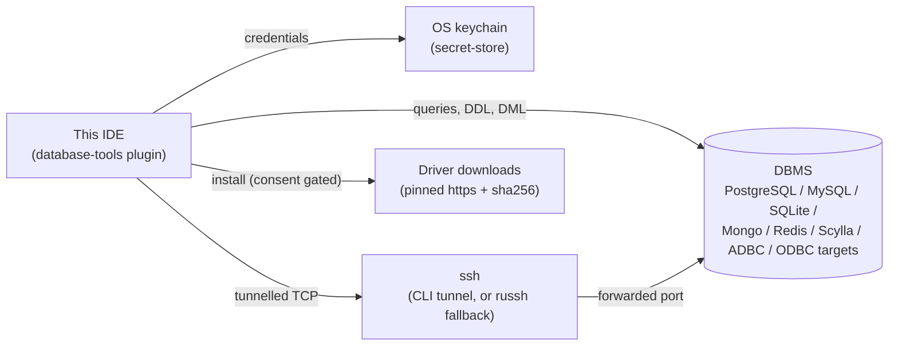
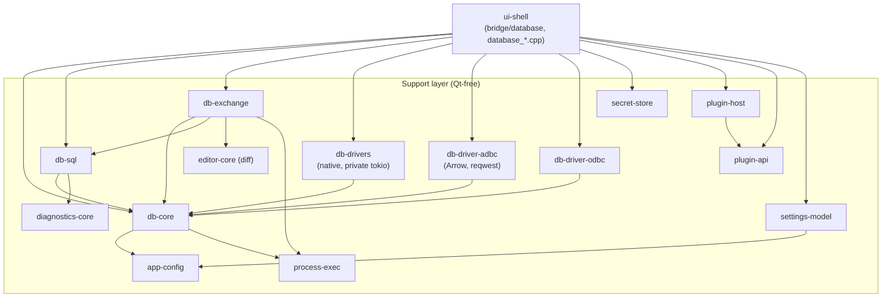
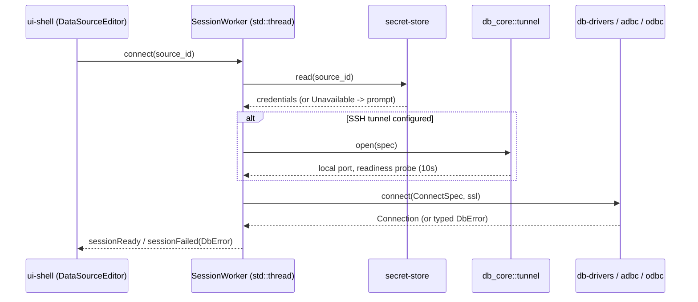
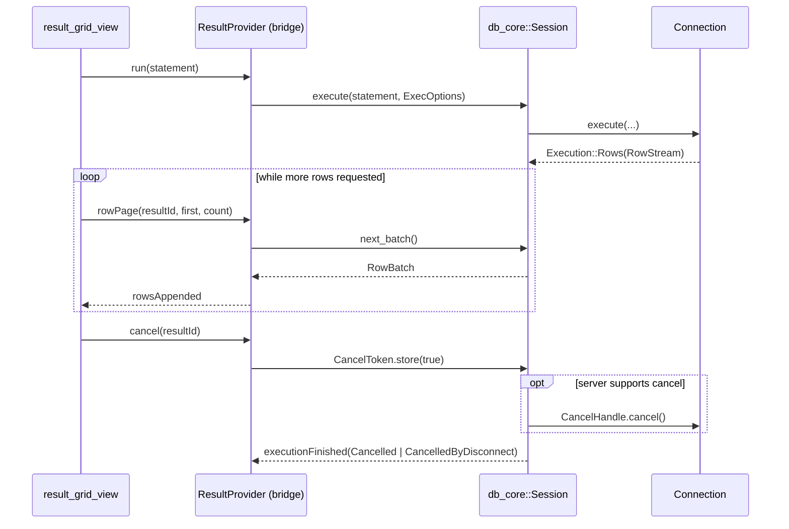
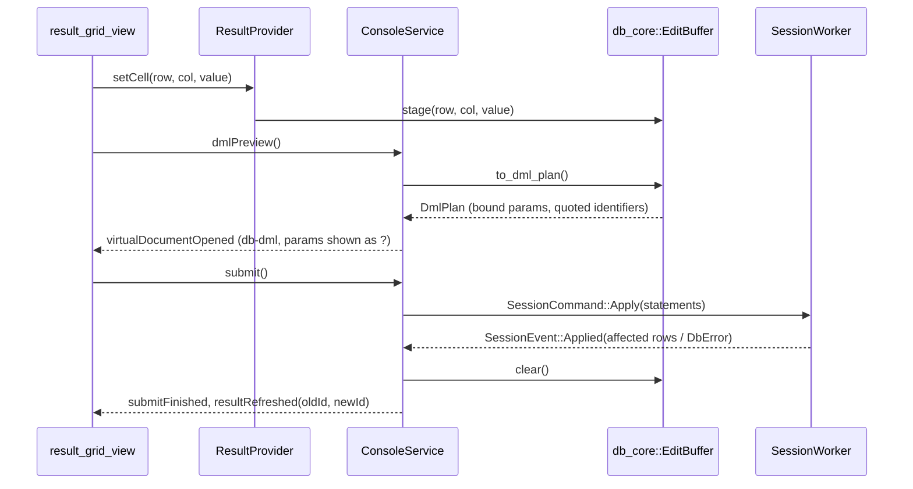
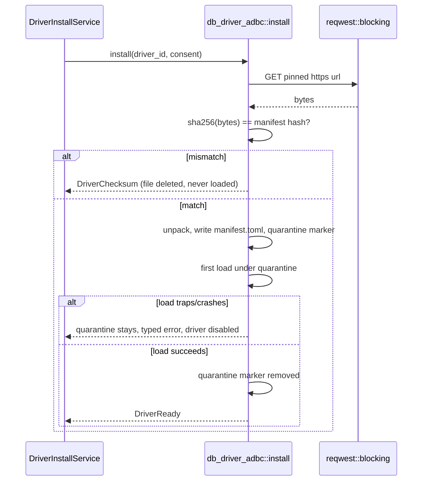

# Database Tools architecture

Implemented, truth-up done in phase F9 against the code on this branch (CLAUDE.md "fix drift when you see it").
A section describing code not yet built carries a one-line note to that effect; everything else below reflects what phases F1-FX actually shipped.
See [`database-tools-plan.md`](database-tools-plan.md) for the phased delivery, the parity matrix, the NFR table and the risk register this document does not repeat, and ADR-0058..0061 for the *why* behind the decisions this document states as *what*.

## 1. Context and scope

*Implemented, F1-FX.*

Database Tools is a built-in plugin, `database-tools`, giving this IDE JetBrains-parity database tooling: data sources, a Database tool window, query consoles, a result grid and data editor, import/export, ER diagrams, schema/data compare, object dialogs, and schema-aware SQL assistance — across relational engines (native drivers, ADBC, ODBC) and NoSQL stores (MongoDB, Redis, Cassandra/Scylla).
Out of scope: a PL/SQL debugger (an Ultimate-only JetBrains feature with no equivalent planned here), a geo viewer and charts in the result grid, grid-level data-compare (text diff only), Kerberos/IAM/proxy authentication, and CQL parsing (Scylla gets keyword+schema completion only, no query parser).

The plugin boundary (C4 level 1):



## 2. Building blocks

*Implemented, F1-FX. Kept below as delivery history — which phase landed which crate/module — since that is still useful orientation for a reader new to the plugin; every crate and module named is real on this branch.*
F1 landed `secret-store`, `db-core`, `db-drivers` (sqlite+postgres), the `plugin-api`/`plugin-host` contribution points, and the `ui-shell::bridge::database` slice this phase needs (`AppSettings` source-list accessors, `DataSourceEditor`, `data_source_dialog.cpp`, `database_settings_page.cpp`) — no dock/console/result-grid yet (F3/F4).
F2 landed `db_core::tree` (flattening/grouping/filters/actions matrix), `db_core::ddl` (DDL synthesis + SQL generator), level/scope-aware introspection in `db-drivers`, `SessionWorker` (one thread per connected source, its own per-scope snapshot cache), `DatabaseService`, and `database_panel.cpp` — the dock itself.
F3.2 landed `db-sql` (split/classify/parse/format/completion/inspections/navigation).
F5/F6 landed `db-exchange`: export (csv/tsv/json/sql/html/markdown/xlsx), import (csv/xlsx, preview → mapping → plan → run), `dump`/`restore` (argv builders for `pg_dump`/`pg_restore`/`psql`, `mysqldump`/`mysql`, `mongodump`/`mongorestore`, `sqlite3 .dump`, credentials never on argv), `copy_table`, `er_diagram` (Mermaid `erDiagram`), `schema_compare` and `data_compare`.
Its own `schema_model` (`TableDef`/`ColumnDef`/`ForeignKey`/`IndexDef`/`ConstraintDef`/`TextObject`) is a second, fully-fetched schema shape the ER diagram/compare pair needs — separate from `db_core::schema::SchemaSnapshot`'s lazily-expanded, names-only dock tree (§6) — since a richer live-`Connection` introspection would need every backend to fetch at `Full` depth up front, which the dock tree deliberately does not do.
F7/F7b/F7c landed the MongoDB/Redis/Cassandra drivers, the NoSQL tree mappings, family-aware consoles/completion, and the SSH tunnel wired into every connect path.
F8/F8b landed `db-driver-adbc`, `db-driver-odbc`, the `database-drivers`/`sql-dialects` contribution points, and driver install/quarantine.
`ConsoleService`, `ResultProvider`, `DriverInstallService`, `ExchangeService`, and their `cpp/` views (F3b/F4/F5b/F6b/F8b) are all implemented; see §4 for each one's runtime flow.*

Seven new Qt-free crates, additions to `plugin-api`/`plugin-host`, and a `ui-shell::bridge::database` module tree plus `database_*.cpp` views.
The component diagram mirrors `layering.md`'s rows exactly — the same dependency edges, drawn once here for orientation:



`app-core` gains no dependency: a console's source-of-tab join is a pure path rule in `db_core::console`, and an ER diagram rides `app_core::preview::PreviewService::render` with a synthetic `.mmd` path rather than a new join crate needing to know about databases.

Module trees (below is the truth-up against the code as it shipped; `database-tools-plan.md` §4 keeps the original P0 design sketch for its rationale, with a note pointing back here where the two now differ):

```
crates/db-core/src/      value.rs  schema.rs  driver.rs  dialect.rs  dml.rs  result.rs  ddl.rs  tree.rs
                         datasource.rs  tunnel.rs  console.rs  history.rs  session.rs  readonly.rs  error.rs
crates/db-sql/src/       lib.rs  split.rs  classify.rs  clauses.rs  parse.rs  completion.rs  inspections.rs  format.rs
                         navigation.rs  dialects.rs  scan.rs  refs.rs  single_table.rs  mongo.rs  resp.rs
crates/db-exchange/src/  export/{csv,tsv,json,sql,html,markdown,xlsx}.rs  import/{mod,csv,xlsx}.rs
                         dump.rs  copy_table.rs  schema_model.rs  er_diagram.rs  schema_compare.rs  data_compare.rs
crates/db-drivers/src/   lib.rs  postgres.rs  mysql.rs  sqlite.rs  sqlite_bench.rs  sqlite_tests.rs  mongodb.rs  redis.rs  cassandra.rs
                         introspect/*.sql  testsupport.rs  ssh.rs
crates/db-driver-adbc/src/  driver.rs  arrow.rs  install.rs  locate.rs  introspect.rs  quarantine.rs
crates/db-driver-odbc/src/  driver.rs  connect.rs  introspect.rs  values.rs
```

`ui-shell::bridge::database`: `mod.rs` (`DatabaseService`), `service.rs`, `sessions.rs` (`SessionWorker`), `console.rs` (`ConsoleService`), `edit.rs` (data editor), `navigate.rs` (FK navigation, aggregates), `results.rs` (`ResultProvider`), `settings.rs` (`DataSourceEditor`), `drivers.rs` (`DriverInstallService`), `exchange.rs` (`ExchangeService`), `backend.rs` (`backend_for`/driver dispatch), `tree.rs` (row mapping), `bridge/language/database.rs`.
`cpp/`: `database_panel`, `database_results_panel`, `result_table_model`, `result_grid_view`, `result_view_modes`, `value_editor_dialog`, `database_console_bar`, `database_dialogs`, `data_source_dialog`, `database_settings_page`, `db_object_dialogs`, `database_exchange_actions`, `driver_install_dialog`.

## 3. Driver seam

*Implemented, F1, F7, F8.*

`db_core::driver` defines the contract every backend implements:

- `Driver { id, capabilities, connect }` — a driver descriptor plus the entry point that produces a `Connection`.
- `Connection { dialect, server_info, introspect, execute, begin/commit/rollback, set_read_only, cancel_handle, ddl_of, apply(DmlPlan), close }` — blocking; every method returns once its work (or its first batch) is ready.
- `Execution { Rows(RowStream) | Affected | Multi | Ok }`, `RowStream::next_batch` — a statement's result shape and how rows are pulled, page by page.
- `CancelHandle` (obtained before `execute`, server-side cancel: PG `cancel_query`, MySQL `KILL QUERY` on a second connection, SQLite `interrupt`, Mongo `killOp`) and `CancelToken` (`Arc<AtomicBool>`, consumer-side, stops pulling regardless of server support).
- `Capabilities` — a bitflag set (transactions, `RETURNING`, server-side cancel, schemas-within-catalog, …) a consumer checks before offering a UI affordance the backend cannot honour, the same "an unsupported capability is absent" rule `dap-core` already applies.
- `ExecOptions { fetch_size: 200, max_rows, timeout, read_only }`.

Three backends implement it (ADR-0058):

| Backend | Crate | Serves |
|---|---|---|
| native | `db-drivers` | PostgreSQL, SQLite (F1); MongoDB, Redis, Cassandra/Scylla (F7); MySQL/MariaDB (FZ, implemented — see below) |
| adbc | `db-driver-adbc` (F8.1, implemented) | any driver `adbc_driver_manager::ManagedDriver` can load; the F8.3 spike found a pinnable artifact for DuckDB, Snowflake and BigQuery only (rows moved from the spike's `catalogue.toml` into `builtin/database-tools/plugin.toml`, F8b) — mssql/clickhouse/trino have no pinnable ADBC artifact today and carry an `install-hint` pointing at the `odbc` row instead |
| odbc | `db-driver-odbc` (F8.2, implemented) | anything with a system DSN or ODBC driver entry, e.g. SQL Server, ClickHouse, Trino, SQLite — one generic `odbc` manifest row (F8b), the Data Source dialog's URL field carrying the DSN or connection string |

**Wired (F8b)**: `ui-shell`'s `bridge/database/backend.rs` maps a `database-drivers` row's `backend` field to which of the three crates above actually builds the `Connection` — `backend_for` resolves the row (plain-data, unit-tested), `connect`/`connect_with_backend` (`bridge/database/mod.rs`) dispatch to `db_drivers::DriverRegistry`/`db_driver_adbc::AdbcDriver`/`db_driver_odbc::OdbcDriver`, and both `DataSourceEditor::test_connection` and `DatabaseService::connect_source` go through it — no more native-only lookup.

`db_core::value::Value` is the one row/document shape every backend converts into: `Null, Bool, Int, Float, Decimal(String), Text, Bytes, Date, Time, DateTime, DateTimeTz, Uuid, Json, Array, Document(Vec<(String,Value)>), Other{type_name,display}`.
Per-driver type mapping tables (e.g. PostgreSQL `numeric` → `Decimal(String)`, MongoDB `ObjectId` → `Text` (hex), Redis's typed keys → `Value` variants keyed by `RedisType`, Cassandra `List`/`Set`/`Map` → `Array`/`Document`) live beside each driver's own module and are fixture-tested against real wire samples, not hand-derived.

F7/FZ backends, implemented (`crates/db-drivers/src/{mysql,mongodb,redis,cassandra}.rs`, `crates/db-drivers/src/ssh.rs`):

- **MySQL/MariaDB** (feature `mysql`, default-on) — async, `mysql_async` 0.37 (`default-features = false`, `rustls-tls`+`ring`+its own `flate2` dependency re-selected to `rust_backend` — no `aws-lc-rs`, no C zlib). Unlike `tokio-postgres`'s owned `'static` row stream, `mysql_async::QueryResult` borrows `&mut Conn` for as long as a result set is open (the MySQL wire protocol allows one command in flight per connection) — `MySqlConnection` keeps its `Conn` behind a shared `Arc<Mutex<Option<Box<Conn>>>>` slot and moves it into the `MySqlRowStream` for as long as a `Rows` execution is open, handing it back (drop or exhaustion) so the next call on the same connection sees it again; a second `execute` while a stream is still open reports `ConnectionFailed` rather than hanging. Cancel is a `KILL QUERY <connection id>` on a second, short-lived connection built from the same `Opts`. Introspection (`Names`/`Columns`/`Full`) reads `information_schema.{tables,columns,statistics,table_constraints,key_column_usage,referential_constraints,check_constraints}`, fixture-tested from SQL text the same way `postgres.rs` is; `ddl_of` uses `SHOW CREATE TABLE`/`SHOW CREATE VIEW`. `ColumnMeta::origin` comes straight off `mysql_async::Column::table_str`. Type mapping: `DECIMAL`/`NEWDECIMAL` → `Decimal(String)` (verbatim), `JSON` → `Json`, `BLOB`/`GEOMETRY` family and a `BINARY`-flagged `VARCHAR`/`CHAR` → `Bytes`, `DATE`/`DATETIME`/`TIMESTAMP` → `Date`/`DateTime`, unsigned `BIGINT` too large for `i64` → `Other` rather than a silent wraparound. `Dialect::MySql` (backtick quoting, `?` params, `USE` schema switch) already existed in `db-core`; read-only is `SET SESSION TRANSACTION READ ONLY`. `mariadb` is the same driver under a second manifest row (same `native-id`, family `mysql`) — MariaDB has no server-side difference this driver needs to special-case.
- **MongoDB** (feature `mongodb`, default-on) — async, `mongodb` 3.9.1 (`rustls-tls`+`bson-3`+`compat-3-3-0`, R11 spike resolved this way, see database-tools-plan.md §13). Statement text is either a raw `runCommand` JSON document, or `db.<collection>.<method>(<json>[, <json>])` sugar for `find`/`findOne`/`aggregate`/`insertOne`/`insertMany`/`updateOne`/`updateMany`/`deleteOne`/`deleteMany`/`countDocuments`/`distinct`, parsed by `db_sql::mongo` (pure, no JS engine). `find`/`aggregate` results are one `Value::Document` column per row, plus `flatten_documents` for a table display mode. Multi-document transactions and `killOp`-based server-side cancel are not wired up (`NotSupported`/`CancelToken`-only, both documented in the source).
- **Redis** (feature `redis`, default-on) — synchronous (`redis` 0.27, `tls-rustls`, bypasses the private runtime entirely). One `RedisCommand` per line, tokenized by `db_sql::resp` (quote/escape-aware). DBs 0–15 as `Catalog` nodes; keys `SCAN`-walked (capped, default 10 000) and grouped one level deep by `key_separator` (default `:`) into `KeyNamespace`/`Key(RedisType)`, TTL carried in `NodeDetail::ttl_seconds`. Read-only classification by a command-name table (`db_sql::resp::is_read_only_command`), fail-closed on an unrecognised command.
- **Cassandra/Scylla** (feature `cassandra`, default-on) — async, `scylla` 1.9, built **without** its `rustls-023` feature: scylla's own `Cargo.toml` gives a dependent no way to select rustls's `ring` provider over its default `aws_lc_rs` one (unlike postgres/mongodb/redis/russh, whose manifests each expose that choice), so this driver stays plaintext-only rather than let `aws-lc-rs` into the tree — `SslMode` other than `Disable` returns `NotSupported` with `"TLS for Cassandra/Scylla is not available yet (scylla's rustls feature forces aws-lc-rs)"` (tested). Introspects `system_schema.{keyspaces,tables,views,types,functions,columns}` directly. Statements split by `db_sql::split` (`Dialect::Cassandra`, semicolon-based), classified read/write by leading keyword. `crates/db-drivers/Cargo.toml`'s `[dependencies.scylla]` comment has the full account, verified against the published manifest for 1.7.0/1.8.0/1.9.0.
- **SSH tunnelling** (`db_core::tunnel::{Tunnel, SshAuthMode, SshConfig, select}` + `db_drivers::ssh::RusshTunnel`) — `db_core::tunnel::select` picks `CliTunnel` (shells out to `ssh`, free config/agent/`ProxyJump` support) when `ssh` is on `PATH` and the auth mode is agent/key-file/ssh-config, else `RusshTunnel` (in-process, `russh` 0.63 `ring`+`rsa`) — always for password auth, since `ssh -o BatchMode=yes` cannot prompt for one. Host key verification against `~/.ssh/known_hosts` (`russh::keys::known_hosts::check_known_hosts`) never auto-accepts: unknown → `DbErrorCode::HostKeyUnknown`, changed → `HostKeyMismatch`.
  **F7b's consent UI, implemented**: `db_drivers::ssh::{append_known_host, accept_host_key, accept_host_key_at}` write an OpenSSH `known_hosts` line for a host `check_server_key` rejected (`learn_known_hosts_path`, a process-wide `(host, port) -> PublicKey` table stands in for the key material `DbError`'s code+message alone cannot carry across the FFI seam, ADR-0003). `DataSourceEditor::testConnection` (`bridge/database/settings.rs`) reads the typed error through the new `test_connection_typed`/`connect_with_backend_typed`/`connect_typed` path (the existing `String`-returning functions were rendering `DbErrorCode` away before the caller ever saw it): `HostKeyUnknown` stashes `(host, port)` and emits `hostKeyPrompt(host, port, fingerprint)` instead of `testConnectionFinished`; `HostKeyMismatch` falls straight through to the ordinary failure path, no accept affordance. `data_source_dialog.cpp` shows a `QMessageBox::question` with the fingerprint and, on Yes, calls `acceptHostKey()`, which records the key and retries `testConnection()`. **Known gap** (see §11): nothing in `connect_with_backend`/`connect_with_backend_typed` actually opens a tunnel yet — `ConnectSpec`/`DataSource` carry no SSH fields at all (only `Secrets::ssh_password`) — so `HostKeyUnknown`/`HostKeyMismatch` cannot yet surface from a real connect attempt; the prompt/dialog/accept path above is real and unit-tested end to end, just unreachable until a follow-up wires `db_core::tunnel::select`+`open` into the connect path ahead of dispatching to a backend.
  Also F7b: the "Test connection" ping itself is family-aware now (`bridge::database::mod::ping_statement`) — a bare `Statement::sql("SELECT 1")` used to run unconditionally and fail every Mongo/Redis/Cassandra test-connection click with `InvalidStatement` (`Connection::execute`'s own `statement.lang` guard) even against a reachable server; it now sends `{"ping": 1}`/`PING`/`SELECT now() FROM system.local` in each family's own `QueryLang`.

## 4. Runtime views

*Implemented, F1-FX.*

**F2 implementation note**: what F2 actually built is the *tree* half of the Connect diagram below — `DatabaseService::connect_source` spawns the driver's blocking `connect()` off the Qt thread, and on success builds a `db_core::session::Session` + `SessionWorker` and dispatches an initial `Names`-level `Introspect`. (TLS wiring stayed F1/F7's own territory then; the SSH-tunnel half of the diagram is F7c's, see the implementation note right below it.)
**Go to DDL** (F2.3, shipped): `DatabasePanel`/context-menu → `DatabaseService::go_to_ddl` → `object_ref_for(row)` (the row's own kind/ancestry) → `SessionWorker::send(DdlOf)` → the worker's `Session::ddl_of` (the engine's own DDL text, e.g. SQLite's `sqlite_master.sql`; `db_core::ddl::synthesize`'s `Node`-detail fallback is wired into `db-core` but not yet called from a backend that has no native DDL text of its own) → `apply_event`'s `Ddl` branch opens it through `AppSession::open_virtual_document("db-ddl", …)` and emits `virtualDocumentOpened`, which `editor_tabs.cpp` wires exactly like `ContainerService`'s.
Deviation: the virtual document's key ends in `.sql` (for the editor's language-by-extension detection), so the opened tab's title is `<object>.sql`, not the literal `"<object> DDL"` a key with no extension would have given it.

**Connect** (secrets → tunnel → TLS → session thread):



**F7c implementation note (SSH tunnel wired, the gap F7b left)**: shipped — the diagram above is now true, not target design. `ui_shell::bridge::database::open_session(source, secrets)` is the one path every connect site goes through (`test_connection_typed`, `DatabaseService::connect_source`, `ConsoleService::attach`, the exact-aggregate connect in `navigate.rs`): when `source.ssh` is set (`db_core::datasource::DataSource::from_setting`, resolved from `app_config::database::SshSetting` plus the keychain's `<id>/ssh` secret), it calls `db_core::tunnel::select` (CLI `ssh` first, `db_drivers::ssh::RusshTunnel` when the auth mode is a password or no `ssh` binary is on `PATH`), rewrites the `ConnectSpec`'s host/port to the tunnel's own loopback/local port, then connects the backend through it. The tunnel outlives the connection: `SessionWorker::spawn` now takes the opened tunnel alongside the `Session` and captures both in the same thread closure, tunnel last, so it only drops once the worker's command loop returns (i.e. after the connection it carried has already closed) — `Drop for SessionWorker` already sends `Shutdown` and joins that thread. `HostKeyUnknown` now genuinely reaches `DataSourceEditor::hostKeyPrompt` from a real "Test connection" or a real tree connect, closing the "implemented but unreachable" gap §9/§11 used to describe; §11's F7b debt row for this is paid off.

**Execute, page, cancel** (two cancellation layers, generation counter):



A `generation` counter on the session guards a race between a cancel and a result that was already in flight: a batch tagged with a stale generation is dropped rather than appended, the same "late answer to a question nobody's asking anymore" guard `search-everywhere`'s own popup already uses for its ranked tiers.

**F3 implementation note**: shipped — `ConsoleService`/`ResultProvider` (`crates/ui-shell/src/bridge/database/console.rs`), one dedicated `SessionWorker` per attached console tab (never the Database dock's tree worker, so a long grid page and a tree expand cannot queue behind each other).
`execute`/`executeFile` split the text with `db_sql::split`, check every statement against a `db_core::readonly::Guard` built from `db_sql::classify::SqlClassifier` (replacing F1's `NaiveClassifier` at this seam), log it to history (text only) if the source's `history` flag is set, then dispatch statements one at a time; `StopOnError`/`Continue`/`Ask` govern what happens after a failing one, `Ask` pausing via `askContinue`/`resume`.
Cancellation is real, not simulated: `SessionWorker::cancel_now` holds the connection's `CancelHandle` (obtained once at spawn, per `db_core::driver`'s own doc comment) outside the command channel entirely, so it can interrupt a blocked `execute` from the Qt thread while the worker thread is still inside it — proven by `db-drivers/src/sqlite.rs`'s new `map_err` case (`SQLITE_INTERRUPT` → `DbErrorCode::Cancelled`, a real pre-existing gap this phase found and fixed, F1 having always mapped every sqlite failure to `Unknown`).
`executionFinished` fires once, on a result's *first* batch/outcome — not once every row is fetched — so a script's next statement is never blocked on however many pages a user later pulls through `ResultProvider::fetchMore`.
`ResultProvider::rowPage` walks `ResultSet::batches()` in row-count order rather than flattening the whole result first, so its own FFI time stays bounded by the batches actually touched, not by how many rows the result has accumulated so far.
**Known gap, found and since fixed**: `db-drivers`' `SqliteConnection`/`PgConnection::execute` both eagerly drained the *entire* `Rows` result into memory before returning (`RowStream::next_batch` only re-chunked an already-fully-materialised buffer) — a pre-existing P0/F1-era gap, out of this phase's file list, that defeated the "first batch ≤ 500 ms, later pages cheap" NFR at real scale.
F3c fixed `SqliteConnection::execute` (a second, dedicated read-only connection driving a live `rusqlite::Statement`/`Rows` cursor); F3d fixed `PgConnection::execute` the same way, over `Client::query_raw`'s own live, wire-backed stream — no second connection needed there, since tokio-postgres pipelines concurrent commands on one `Client` transparently. §11 no longer tracks this as open debt.

**F3.7 implementation note (SQL assistance)**: shipped — `crates/ui-shell/src/bridge/language/database.rs` injects completion, inspections and two intentions into `LanguageService`, before the language-server gate, exactly the way `containers.rs` injects image-name completion (SQL has no language server in this codebase).
A path attaches to a data source through `db_core::console::source_of` (a console file under `consoles_dir`) or `[database] file_sources` (a plain project `.sql` file); `database_completion`/`database_intentions`/`refresh_database_inspections_now` all resolve that once per path and cache it.
`db_sql::completion`/`inspections`/`navigate`/`format`/`split`/`parse` do the real work over a `SchemaSnapshot` fetched at `Columns` level and a `db_core::dialect::Dialect`, both cached per source id; a request before the first snapshot lands triggers one background introspection (deduplicated per source id) and answers with keywords only in the meantime.
Inspections publish under `database:inspections` through the shared `DiagnosticStore`, on save and on a 500ms idle debounce per path (a generation counter per path drops a superseded run rather than coalescing into one re-armed timer, the simpler of the two shapes `mod.rs`'s watched-file debounce and this one both solve); a `db_sql::parse` grammar error joins them as `Warning` rather than `Error` when the dialect maps to `sqlparser`'s `GenericDialect` (SQL Server, Cassandra, Mongo, Redis) — a weaker signal there than for a dialect `sqlparser` actually models.
"Format SQL" carries its own `WorkspaceEdit` over the statement at the caret (via `db_sql::split`) and applies through the ordinary code-action path, the same way D7's build-file "Update to X" quick fix does; "Go to DDL" resolves the identifier under the caret with `db_sql::navigate` and opens its DDL as a `db-ddl` virtual document — the same scheme `DatabaseServiceRust::go_to_ddl` uses, so re-navigating to the same object from the Database dock's tree or from a console file focuses the same tab.
Deviation from the plan text: this module opens its own short-lived connection per source id for both introspection and DDL fetch, rather than reusing `bridge::database::console`'s already-open `SessionWorker` — that state is private to `console.rs`, owned by the phase (F3e) developed in parallel with this one, and this module's owned file list did not include it.
Selection-scoped "Format SQL" (the plan's other stated trigger, alongside "the statement at caret") is not wired: `requestIntentions` carries only a caret position, no selection range, in this codebase's current FFI.

**F7b implementation note (console/completion/dialog)**: shipped. Consoles open under a family-specific extension now (`db_core::console::{Family, family_for_driver, extension, console_file}`) — `.mongodb` (javascript highlighting), `.redis` (no grammar registered, renders as plain text), `.cql` (sql highlighting, CQL being close enough for `sqlparser`'s generic dialect), every other family unchanged at `.sql`; `DatabaseService::open_console` resolves the source's own family before scanning for/creating the file. `ConsoleService::execute`/`applyClauses` (`console.rs`) now split and run each family's own way — `db_sql::mongo::split_commands`/`command_spans` (bracket/string-aware, one statement per top-level `db.coll.method(…)` call or JSON document, `;` optional) for Mongo, `db_sql::resp::split_lines` (one command per line) for Redis, the existing `db_sql::split` for everything else — and dispatch through `Dialect::query_lang()` (`Sql`/`MongoShell`/`RedisCommand`/`Cql`) rather than the `Statement::sql`-only path that used to send every family's text as `QueryLang::Sql` and get refused by every NoSQL driver's own `statement.lang` guard. The read-only guard follows the same split: `Guard`'s classifier is `db_sql::classify::FamilyClassifier` (Mongo/Redis read the structural read-only tables `db_sql::mongo::is_read_only_method`/`resp::is_read_only_command` already expose; Cassandra still uses `SqlClassifier` over the generic dialect, per §3's own note on why that is correct for CQL) rather than always `SqlClassifier`, which used to fail every Mongo/Redis statement's classification closed regardless of read-only source or not.
Completion needed no bridge change at all: `db_sql::completion` already dispatches Mongo/Redis to its own `mongo_completion`/`redis_completion` internally (collection names after `db.`, sugar method names after `db.<coll>.`, Redis command names + key prefixes from the cached schema snapshot) before `bridge/language/database.rs`'s single `db_sql::completion(...)` call ever sees the dialect — Cassandra/CQL keeps the existing keyword+schema path (`dialects.rs`'s "Cassandra → generic" choice).
The Data Source dialog's "Database" field is relabelled per family without a per-family `if` in C++: `db_core::console::database_field_label_key(family)` returns a stable key (`"database"`/`"auth_database"`/`"db_index"`/`"keyspace"`), `DataSourceEditor::databaseFieldLabelKey()` exposes it for the draft's current driver, and `data_source_dialog.cpp`'s `databaseFieldLabel()` is a mechanical key→`tr()`'d-label lookup, not a business decision.

**F7c implementation note (family-aware extra fields)**: shipped, scoped down from the plan's fuller "family-aware form" ask. Once F7b's relabelling above is accounted for, the only connection detail a family actually needs beyond the dialog's common host/port/database/user/ssh/ssl fields turns out to be three small ones: Mongo's replica set, Redis's TLS toggle, Cassandra's local datacenter (Postgres/MySQL/SQLite and ADBC/ODBC need nothing extra). `db_core::console::extra_fields(family)` is the descriptor (a stable `key` plus `ExtraFieldKind::{Text,Bool}`), tested per family; `DataSourceEditor::{extraFields,option,setOption}` are the FFI seam, backed by `DataSourceDraft`/`DataSourceSetting`'s pre-existing `options` map (previously read on load but silently discarded on every commit — the dialog's draft had no `options` field at all until this phase, so any value there was wiped the moment a source was next edited and saved). `data_source_dialog.cpp` builds the Options tab's family-specific rows generically from the descriptor (a `QLineEdit` for `Text`, a `QCheckBox` for `Bool`, never a per-family `if`), rebuilding that section whenever the driver combo changes. Deferred (explicitly, not silently): a fully generic form-builder for *every* field (host/port/database included, as a `data_source_form.{h,cpp}`, a richer widget-kind vocabulary with sections/lists/driver defaults) — speculative machinery for a hypothetical future family this phase's actual three fields did not need. A Cassandra contact-points *list* (as opposed to today's comma-free single host) is still real follow-up work, not blocked by anything this note found.

**F3e implementation note**: shipped — the console UX gaps F3 left open. `EditorOps::caretOffset` exposes the primary caret's byte offset (already tracked internally, no unit conversion), so the console bar's Run button now runs `FfiDbExecWhat::Statement` at the caret instead of falling back to the whole buffer; a new "Run script" button/`database.runScript` action (Ctrl+Shift+Return) always runs the whole buffer.
`askContinue` now carries the failing statement's error message, answered by a real `QMessageBox` (`cpp/database_dialogs.cpp`); the console bar's Stop/Continue/Ask combo persists per source through a new `DataSourceSetting::script_policy` field.
The schema picker reads a `Names`-level `Introspect` `attach` now kicks off on its own; `setSchema` runs `Dialect::set_schema_statement`'s `SET search_path`/`USE` (`db_sql::classify` already treats it as session control, not a write, so the read-only guard lets it through) like any other statement.
`ResultProvider::applyClauses` calls `db_sql::clauses::apply` instead of always wrapping: a plain `SELECT` gets its own `WHERE`/`ORDER BY` extended in place, falling back to the derived-table wrapper only for a CTE, a set operation, or a clash with an existing `ORDER BY`/`LIMIT`.
`DatabaseResultsPanel` is now a `QTabWidget` with one page per attached console (its own Output/Result sub-tabs), created lazily on that console's first output/execution and removed on `DocumentManager::tabClosed` — which now also detaches the console instead of leaking its `SessionWorker` thread, a gap F3 left in place.
F3.6's `sql-script` run configuration (`bridge::run::sql_script`) runs off a plain background thread, no `Supervisor`/PTY process, reporting through the same `consoleStarted`/`consoleOutput`/`consoleFinished` signals with its own console-id range.
**Known gap, found not fixed**: `db_core::readonly::Guard::check` refuses every `Write`/`Ddl`/`Unknown` statement unconditionally — it has no notion of whether the *source* is actually read-only, despite this module's own doc comment describing it as a read-only-source check. `bridge::run::sql_script` gates its own guard check on the source's `read_only` flag; `bridge::database::console`'s `attach()` (F3, unchanged this phase) does not, so every console — on a read-only source or not — currently refuses any write/DDL statement. §11 tracks this as new debt.

**Data-editor submit** (EditBuffer → DmlPlan → apply → refresh) — shipped
(F4.2), on `ConsoleService` rather than `ResultProvider` for `dmlPreview`/
`submit`: both need the console's own worker/session (`submit`) or the
shared `AppSession` (`dmlPreview`, to open the virtual document), neither
of which `ResultProvider` holds (this document's own doc comment on why
the two QObjects split as they do); every cell-staging call
(`setCell`/`setNull`/`setDefault`/`revertCell`/`addRow`/`cloneRow`/
`deleteRows`/`revert`) still lives on `ResultProvider`, pure buffer state:



**F4 implementation note (data editor, F4.1/F4.2/F4.5)**: shipped — `bridge::database::edit` (split out of `console.rs` once F4 pushed it past the file-size ceiling).
Editability is decided per result, not per source: a read-only source or a statement `db_sql::single_table::of` cannot resolve to one plain table settles `NotEditable` immediately; otherwise a `Full`-level introspect scoped to that one table (`ConsoleService::start_editability_check`/`edit::apply_edit_lookup`) reads the table's own primary-key columns (already populated by both real drivers' `Full`-level introspection) and applies the per-source `no_primary_key_policy` setting (`"refuse"` default, `"all_columns_where"` opt-in) when none remain — reported through `editabilityChanged`.
`db_core::dml::EditBuffer` grew `CellEdit::{Set,Default}`, `add_row`/`clone_row`/`delete_row`/`revert_cell`/`pending_count`/`row_flags`/`sync_rows`; `to_dml_plan` now emits `DELETE`/`INSERT` alongside the existing `UPDATE`, still binding every value and quoting every identifier through `Dialect`. `submit` runs the plan through `SessionCommand::Apply` (auto mode wraps its own transaction; manual mode runs inside the console's already-open one), then clears the buffer and re-runs the original statement for a fresh page (`resultRefreshed`). `dmlPreview` opens the plan's SQL (params shown as `?`, never substituted) as a read-only `db-dml` virtual document, the same scheme Go to DDL uses.
`ColumnMeta::origin` (F4b): Postgres populates it (`PostgresConnection::table_name_for_oid`, `Column::table_oid()` resolved against `pg_class` and cached per connection); SQLite still does not — `rusqlite` 0.32 exposes no `sqlite3_column_table_name`-shaped API at all (documented at the call site in `sqlite.rs`). `db_sql::single_table::of` (parses the statement text every backend already has in hand) stays the editability decision's own stand-in regardless of which drivers populate `origin`.
**F4c**: the value editor opens a `Value::Bytes` column in a dedicated hex-edit mode — `ResultProvider::isBinaryColumn` (`db_core::value::is_binary_type`) decides, and `validateHex` (`db_core::value::validate_hex_text`) gives live feedback as the user types, still coerced/bound through the unchanged `setCell` → `parse_text` path on Save.

**F4b implementation note (FK navigation, exact aggregate, read-only demotion)**: shipped — `bridge::database::navigate` (split out of `console.rs` once F4.3's own additions pushed it past the file-size ceiling).
`ConsoleService::cellNavigation(resultId, row, column)` offers forward FK navigation: a cell whose column is part of a `ConstraintKind::ForeignKey` (F6c's structural detail, cached on `ResultState::table_constraints`) offers a `FfiDbNavTarget` — a label plus a complete, already-bound `SELECT` (the row's own already-fetched value rendered through `Value::sql_literal`, never interpolated user text). `goToNavTarget` runs it as a fresh result on the same console, same shape `applyClauses` already uses.
`ConsoleService::aggregateExact(resultId, column, op)` runs `SELECT op(col), COUNT(*) FROM (<the result's own statement>) t` on its own short-lived connection (never the console's shared worker — an aggregate must not steal the one in-flight slot a still-open grid page is using) and reports the value plus the whole result's row count through `aggregateComputed`. `ResultProvider::aggregate` (the fetched-rows-only estimate) is unchanged, for an instant answer while the exact one loads.
`DataSourceEditor::commit` calls `edit::rebuild_guards_for_source` when a source's `read_only` flag actually changes: every attached console's `Guard` is rebuilt against the new value immediately, and every open result's cached `EditState` is invalidated — `Editable` demotes to `NotEditable` turning read-only on; a read-only-caused `NotEditable` resets to `Unknown` (re-checked on the console's next execute, not eagerly) turning it back off.

**F4c implementation note (typed rows, hex edit mode, FK navigation UI)**: shipped — the typed row accessor (`ResultProvider::rowValues`), the value editor's hex-edit mode, and the grid's FK-navigation context menu/`F4` shortcut. `result_grid_view.cpp` calls `cellNavigation`/`goToNavTarget` (context menu built from the returned `FfiDbNavTarget` list, one action per target; `F4` on the current cell does the same from `tableView_->currentIndex()`) — the referenced row replaces this grid's own page, in the same console tab, the same "new result id travels back in `FfiResult::message`" convention `applyClauses` already used. Fixed the same pass: `applyClauses`/`goToNavTarget` never fired `executionStarted`, so `DatabaseResultsPanel::resultTab_` never learned to route their new result id's `rowsAppended`/`executionFinished` back to the right grid — `ResultGridView` now takes an optional `onResultAdopted` callback, fired from `setResultId`, that registers the mapping.

**F4d implementation note (view modes, aggregate footer, F4.4 object dialogs, reverse FK navigation)**: shipped.
*View modes*: `ResultProvider::resultModes(resultId)` (`FfiResultModes`) tells the grid which of Transpose/Text/Record it can offer — Transpose/Text whenever the result has any columns, Record only when the first fetched row actually carries `Document`/`Array`/parsed-object-or-array-`Json` structure (`has_nested_structure`) — and picks `Record` as the default when the result is Mongo-shaped (one column, a `Document` per row), closing F7b's "Document/Table toggle" gap without a Mongo-specific `if` in C++ (the decision is `db_core::value`'s, keyed only on the value's own shape). `crates/ui-shell/cpp/result_view_modes.{h,cpp}` holds `TransposeTableModel` (a read-only row/column swap over the same `ResultTableModel`), `buildRecordModel` (a three-column `QStandardItemModel` built from `db_core::value::record_rows`'s depth-first `RecordRow` walker) and `installColumnVisibilityMenu` (a checkable per-column popup, `ponytail`: resets per result, no persistence). Text view gained a fourth format, Markdown, alongside CSV/TSV/JSON.
*Aggregate footer*: selecting a column runs `ConsoleService::aggregateExact` and shows "computing…" until `aggregateComputed` answers (`FfiDbAggregateOutcome`). `navigate.rs::aggregate_scope` is the Rust-side "can this even be wrapped" decision: a dialect with no derived-table concept (`query_lang() != Sql` — Mongo/Redis) or a statement that is not, comments/whitespace aside, a plain `SELECT` is refused *before* opening a connection, reported as `FfiDbAggScope::FetchedRowsOnly` with a `reason`; the footer falls back to `ResultProvider::aggregate`'s synchronous fetched-rows estimate and shows the reason as a caveat.
*F4.4 object dialogs*: `db_core::ddl` gained `TableSpec`/`ColumnSpec`/`ForeignKeySpec`/`IndexSpec`/`UserSpec` (all `serde`-deserialisable straight from the dialog's own JSON) and their generators — `create_table`, `alter_table_add_column`/`alter_table_alter_column`/`alter_table_drop_column` (SQLite refuses `alter_column` typed — no `ALTER COLUMN`/`MODIFY COLUMN` shape exists to generate), `create_index`, `create_user` (per-dialect syntax; SQLite/Redis refused typed, neither has a user/role concept) — every generator adversarially tested the same way `ddl.rs`'s existing generators are. `db_core::tree::ActionSet` gained `CREATE_TABLE`/`MODIFY_TABLE`/`ADD_COLUMN`/`CREATE_INDEX`/`CREATE_USER`, wired into `actions_for`. `DatabaseService::objectDdlPreview(nodeId, kind, specJson)`/`runObjectDdl` decode the spec JSON against `nodeId`'s own resolved dialect/table-or-schema context and either return the generated text or dispatch it. `crates/ui-shell/cpp/db_object_dialogs.{h,cpp}`: one small `QDialog` per action, every one calling `objectDdlPreview` and showing the generated DDL in a confirmation `QMessageBox` before ever calling `runObjectDdl`.
*Reverse FK navigation*: `db_core::schema::find_referencing_columns(roots, table, column)` walks a `Full`-level `SchemaSnapshot`'s roots for every `ForeignKey` constraint pointing back at `(table, column)`. `ConsoleService::referencingTargets(resultId, row, column)` runs this over a whole-schema introspect on its own short-lived connection and answers through `referencingTargetsReady` with one `FfiDbNavTarget` per hit; offered both from the cell context menu and a dedicated `database.showReferencingRows` action.

**F4.5 `security-expert` pass** (read-only review of `dml.rs`, `dialect.rs`, `readonly.rs`, `value.rs`, `single_table.rs`, `console.rs`, `edit.rs`, `sessions.rs`): the "every value bound, every identifier quoted, nothing interpolated" property held up under adversarial-identifier/value testing.
Two real findings, both fixed this phase: `Value::parse_hex` byte-index-sliced a value-editor cell's text without checking it was ASCII first, so a multi-byte UTF-8 character panicked the process rather than returning `Err`; and `ConsoleService::submit` compiled a `DmlPlan` and dispatched it straight to `SessionCommand::Apply` without ever consulting the console's own read-only `Guard` — a result's editability decision is cached once in `ResultState::edit` and never re-checked, so this was the one write path with no client-side check left between a stale "editable" decision and an actual write.
Two Low/Info findings noted but not fixed: see §11's debt table.

**Driver install** (download → sha256 → quarantine → probe):



**Import/export** (F5.1/F5.2, real): export takes the columns a result already fetched plus a `RowBatch` iterator and writes one of seven formats through `db_core::value::Value::display`.
SQL and XLSX are the two exceptions — SQL renders a bindable literal, never `display` text, since a paste-into-console statement has no parameter slot; XLSX keeps numbers/dates as Excel's own typed cells and falls back to `display` text for everything else, including `Bytes` as full hex, which XLSX has no binary cell type for.
Import runs the reverse: `preview` samples a source and guesses each column's type, a user-edited `Mapping` says what to keep/rename/skip, and `plan` compiles the full row set into a `CREATE TABLE` plus batched, parameterised multi-row `INSERT`s — never an inlined literal.
`run` then applies that plan through a live `Connection`, stopping between batches on a `CancelToken`.

**F5b.1/F5b.3 implementation note**: shipped — `crates/ui-shell/src/bridge/database/exchange.rs`'s `ExchangeService`, one QObject for every F5/F6 operation.
`exportTable`/`importRun`/`copyTable`/`dump` each allocate a job id up front and run on a `std::thread`, reporting through `jobProgress(jobId, done, total, message)`/`jobFinished(jobId, ok, message, outputPath)`; a synchronous pre-flight failure (unknown source, empty destination) still allocates and immediately finishes a job rather than a separate error shape, so a caller never special-cases "failed before it started".
`exportTable` resolves the source id to a fresh `Connection` (`bridge::database::connect`, the same seam `bridge::run::sql_script` already uses) and streams `SELECT *`; every batch is buffered before one `export::write_format` call rather than one call per batch — `write_format`'s JSON-array and XLSX outputs are each a single whole document (a `[...]` array, one zip archive) with no batch-append story, so per-batch calls would corrupt exactly those two formats. This trades `exportTable`'s originally-stated "never materialises" ideal for correctness across every format it offers; CSV/TSV/JSON-Lines/Markdown/HTML/SQL could still stream incrementally if a huge table's memory footprint ever becomes a real problem.
`exportRowsToFile`/`exportRowsToText` serve the results-grid toolbar's "Export…"/"Copy as ▸" instead: **F4c closed the typed-row gap** this paragraph used to describe — the rows now cross the seam as `ResultProvider::rowValues`'s own typed JSON-per-row encoding (`db_core::value::row_to_json`/`row_from_json`, one `QString` per row: `Value`'s recursive `Array`/`Document` cases and its dozen scalar variants have no shape a cxx-qt shared struct accepts directly, so a new struct was not the answer), decoded back into a real `RowBatch` before `export::write_format` runs — a `SqlInsert`/`SqlUpdate`/XLSX/JSON export from the grid now types every cell from its real driver value, not from rendered text.
`importPreview`/`importRun` read a CSV/XLSX file directly (`db_exchange::import::{csv,xlsx}`), compile an `ImportPlan` against a fresh connection to the target source, and apply it.

**F5b.2 dialogs**: one file, `crates/ui-shell/cpp/database_exchange_actions.{h,cpp}`, rather than one per dialog — each is a small, single-use `QDialog` built from a handful of widgets sharing one job-progress view (`runJobModally`) and one export-options form; every choice (formats, dump-tool availability, mapping validity) is read from `ExchangeService`, never encoded as a C++ `if`.

**Dump/restore** (F5.3, real): `dump` builds one `Command` (argv, env, an optional 0600 credentials temp file) per tool — `pg_dump`/`pg_restore`/`psql`, `mysqldump`/`mysql`, `mongodump`/`mongorestore`, `sqlite3 .dump` — never a password as an argv word (`/proc/<pid>/cmdline` is world-readable).
PostgreSQL gets `PGPASSWORD` via `process_exec::spawn_with_env` (added in F5, see `layering.md`'s `process-exec` row); MySQL and Mongo get a `--defaults-extra-file`/`--config` temp file instead, since neither tool has an env-var equivalent as clean as `PGPASSWORD`.
`preview()` renders the shell-quoted command line for the confirmation dialog (F5b); `tool_available`/`install_hint` back the "not installed" affordance.

**F5b.1 dump deviation (recorded, not a technical wall)**: the plan text said "into the Run dock console like a run configuration, reuse `RunService`'s console signals the way F3e's `sql_script` did". `ExchangeService::dump`/`restore` instead spawn the tool themselves (`process_exec::spawn_with_stdin`, non-PTY), streaming stdout/stderr lines through their own `jobProgress`, and the dialog shows that log in its own `runJobModally` view — never touching `bridge::run::mod.rs`'s `Supervisor`/`ConsoleState` machinery. Reason: `sql_script.rs`'s reuse of `RunService`'s signals works because it runs SQL *in-process* through `Session::execute`, never spawning an OS process at all; `run_core::supervisor::Supervisor` has no "adopt an already-running `process_exec::Spawned`" entry point either — its `RunningConsole` owns a `pty_core::PtySession` it spawned itself (argv in, PTY out), not a generic child handle, and `dump`/`restore` spawn over plain pipes (`process_exec::Spawned`), not a PTY. Bridging the two (a new `RunningConsole` variant, `Supervisor::adopt(Spawned)`, PTY-vs-pipe read-loop parity) is a real restructuring, not a wire-up, and stayed out of F6c's scope the same way it stayed out of F5b's. `ExchangeService`'s own signals satisfy the literal deliverable; only *which dock* the output lands in differs from the plan's stated intent. §11 tracks this as open debt.
**F6c**: restore is now implemented — `dump::restore_command(driver, …)` dispatches to `psql -f` (PostgreSQL; this crate's own `pg_dump` never passes `--format=custom`, so its output is always plain SQL `psql` reads directly), `mysql`/`sqlite3` (both via stdin — `dump::spawn` moved from `process_exec::spawn_with_env` to the new `spawn_with_stdin`, so a `Command::stdin_file` is now actually piped into the child rather than silently dropped, the root cause behind the "restore not implemented" note this replaces), and `mongorestore` (archive file arg). `ExchangeService::restore`/`restoreArgvPreview` mirror `dump`/`dumpArgvPreview`; `showRestoreDialog` (`database_exchange_actions.cpp`) is a "Restore…" entry next to "Dump…" in the data source row's context menu, sharing its `canDump` gate, with a confirmation naming the source and file before running.

**Copy table** (F5.4, real): stream `SELECT *` from the source `Connection`, synthesize a `CREATE TABLE` from the first batch's `ColumnMeta` for the target dialect (`copy_table::map_type`'s source-type-name → target-dialect-type table) unless the caller says the table already exists, then batch parameterised `INSERT`s, one transaction per batch, checking a `CancelToken` between batches — never mid-batch, so a cancelled copy never leaves a half-committed batch.
**F5b.3 wiring**: `ExchangeService::copyTable`, a job like `exportTable`, driven from the table row's "Copy Table to…" context-menu entry (`db_copy_table_dialog`'s functional equivalent inside `database_exchange_actions.cpp`) — destination source/table, create-if-missing, batch size, all read from `DatabaseService::sources()`.

**ER diagram** (F6.1, real): `er_diagram::to_mermaid` walks a `schema_model::SchemaSnapshot` (optionally scoped to one table plus its FK neighbours) into Mermaid `erDiagram` text — entities with `type name PK/FK` columns, relationships with cardinality derived from a foreign key's own structure (F6c: `||--||` when the child's FK columns are themselves covered by a unique index/the primary key — `TableDef::columns_are_unique` — `||--|{`/`||--o{` from column nullability otherwise; a `}o--o{` many-to-many is out of scope, since it only arises from an association table's *pair* of FKs, which this per-FK rendering does not attempt to collapse into one line), deterministic (name-sorted) ordering so two runs over the same snapshot never flicker.
Rendered through `PreviewService::render` with a synthetic `.mmd` path (§2's note on why `app-core` gains no new dependency for this), never a file on disk.

**F6b.1 implementation**: `ExchangeService::erDiagramMermaid`/`erDiagramImage` build the `schema_model::SchemaSnapshot` from a `db_core::schema::SchemaSnapshot` fetched at `IntrospectLevel::Full`, via `schema_model::from_snapshot`/`fetch` (moved from this file into `db_exchange` itself in F6c, since the mapping is exactly the kind of Qt-free logic that crate already owns the rest of). Shown in its own `showErDiagramDialog` (rasterised via `PreviewService::render`'s existing Mermaid path and displayed as a `QPixmap`) for the at-a-glance raster view; "View as Mermaid Text" opens the raw `.mmd` as a real, focusable tab via `DocumentManager::openVirtualDocument(scheme, key, text)` (the C12 mechanism `AppSession::open_virtual_document` already provided).
**F6c**: that same tab is now previewable in the tab-following Preview dock too — `AppSession::tab_preview_path` (`app-core/src/virtual_doc.rs`) falls back to a virtual document's own title (which already carries its extension, e.g. `erd.mmd`) where `tab_path` has nothing, since a virtual document has no backing file; `DocumentManager::previewPath`/`EditorTabs::currentPreviewPath` expose it, and `main_window.cpp`'s own Preview-dock wiring (and `editor_tabs_preview.cpp`'s in-editor toggle) read it instead of `tabPath`/`currentPath` — every *other* consumer of those two (LSP, VCS, AI chat attachments, jump history) is untouched, since a virtual document's title is not a real file path and must never be treated as one there. The dialog's raster view stays as a fallback for "show me a picture right now with no extra click".

**Schema/data compare** (F6.2/F6.3, real): `schema_compare::compare` diffs two `SchemaSnapshot`s into added/dropped/changed tables, field-level column changes, and *structural* index/constraint changes (F6c: full-value equality, not name-only — a same-named index/constraint whose columns, uniqueness or reference changed is reported as a drop-and-recreate, since there is no portable `ALTER INDEX`/`ALTER CONSTRAINT` across the dialects `migration_script` targets), and view/routine text diffs (no structural view/routine diff — the plan's recorded debt).
`migration_script` renders that as forward DDL — including `CREATE`/`DROP INDEX` and `ADD`/`DROP CONSTRAINT` per dialect — with view/routine changes as commented text blocks; `ddl_pairs` hands the DiffView a left/right DDL text pair per changed object.
`data_compare::compare` key-aligns two already-fetched row sets (sorted in Rust — a merge-walk needs a total order regardless of whether the driver could `ORDER BY` for it), producing a `DataDiffSummary` plus a canonical, key-sorted TSV per side.
`editor_core::diff::diff_lines` renders that pair exactly like any other two-text diff — the existing DiffView, no bespoke grid-diff widget.

**F6b.2/F6b.3 wiring**: `ExchangeService::schemaCompare` builds both sides' `schema_model::SchemaSnapshot` (same `IntrospectLevel::Full` walk and FK/index gap as the ER diagram above) and caches the resulting `SchemaDiff` keyed by the exact `(left, right)` source pair; `ddlDiffTexts`/`migrationScript` read that cache back rather than re-introspecting on every list click. The dialog opens a DDL diff through `DocumentManager::openDiffTab` (already a public invokable, unchanged) and a migration script through the same generalised `openVirtualDocument` the ER diagram uses. `ExchangeService::dataCompare` fetches both tables' full row sets over two fresh connections and returns the summary plus both canonical TSVs in one round trip; the dialog's "Show Row Diff" opens them the same way.

## 5. Threading and lifetimes

*Implemented, F1, F2, F3.*

F2 shipped `SessionWorker` (`crates/ui-shell/src/bridge/database/sessions.rs`): one `std::thread` per connected source, an `mpsc::Receiver<SessionCommand>` loop, and a per-scope `SchemaSnapshot` cache keyed by `(IntrospectScope, IntrospectLevel)` with `level_covers` (a `Full`-level cache entry answers a `Names`-level request; the reverse does not).
`Refresh` drops one scope's cache entry, `Force refresh` clears the whole cache and calls `SessionWorker::invalidate()` first, bumping `db_core::session::Session`'s own generation counter — reused as the stale-reply guard rather than a second counter, since every `SessionEvent` already carries the generation `Session::generation()` reported when its command was dispatched.
**Idle-close, implemented (FZ)**: `run`'s own `mpsc::recv_timeout` loop (`IDLE_CHECK_TICK`, 200ms — "no extra thread") tracks `last_used`; once `idle_close_minutes` (0 = never) of no command elapses on an otherwise-quiescent `TxMode::Auto` session with no parked cursor (manual tx and an open cursor each still pin the connection, decision #9), the worker drops the real connection (and any SSH tunnel) via `Session::replace_connection` (a new, additive `db-core` method) and swaps in a `ClosedConnection` placeholder. The next command reopens it lazily through the same `Reconnect` closure `SessionWorker::spawn_with_idle_close` was given — the identical `open_session` construction path, so a tunnel comes back too, not just the bare connection — or reports the matching failure event (`report_reconnect_failure`) if none is configured. `SessionWorker::spawn` (every existing caller) passes `idle_close_minutes: 0, reconnect: None`, which disables the timer entirely — unaffected behaviourally. Wiring the production `reconnect` closure into `bridge::database::service.rs`'s own `open_session` call site is F Y/the integrating session's job (out of this phase's file list); `sessions.rs`'s own unit tests exercise the timer end to end against a fake `Connection` with a 1-second setting.

**F3**: `ConsoleService::attach` spawns a second, independent `SessionWorker` per console tab (`ConsoleState`, keyed by `TabId`), extending `sessions.rs`'s `SessionCommand`/`SessionEvent` rather than inventing a second worker type — `Execute`/`FetchMore` park/page a `RowStream` in the worker's own local state (never crossing threads), and `BeginManual`/`Commit`/`Rollback` reuse `db_core::session::Session`'s existing transaction methods.
`ConsoleService` and `ResultProvider` are two separate QObjects that need the same live consoles/results; since cxx-qt's `Default`-constructed QObjects have no constructor-injection point, both take an `Rc<RefCell<console::Shared>>` from a new thread-local in `bridge::registry` (the same pattern `AppSession`/icon theme already use there).

One session thread per open console and per source-tree connection (`SessionWorker`), the same "one blocking call per background operation" shape `ContainerService`/`BuildToolsService` already use; every result crosses back to the Qt thread through `CxxQtThread::queue()`, never a callback invoked from the worker thread directly.
`db-drivers` owns a single private `tokio::Runtime` (`OnceLock`, 2 workers named `"db-io"`) that every async native driver's calls are `block_on`'d against; SQLite and Redis bypass it, since both have synchronous APIs.
Startup carries zero connections and loads zero drivers — the NFR table (ADR-0058) requires an E2E assertion that no `db-io` thread exists before the first connect.

**F3e**: the `sql-script` run configuration (`bridge::run::sql_script`) is a third, simpler threading shape — a plain `std::thread::spawn`, not a `SessionWorker`: it connects its own fresh `db_core::session::Session` (never a `ConsoleService` console's, never the Database dock's tree connection), runs the whole script start-to-finish, and reports through `RunService`'s existing `qt_thread.queue()` — the same "never a callback invoked from the worker thread directly" rule every other worker here follows, just without a persistent command channel, since there is exactly one thing to run and then the thread exits.

## 6. Schema model

*Implemented, F1, F2, F7, F6c.*

`db_core::schema::ObjectKind`:

| Kind | Applies to | Typical actions |
|---|---|---|
| `Catalog`, `Schema` | every relational backend | refresh, filter |
| `Table`, `View`, `MaterializedView` | relational | Go to DDL, edit data, rename/drop/truncate, SQL generator |
| `Column` | relational | Go to DDL, rename, comment |
| `Index`, `Constraint`, `Trigger` | relational | Go to DDL, drop |
| `Routine`, `Sequence`, `Type` | relational | Go to DDL |
| `Role`, `User` | relational, server-scoped | Go to DDL (where the engine supports it) |
| `Collection` | MongoDB | open console, Go to DDL, drop — **no** edit data, **no** ER diagram (F7b: document editing is F4's territory and has not landed for Mongo yet, and a schemaless collection has no FK for the ER builder to draw; both bits are deliberately left off `actions_for`'s `Collection` arm rather than offered as dead menu entries) |
| `Field` | MongoDB | none yet (detail-only row: `NodeDetail::type_name` carries the sampled `"string (80%), int32 (20%)"`-shaped type histogram) |
| `Keyspace` | Cassandra/Scylla | refresh, copy name/qualified name — a schema-like row, no drop/rename of its own; its `Table`/`View`/`MaterializedView` children get the full relational action set |
| `KeyNamespace` | Redis | refresh, copy name — a tree-invented `:`-grouping, no backend object of its own |
| `Key(RedisType)` | Redis | open console, delete key, set TTL (F7b: `ActionSet::DELETE_KEY`/`TTL_SET`, gated by `!caps.read_only` like every other write action); TTL shown in `NodeDetail::ttl_seconds` |
| `Group` | user-defined grouping (not backend-reported) | rename, recolor |

`db_core::tree::actions_for` (F7b) is the one place these NoSQL rows' affordances are decided — the view (`database_panel.cpp`'s row icon/label switch, `bridge::database::tree::to_ffi_row`) renders only what it returns, never re-derives a business decision about which family a kind belongs to.

`IntrospectLevel { Names, Columns, Full }` controls how much of a subtree is fetched eagerly versus lazily on expand (`Node::children: NotLoaded | Loaded`) — the 5 000-table NFR target depends on `Names` staying a cheap, near-instant query even on a large catalog.
`Node` also carries `NodeDetail` (F2.1: a column's `type_name`/`nullable`/`default`/`primary_key`; F7.3 added `ttl_seconds`, `None` for every non-Redis backend) — `db_core::ddl::synthesize`'s only source of column detail for a backend with no native DDL text.
**F6c** added `NodeDetail::{auto_increment, comment, constraint, index}`: `constraint: Option<ConstraintKind>` (`PrimaryKey{columns}`/`ForeignKey{columns, ref_table: ObjectRef, ref_columns, on_delete, on_update}`/`Unique{columns}`/`Check{expr}`) on a `Constraint` node, `index: Option<IndexDetail>` (`{columns, unique, method}`) on an `Index` node, `auto_increment`/`comment` on a `Column` node where the backend reports them cheaply. SQLite fills all of these at `Full` (`PRAGMA foreign_key_list`/`index_list`/`index_info`/`table_info`'s `AUTOINCREMENT` keyword search) except `Check` (no pragma exposes a check constraint's columns short of parsing `sqlite_master.sql`'s own DDL text) and `comment` (SQLite has none). Postgres gets two new `Full`-level queries (`pg_constraint`/`pg_get_constraintdef`, `pg_index`/`pg_am`), fixture-tested the same way its existing `Names`/`Columns` queries are — no live Postgres server in this repo's own test environment, so the query text is asserted rather than run; `db-integration`'s gated test is where it runs for real.
`IntrospectScope` gained an `object` field (F2.1): narrows a request to one object's own subtree, the shape `expand()` uses once a user opens a single table/view/collection rather than re-listing its whole schema.

F7's three NoSQL/wide-column mappings onto this one tree, implemented:

- **MongoDB**: `scope.catalog = None` lists database names as `Catalog`; a database's collections list as `Collection`; a collection's own subtree samples up to 100 documents to build `Field` children (`NodeDetail::type_name` holds a synthesized `"string (80%), int32 (20%)"`-shaped histogram, since a single string field is the closest existing slot to "an observed type set with occurrence percentages" without adding a Mongo-only field to `NodeDetail`), plus `Index` children from `list_indexes`.
- **Redis**: `Catalog` nodes are DBs 0–15 (fixed — Redis's own `databases` config is not read back); expanding one `SCAN`s and groups keys one `key_separator` level deep into `KeyNamespace`/`Key(RedisType)`, TTL in `NodeDetail::ttl_seconds`.
- **Cassandra/Scylla**: `Keyspace` at the top; a keyspace's subtree lists `Table`/`MaterializedView`/`Type`/`Routine` from `system_schema`; a table's subtree lists `Column` with `NodeDetail::primary_key` doubling as "partition or clustering key" (CQL's own two-role key model, reusing the existing bit rather than adding a Cassandra-only one).

**F2 status**: `sqlite`/`postgresql` (`db-drivers`) honour all three levels — SQLite's `Names` level is a single `sqlite_master` query with no per-table pragma call, Postgres' is a single `pg_class`/`pg_namespace` join; `Columns`/`Full` add one further per-table round trip only for the objects a scope actually narrows to.
SQLite's `Full` level also lists indexes (`PRAGMA index_list`), constraints (primary key/unique/foreign key — see F6c above) and triggers (`sqlite_master` filtered by `tbl_name`) as extra `Index`/`Constraint`/`Trigger` child nodes; Postgres' `Full` level now also fetches constraints/indexes (F6c), fixture-tested only (no live server in this environment).
`db-driver-adbc`/`db-driver-odbc` compile against the new `level` parameter but do not yet honour it (always fetch at their own existing depth) — a follow-up once either UI path needs the same 5 000-table NFR the native drivers meet. **F6c**: neither backend's `Full`-level constraint/index detail was extended to match `sqlite`/`postgresql` in this pass either — `db-driver-odbc` already exposes `foreign_keys()`/`primary_keys()` (F8a) that a future pass can map onto `NodeDetail::constraint`, and `db-driver-adbc`'s `get_objects` constraints depend on how cheaply each ADBC driver reports them, unverified here. Trigger: a caller (Database dock detail view, or another ER diagram/compare source) that needs FK/index structure from an ADBC/ODBC-backed source.
`db_core::tree` (F2.2, Qt-free, no Qt/tokio in its dependency tree) flattens a `SchemaSnapshot`'s roots into `TreeRow`s: `GroupMode::{ByObjectType, Flat}` (a fixed Tables→Views→Materialized Views→Procedures→Functions→Sequences→Types folder order), an `ObjectTypeFilter`, a dependency-free `PatternFilter` (a plain case-insensitive substring, or a `kind:pattern`/`kind:-pattern` scoped one over a small hand-rolled `.`/`*` regex subset), `SortOrder::{Natural, Alphabetical}`, and `actions_for(kind, SourceCapabilities)` — the one function that decides a row's rename/drop/truncate/comment/edit-data/go-to-ddl/generate-ddl/ER-diagram affordances, honouring a read-only source and a dialect with no `COMMENT ON` (SQLite).
Every `TreeRow` also carries `object_path`: the row's real object-name ancestry with every synthetic folder segment stripped out, so `DatabaseService` can build an `IntrospectScope`/`ObjectRef` for `expand`/`goToDdl`/`runAction` without parsing `node_id`'s folder-inclusive path.

## 7. Plugin contract

### The four contribution points

`plugin-api::ContributionPoint` names four points a `plugin.toml` may declare under `[contributes]`, two of them new in G1:

- **`tool-windows`** — a dock the host places for the plugin: `ToolWindowContribution { id, title, area }`.
- **`settings-pages`** — a page in the Settings dialog: `SettingsPageContribution { id, title, scope }`.
- **`database-drivers`**, **`sql-dialects`** — reserved for the database-tools plan's F1 phase; not yet defined.

Both new points are additive, so `api_version` stays `1` (`Contributes` already flattens any key an older host does not recognise into an ignored `unknown` map, `plugin-api/src/manifest/mod.rs`).
Neither point needs a `[wasm]` component: a wasm guest can neither draw a Qt widget nor be trusted with the raw bytes of one, so a tool window or a settings page is always rendered by a native factory the host already ships — see the wasm limitation below.

### TOML shape

```toml
[[contributes.tool-windows]]
id = "buildTools"        # camelCase: a dock id and a View-menu action suffix, not a directory name
title = "Build Tools"    # shown on the dock's title bar and the View-menu entry, as-is
area = "right"           # one of: left, right, bottom, center

[[contributes.settings-pages]]
id = "buildTools"         # camelCase, joins settings_model::ScopedField::from_id when scope = "project"
title = "Build Tools"     # shown in the Settings dialog's category list
scope = "project"         # one of: global, project
```

### Validation

`PluginManifest::validate` (`plugin-api/src/manifest/mod.rs`) checks, per point, before the manifest is accepted at all:

- `id` is non-empty, at most 64 characters, and matches the camelCase charset `[a-z][a-zA-Z0-9]*` — the same convention `settings_model::ScopedField::id()` and every existing `DockRegistry` id already use, deliberately not the kebab-case charset a plugin *id* is held to (that one doubles as a directory name; a tool-window/settings-page id does not).
- `title` is non-empty.
- `area` is one of `left`/`right`/`bottom`/`center`; `scope` is one of `global`/`project` — an unrecognised value is a parse-time `MalformedManifest`, not a silent default.
- Two contributions to the same point in one manifest may not claim the same id (`DuplicateContributionId`).

`plugin-host` adds one more check the manifest alone cannot make: two *different* plugins racing for the same `tool-windows` or `settings-pages` id.
The rule is the same one `PluginRegistry::claim` already applies to a plugin-id collision — first loaded wins, the later plugin is rejected whole (not just the clashing row, since a manifest has no way to drop one contribution from itself) with a `PluginLoadError { kind: DuplicateContributionId }` row on the Plugins page.

### Consumer join points

- `ui-shell`'s `AppSettings` QObject exposes `contributedToolWindows()`/`contributedSettingsPages()` (`bridge/tool_windows.rs`), reading the *live* `plugin_host::registry()` — already filtered by the user's disabled list, so a disabled plugin's rows are simply absent.
- `cpp/tool_window_factories.{h,cpp}` holds a `QHash<QString, DockFactory>` keyed by tool-window id; `main_window.cpp` loops over `contributedToolWindows()` once, looks up each row's factory, and lets the factory do its own `DockRegistry::registerDock` exactly as it always has. The same loop (`wireContributedToolWindowMenus`) creates the View-menu's `view.<id>` toggle action, with the contributed `title` passed through as-is (it is plugin text, not a `tr()` literal).
- `settings_dialog.cpp` guards the Build Tools/Containers category — the sidebar entry, the page build, the scope-rebuild block and the OK-branch commit — on the same `contributedSettingsPages()` presence, rather than building both unconditionally. `scope = "project"` is expected to join an existing `settings_model::ScopedField::from_id`; both of G1's built-in pages already do (`ScopedField::BuildTools`/`ScopedField::Containers`), so the "register global-only and log" fallback for a *mismatched* scope has no exerciser yet in this build and remains a documented gap (see below).

### Disabled-plugin behaviour

Disabling `jvm-build-tools` or `containers` on the Plugins settings page (`bridge/plugins.rs`) and reloading removes that plugin's rows from both `contributedToolWindows()` and `contributedSettingsPages()`, which in turn:

- removes its dock and the dock's View-menu entry (`tool_window_factories.cpp`'s loop simply never calls its factory);
- removes its Settings-dialog category and page.

`DockRegistry::show`/`hide`/`isClosed`/`dock` (`cpp/dock_layout.cpp`) were hardened alongside this: a caller (the status bar's Build Tools button, in particular) can still name a dock id whose contributing plugin is now disabled, and the registry now no-ops instead of dereferencing a null `Entry::dock`.

### The wasm limitation

A wasm plugin may *declare* a `tool-windows` row; there is no `render-tool-window` WIT export for it to satisfy yet, so `buildContributedToolWindows` logs `"tool window <id> from <plugin> needs a native host"` and skips it rather than failing the whole plugin.
Giving it one is a later, `api_version`-2 change (decision 11 of the database-tools plan) and is out of G1's scope; it is the same open "no palette/host consumer for a wasm contribution" question `commands` already raised in the plugin-host-and-icon-themes plan, not a new one.

### Known gap: settings-page scope mismatch is unexercised

The plan calls for a settings page whose manifest declares `scope = "project"` but whose id has no matching `settings_model::ScopedField` to fall back to a global-only registration with a logged warning.
G1's two settings pages (`buildTools`, `containers`) both already have a matching `ScopedField`, so `settings_dialog.cpp` never had to build that fallback path — it reuses the existing `scopedPage`/`ScopedField::from_id` machinery unconditionally.
A future phase contributing a settings page with no existing `ScopedField` is the trigger to build the fallback for real.

### `database-drivers` and `sql-dialects` (implemented; F1, F8b)

*Implemented by phase G1, F1, F8b.*
Four contribution points, all additive (`api_version` stays 1):
- `database-drivers` — `DatabaseDriverContribution { id, name, family, backend, native-id?, default-port?, url-template?, dump-tool?, icon?, adbc: {...}? }`.
- `sql-dialects` — `SqlDialectContribution { id, name, parser, identifier-quote, param-style, keywords }`.
- `tool-windows` — `ToolWindowContribution { id, title, area }` (shared with `jvm-build-tools`/`containers`, see ADR-0059).
- `settings-pages` — `SettingsPageContribution { id, title, scope }` (shared with `jvm-build-tools`/`containers`, see ADR-0059).
`AdbcDriverSection` (F8b, additive over F1): `manifest-name?`, `url?`/`sha256?` (single-platform, F1), `entrypoint?` (a non-standard C init symbol, e.g. DuckDB's `duckdb_adbc_init`), `artifacts?` (per-platform `{url, sha256, library}` map, keyed `linux_amd64`/`windows_amd64`), `install-hint?` (shown verbatim when no artifact exists for this platform).
Validation (no filesystem, `plugin-api`): id charset + per-point uniqueness, `backend`/quote/param-style/`area`/`scope` enums, port range, url-template placeholder allow-list, sha256 hex format, `https://`-only, `native` requires `native-id`, `adbc` requires `manifest-name`, a single `url`, or a non-empty `artifacts` map — every artifact entry (single or per-platform) gets the same `https://`+sha256-hex check.
Cross-plugin checks (a driver's `family` names a real dialect) run in `plugin-host` at registry build, fail-soft to a `PluginLoadError` row.
Consumer join points: `ui-shell` maps a `DatabaseDriverContribution`/`SqlDialectContribution` to `db_core` plain strings at the seam (never crossing `plugin-api` into the driver crates) — `bridge/database/backend.rs`'s `backend_for` (F8b) is the exact function that does it for connecting; `cpp/tool_window_factories.{h,cpp}` and `settings_dialog.cpp`'s page-factory table read `tool-windows`/`settings-pages` rows through one loop each (ADR-0059).
A disabled plugin's rows are simply absent from the registry, so its dock, menu entry and settings page disappear with it.
A wasm plugin may declare a `tool-windows` row; nothing renders it yet (no `render-tool-window` WIT export) — skipped with a Plugins-page explanation, deferred to a future `api_version` 2.
`builtin/database-tools/plugin.toml` (F8b) carries every row this build ships: `sqlite`/`postgresql`/`mongodb`/`redis`/`cassandra` (native), `duckdb`/`snowflake`/`bigquery` (adbc, pinned artifacts), `mssql`/`clickhouse`/`trino` (adbc, `install-hint` only, no pinnable artifact per the F8.3 spike), and a generic `odbc` row (family `generic`); `sql-dialects` rows for all of `sqlite`/`postgresql`/`cql`/`duckdb`/`snowflake`/`bigquery`/`mssql`/`clickhouse`/`trino`. `db-driver-adbc/catalogue.toml` (the F8.3/F8.4 spike's own data file) is deleted now that its rows live here.

## 8. Persistence

*Implemented; F1, F8b (`allow_third_party_drivers`, exposed on the Database settings page as of F8.5).*

```toml
[database]
page_size = 500   memory_cap_mib = 256   idle_close_minutes = 30   history_cap = 1000   allow_third_party_drivers = false
[[database.sources]]
id = "3f0c…"  name = "prod-replica"  driver = "postgresql"  group = "work/analytics"  color = "#3a7bd5"
host = "db.internal"  port = 5432  database = "shop"  user = "florian"  auth = "password"  read_only = true  history = false  url = ""
[database.sources.ssl]  mode = "verify-full"  ca_file = "…"
[database.sources.ssh]  host = "bastion"  port = 22  user = "florian"  auth = "agent"  key_file = ""
[database.sources.options]  application_name = "ide"
# project .ide/settings.toml additionally:
[database]  file_sources = { "sql/reports.sql" = "3f0c…" }
```

`ScopedField::Database`; sources merge by id, project shadows global (ADR-0045's union rule).
Secrets: keychain service `ide.database`, keys `<id>`, `<id>/ssh`, `<id>/ssl-key` (never in TOML, structurally).
Consoles: `<config_dir>/consoles/<source-id>/console*.sql`.
History: `<config_dir>/database/history/<id>.jsonl`, capped at `history_cap` entries.
Drivers: `<config_dir>/database/drivers/<id>/<version>/{manifest.toml,<lib>}` (ADBC manifest format; implemented, F8.1's `crate::locate`/`crate::install` — the sha256 is verified once at install time rather than persisted alongside the library, so there is no separate `.sha256` file on disk). `<version>` is the literal `"current"` (`bridge::database::backend::ADBC_INSTALLED_SLOT`) — one install slot per driver id, no side-by-side versions; a real version tag is future work if a driver ever needs two to coexist.
Dock state: ADS `saveState`, unchanged from every other dock.

## 9. Security posture

*Implemented, F1, F4, F7, F8. Full detail in [ADR-0061](decisions/0061-database-security-posture.md).*

Secrets only in the OS keychain, never in `settings.toml` or history.
TLS defaults `Prefer`, tightens to `VerifyFull` once a CA is configured, no verification-skip flag exists.
Read-only enforced twice (client classifier + server session flag); the data editor is hidden, not merely disabled, on a read-only source.
ADBC/ODBC drivers are quarantined on first load, downloaded only from a pinned `https://` URL with a manifest-shipped sha256, gated by a consent dialog and `allow_third_party_drivers = false` by default (quarantine marker + install verification implemented in F8.1's `db-driver-adbc::quarantine`/`::install`; the consent dialog — `driver_install_dialog.cpp`, naming the publisher/URL/sha256 before `DriverInstallService::install` runs — and the `allow_third_party_drivers` gate in `bridge/database/drivers.rs`'s `status_for`/`install` are F8.5, implemented).
SSH tunnels prefer the CLI (the user's own config/agent/ProxyJump for free) and fall back to in-process `russh` only where the CLI cannot do the job — wired into every connect path since F7c (`ui_shell::bridge::database::open_session`, §4). Host key trust is never automatic (F7b): an unknown key surfaces as `hostKeyPrompt`, requiring an explicit "Accept and add to known_hosts" click before `db_drivers::ssh::accept_host_key` appends it; a *changed* key never gets that affordance at all, only an ordinary failure dialog with the security-relevant wording (`DbErrorCode::HostKeyMismatch`).
Dump tools receive credentials via environment or a mode-restricted file, never argv.
Imports are parameterised and batched; XLSX reads cached values only.

## 10. Verification

Per-PR: `make test`, `make lint` (+ the `aws-lc-rs` empty-tree gate once F1 lands it), the layering greps, the file-size gate, patch coverage ≥ 80% on Qt-free crates, two `e2e_database` flows on SQLite (budget 14 of 16 per-PR flows).

**Phase FX landed `e2e_database` (budget 13/16)**: `crates/app/tests/e2e_database.rs`'s `e2e_database_add_sqlite_source_and_browse_tree` seeds a SQLite data source straight into the fixture project's `.ide/settings.toml` (`rusqlite`, a plain dev-dependency of `app` — not `db-drivers`, since the test process only ever needs to put bytes on disk; the running `app` binary is what actually exercises `db_drivers::sqlite`), opens the Database dock from the View menu, connects the source (double-click on its `source` row — `DatabasePanel::onItemDoubleClicked`, a gap this phase found and closed: nothing in `database_panel.cpp` called `connectSource` before), expands the `Tables` grouping folder and the `users` table down to a column, and asserts Go to DDL's opened `.sql` tab title and `CREATE TABLE` buffer text. Green 3/3 under `../mk e2e-repeat N=3`. Two real product gaps this flow's own construction surfaced and fixed (not just instrumentation): (1) `DatabaseService::rows()` is computed once at the dock's construction, before any project is open — a source declared in the project this window eventually opens never showed up, since nothing re-read `configured_sources()` after `projectOpened`; fixed with a new `DatabaseService::projectOpened` slot, wired in `tool_window_factories.cpp` (not `main_window.cpp` — that file is at its grandfathered line-count ceiling); (2) the tree had no `e2eMark` row-rect reporting at all (`ContainersPanel::rowRectsJson`/`refreshE2eRects`'s own precedent, added here as `database_tree_changed`/`DatabasePanel::refreshE2eRects`) and no context-menu action marks (`e2eMarkMenuActions`, `showContextMenu`). A third, narrower issue stayed a test-side workaround rather than a product fix: `QTreeWidget::visualItemRect` reports a row's rect spanning every column, and the Database dock's two-column tree (Name, Detail) is narrower than that combined width on this dock's `RightDockWidgetArea` slot — `rect_centre` on the reported rect can therefore fall outside the window; the test clicks near the rect's left edge instead (`rect_row_click_point`), and the dock's header now sets `Stretch`/`ResizeToContents` (`database_panel.cpp`), a correctness improvement that did not by itself change what `visualItemRect` reports.

**Phase FX also landed `e2e_database_console` (budget 14/16)**: `crates/app/tests/e2e_database_console.rs`'s `e2e_database_console_runs_query_and_pages_grid` seeds a 1,000,000-row `big` table (a recursive CTE inside SQLite, not one bound `INSERT` per row from the test process), opens both the Database and Database Results docks, connects, opens a console via the tree's context menu ("Open Console" — F2.5's own handoff note left this stubbed; closed here too, `DatabaseService::openConsole`/`consoleFileReady` were already wired end to end, only the C++ call site was missing), types `SELECT * FROM big`, clicks Run, and asserts `db_exec_started` → first `db_rows_appended` ≤ 500 ms and `db_exec_finished(ok=true)`; a best-effort (non-fatal-if-absent) `db_row_page` sample is asserted ≤ 16 ms when the harness manages to reach the grid. New e2eMarks: `db_exec_started`/`db_rows_appended`/`db_exec_finished` (`DatabaseResultsPanel`), `db_row_page` (`ResultTableModel::ensurePage`, timing every `ResultProvider::rowPage` FFI call), `database_console_toolbar_rects`/`database_grid_rect`. A second real product gap this flow found and fixed: `DatabaseConsoleBar::sourceCombo_` is populated once, at construction, before any project is open — the same "computed once, never refreshed on `projectOpened`" bug class `DatabaseService::rows()` had; fixed with `ConsoleService::projectOpened`/`sourcesChanged`, wired the same way. Also fixed: `DatabaseConsoleBar::refreshForCurrentTab`'s toolbar-rects mark, taken from the dock's own `visibilityChanged`, reported every button at the same stale pre-layout geometry — the bar starts (and stays, between `.sql` tabs) hidden via `setVisible(false)`, so the mark now fires from the exact `setVisible(true)` transition instead, mirroring the same fix `ResultGridView::markE2eGridRect` needed for the grid becoming current for the first time.
**Left out of this flow, not faked** (see the test's own module doc comment for the full reasoning): scrolling the grid to sample more than one `rowPage` call — the `databaseResults` dock's default `BottomDockWidgetArea` split leaves the grid almost no clickable height, and dragging the splitter above it did not move it under repeated attempts; and a busy `WITH RECURSIVE` query cancelled mid-flight — every way this phase tried to get a second statement into an already-run console's buffer (retype over Ctrl+A, close-and-reopen the tab) proved unreliable under this harness (a real, narrow editor gap surfaced along the way: `edit-ops`' bracket-pairing auto-closes a typed `(` but does not treat a subsequently *typed* `)` as "skip the auto-inserted one," leaving a stray extra `)` — worth its own fix, out of this phase's scope). `ConsoleService::cancel` and the driver-level `SQLITE_INTERRUPT` cancel path are exercised by `db-drivers`' own unit tests (F3c); what is missing is specifically a click-driven E2E path to it.

**Phase FY**: closed the icon/colour/view-options/confirmation-refresh F2 polish debt and the bracket-skip bug FX found (both described in their own places above — §11's F2/F3 debt rows), and extended `e2e_containers_settings_test_connection` (G1.6, still 14 flows total) to disable the `containers` plugin from the Settings dialog and relaunch, asserting the View menu's `Containers` action is gone — new `plugins_page_rows`/`plugins_page_toggle` e2eMarks (`plugins_page.cpp`) and a `plugins_category_rect` on `settings_dialog.cpp`'s own `dialog_shown` mark. Green 3/3 under `../mk e2e-repeat N=3`.
This flow's own construction found a real crash, not just an instrumentation gap: `main_window.cpp` dereferenced `central.containersPanel`/`central.databasePanel` unconditionally (both null when the `containers`/`database` plugin is in `disabled_plugins` — `buildContributedToolWindows`' own factory loop simply never runs for a disabled id), and `build_tools_wiring.cpp`'s `wireBuildToolsSettings` did the same for its `BuildToolsPanel*` — every one of the three segfaulted the very next launch instead of just hiding its dock, reproduced by hand (`xvfb-run ./app` with `disabled_plugins = ["containers"]` in `settings.toml` crashed before `main_window_shown` ever fired) before this phase null-guarded all three call sites. A second, smaller finding the same flow surfaced: the test's own `ide.quit()` (`ctrl+q`) hung once the View menu it had just opened to read was left open — an open popup menu swallows the global shortcut, so the flow now closes it (`Escape`) first.
The busy-query cancel sub-flow FX left out of `e2e_database_console` (§10 above) is still not click-driven end to end this phase either: the bracket-skip fix removes the one editor-level obstacle FX's own note named, but building a second statement into an already-run console reliably under this harness needs more than that one fix, and this phase's budget went to the F2 polish/G1.6 items the plan named instead — tracked as a further F3 follow-up, not silently dropped.

**NFR bench, measured** (`crates/db-drivers/src/sqlite_bench.rs`, `db-integration` feature, run via `cargo test -p db-drivers --features db-integration,sqlite -- bench --nocapture`): a 5 000-table × 20-column SQLite schema — `Names`-level introspection **7.0 ms** (target ≤ 1.5 s), `Columns`-level **2.11 s** (target ≤ 10 s). Both comfortably inside target; recorded once, not yet a nightly-tracked trend.
First-row/paging NFR, measured live in `e2e_database_console` (not a nightly bench, a per-PR E2E assertion): first row landed in low single-digit milliseconds against the 500 ms ceiling this harness's own round-trip overhead budgets for (well inside the NFR table's underlying ≤ 30 ms warm-SQLite target); `rowPage` timing is instrumented and asserted when reached, not yet reached on every run (see the left-out note above).
Nightly/on-demand: `docs/architecture/db-integration.md` — `docker/db-compose.yml`'s real servers (postgres/mysql/mariadb/mongo/redis/scylla/sshd) reached from inside `linux-builder` over `--network host` (no dedicated `linux-db` image stage yet), `make test-db`/`db-ci` (every service's env passed in, plus an explicit `--run-ignored only ssh` pass for the sshd tunnel test), mirroring `docs/architecture/jvm-integration.md`'s shape. `make e2e-db` (a click-driven E2E flow per backend family) is not built yet.
Windows: a cross-link spike per phase that adds a new crate (the P0 spike is the first of these, see below), plus a manual matrix in F9.

**P0 cross-link spike result** (full detail in `database-tools-plan.md` §13): every crate in the driver catalogue compiles and links on both `x86_64-unknown-linux-gnu` and `x86_64-pc-windows-gnu`, with three findings that correct the plan's original assumptions rather than confirm them —
(1) `mongodb` 3.9.1 does not currently compile under this repo's pinned rustc 1.98.1 at all (`E0659`, a `macro_magic`/`bson::doc` glob-import ambiguity, 1226 downstream errors) — new risk R11, blocks F7 until resolved upstream or worked around;
(2) `aws-lc-rs` enters the dependency tree transitively through `russh`/`redis`/`scylla`/`tokio-postgres-rustls`'s own default features despite a workspace-level `rustls` override — R2 corrected from "pin and forget" to "an active per-driver-crate feature audit," a task in F1/F7/F8;
(3) `odbc-api` needs `unixodbc-dev` installed in `linux-builder` to link at all on Linux (R3, confirmed, the Dockerfile change lands in F8.6), and the `ide-windows-builder` image is stale relative to its own Dockerfile's pinned Rust version (a pre-flight task before the next Windows-affecting phase, not fixed by this spike).

## 11. Known gaps and debt

*Consolidated from every phase's own debt notes and `database-tools-plan.md` §7; paid-off items (closed by a later phase) are dropped here, not listed as debt — see §4/§10 for where each was closed. Triggers below are the authoritative wording; the plan's §7 table points back here.*

| Debt | Why accepted | Trigger |
|---|---|---|
| `db-driver-adbc`/`db-driver-odbc` do not honour `IntrospectLevel` — always fetch at their own existing depth | Neither UI path needed the 5 000-table NFR the native drivers meet yet | A caller (Database dock, ER diagram/compare) that needs a fast `Names`-level fetch from an ADBC/ODBC-backed source |
| `db-driver-adbc`/`db-driver-odbc` do not fill `NodeDetail::constraint`/`index` at `Full` level | ODBC already exposes the underlying catalog calls (unmapped); ADBC's own cost via `get_objects` is unverified | A caller that needs FK/index structure from an ADBC/ODBC-backed source |
| `db-driver-adbc` does not bind statement parameters (every query today is parameter-free) and its `get_objects` introspection stops at columns, not constraints | No caller has needed either yet | F8b's UI (or a later one) needs parameterised ADBC queries or constraint detail |
| `db-driver-adbc`'s `cancel_handle` returns `None` | A real server-side cancel needs the same worker-thread-plus-channel restructuring `db-driver-odbc` uses; not yet justified by a caller | A user hits an uncancellable long-running ADBC query |
| Postgres' `Full`-level constraint/index queries (`postgres_constraints.sql`/`postgres_indexes.sql`) are fixture-tested (SQL text assertions) only | No live Postgres server in this development environment to run them against for real; SQLite's equivalent detail is exercised in-process | `db-integration`'s gated suite, next time it runs against a real server |
| `ConstraintKind::Check` is never produced by `db-drivers::sqlite` | SQLite has no pragma exposing a `CHECK` constraint's own columns/expression short of parsing `sqlite_master.sql`'s DDL text itself (Postgres' `pg_get_constraintdef` does produce it) | A caller specifically needs SQLite check-constraint detail |
| `schema_compare`'s structural index/constraint diff reports a *renamed* index/constraint (same columns/uniqueness/reference, different name) as a drop-and-recreate | Full-value equality is correct for `migration_script` (the DDL works either way); rename detection is a semantic nicety, not correctness | A real rename-heavy compare surfaces this as noisy output |
| `ResultProvider::applyClauses`/`goToNavTarget`'s fresh result id still travels string-encoded in `FfiResult::message` rather than a typed field | `ResultProvider` has no `executionStarted` signal of its own to announce a new result id with; adding one is a bigger seam change than this pass justified | A second consumer of the same pattern makes the string-encoding a real maintenance cost |
| `ResultProvider::aggregate`/`textView` operate over the rows fetched so far, not the whole result | `ConsoleService::aggregateExact` (F4b) already gives an exact, whole-result answer for the footer's real use; the fetched-rows estimate is the fast synchronous fallback shown while it loads | A caller needs the whole-result `textView`/CSV export without first paging everything in |
| The `sql-script` run configuration supports no cancel, no rerun-in-place; its `resolveLink` always answers empty | A script that hangs mid-statement can currently only be dealt with by closing the IDE — accepted for this phase's scope (a run configuration, not a console) | A real user reports a hung script with no way to cancel it |
| Export/import/copy-table/compare (`exportTable`/`importRun`/`copyTable`) resolve a table's "object path" as a single unqualified identifier, not schema-qualified | Correct for SQLite (the tested backend); `schema_model::TableRef` already carries schema qualification for the ER diagram/compare pair since F6c — this is specifically the bare-string path these three build for their own `SELECT *`/`INSERT` | A real multi-schema Postgres/MySQL/SQL Server E2E flow surfaces a name collision across schemas |
| No E2E flow for F5/F6 (export a table to CSV / compare structure / diagram a schema) — unit tests cover the Qt-free mapping/job-state-machine logic and a real SQLite export/schema-model build only | A full click-driven flow needs the main session's E2E wave/budget, not this phase's | The main session's E2E wave reaches this area |
| `ExchangeService::dump`/`restore` report through their own `jobProgress`/`jobFinished` rather than the Run dock's `RunService` console signals the plan text originally asked for | `run_core::supervisor::Supervisor` has no entry point to adopt an already-spawned `process_exec::Spawned`; its `RunningConsole` owns a `pty_core::PtySession` it spawns itself over argv, not a generic child handle, and dump/restore spawn over plain pipes — bridging the two is a real restructuring, not a wire-up | A real user request for dump/restore output to live in the Run dock specifically, or a follow-up phase with budget to build and test that adoption path |
| Redis/Cassandra/Mongo consoles have no NFR bench and no `e2e_database`-style click-driven flow of their own — F7b's own tests are unit-level only | Budget went to the native SQLite/Postgres flows first; the NoSQL bridge/parsing logic is unit-tested at every layer already | The main session's E2E wave, or a real user report against a NoSQL console |
| A Cassandra contact-points *list* is not built — the dialog's single `host` field carries one comma-free contact point | Scylla/Cassandra tolerate a single seed node for the initial handshake, so this is a convenience gap, not a hard blocker; multi-contact-point support needs a real `List`-kind field this phase's three extra fields (`Text`/`Bool` only) did not need to build | A real multi-contact-point Cassandra source is configured through this dialog and one host proves insufficient |
| No generic form-builder (`data_source_form.{h,cpp}`) for the Data Source dialog's *common* fields (host/port/database/user/ssh/ssl) | The concrete gap this phase found (Mongo/Redis/Cassandra's three missing fields) did not need one — building a generic engine for fields that already work as named setters is speculative machinery with nothing yet to justify it (YAGNI) | F8b's ADBC/ODBC dialog work, or a new family whose *common* fields genuinely differ from the existing host/port/database/user shape |
| No CQL parser — keyword+schema completion only for Scylla | No maintained CQL-parsing crate exists today | A maintained crate appears |
| Cassandra/Scylla connections are plaintext-only, permanently rather than "for now" | `scylla`'s own `Cargo.toml` gives a dependent no way to select rustls's `ring` provider over its default `aws_lc_rs` one, and pulling `aws-lc-rs` in violates the workspace's strict `cargo tree --all-features -i aws-lc-rs` gate | Scylla exposes a ring/provider-agnostic rustls option upstream |
| Data compare is a text diff, not a cell-level grid | A bespoke grid-diff widget is real new UI scope; the canonical-TSV-through-`DiffView` shape reuses existing infrastructure and is correct, just not as navigable | A navigation request, or datasets over 100k rows where a text diff becomes hard to read |
| The migration script covers tables/columns/indexes/constraints; routines/views are text-diffed rather than semantically compared | A semantic view/routine diff needs a parser per dialect's procedural SQL dialect — real new scope | Nightly DDL-synthesis fixtures for two engines justify the parser investment |
| No prepared-statement cache | No bench has shown statement preparation as a meaningful share of execute time | Benching shows > 20% of execute time in statement preparation |
| A wasm plugin cannot yet render a tool window it declares (skipped with a Plugins-page explanation) | No `render-tool-window` WIT export exists; giving it one is an `api_version` 2 change, out of this plan's scope | `api_version` 2 work begins |
| The security-audit's two Low/Info findings are unfixed: `ResultProvider::text_view`'s JSON export uses Rust's `Debug` formatting, not real JSON string escaping; driver/connection error text is surfaced verbatim to console output with no redaction pass | Both are pre-existing, out of the F4.5 pass's own file list, and Low/Info severity | A control-character-bearing value breaks a JSON export, or a driver's error text is found to leak something redaction-worthy |
| `e2e_database_console`'s flow does not scroll the grid to sample a second `rowPage` call, and does not exercise cancelling a busy query mid-flight; a real editor gap it surfaced along the way — `edit-ops`' bracket-pairing does not treat a subsequently *typed* `)` as "skip the auto-inserted one" — is also unfixed | The dock's default split leaves too little clickable grid height for a reliable scroll under the E2E harness; a hung recursive-CTE console proved unreliable to reset between attempts; the bracket-pairing gap is a real, separate, narrow editor bug outside this phase's scope | A harness fix for the grid-height/console-reset problem, or a dedicated bracket-pairing fix landing for its own reasons |

**F8.3 asset-enumeration spike result** (database-tools-plan.md F8.3; the rows below now live in `builtin/database-tools/plugin.toml` — the spike's own `catalogue.toml` was deleted in F8b once they moved): of the six drivers looked at, three have a stable `https://` artifact with a computed sha256 and three do not.

| Driver | Pinnable artifact? | Source |
|---|---|---|
| DuckDB | yes (linux_amd64, windows_amd64) | GitHub Releases `libduckdb-<platform>.zip` (DuckDB's own C API is the ADBC entrypoint, `duckdb_adbc_init`; no checksum published upstream, so this repo computed and pins its own) |
| Snowflake | yes (linux_amd64, windows_amd64) | official `apache/arrow-adbc` driver, PyPI wheel (`adbc-driver-snowflake`), sha256 published by PyPI itself |
| BigQuery | yes (linux_amd64, windows_amd64) | official `apache/arrow-adbc` driver, PyPI wheel (`adbc-driver-bigquery`), sha256 published by PyPI itself |
| SQL Server (mssql) | no | no ADBC driver published anywhere; `db-driver-odbc` + "ODBC Driver 18 for SQL Server" is the supported path |
| ClickHouse | no | only unofficial/unmaintained third-party PyPI packages found, no reproducible release; ClickHouse's own ODBC driver via `db-driver-odbc` is the supported path |
| Trino | no | no ADBC driver published; `apache/arrow-adbc`'s Flight SQL driver only helps behind a Flight SQL gateway, which is not a given deployment |

Every pinned artifact was verified (via `nm`/string-scan on the extracted shared library) to export the ADBC-standard `AdbcDriverInit` entrypoint symbol except DuckDB, which exports its own `duckdb_adbc_init`.
