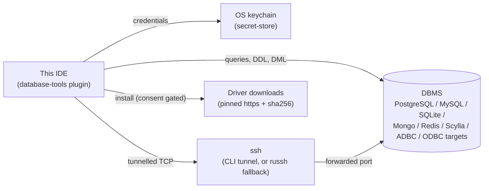
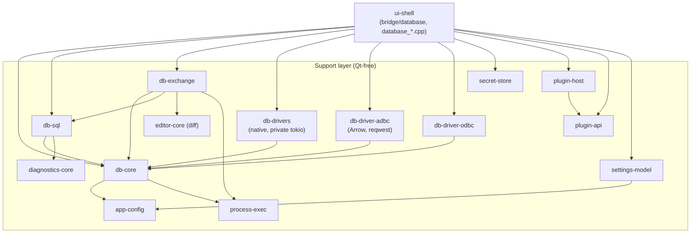
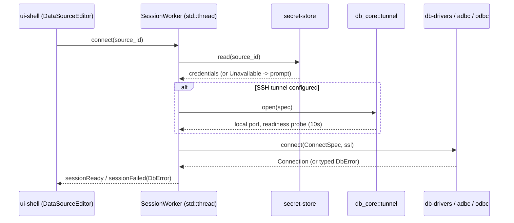
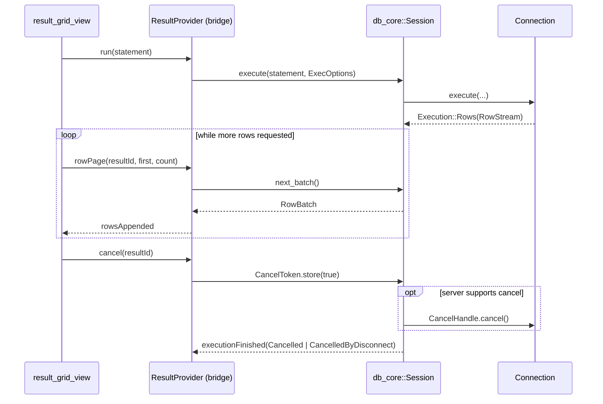
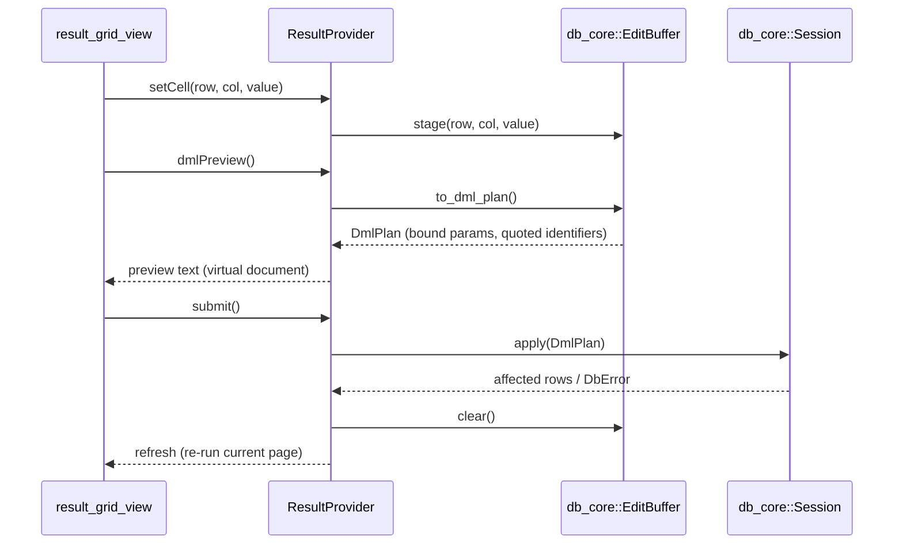
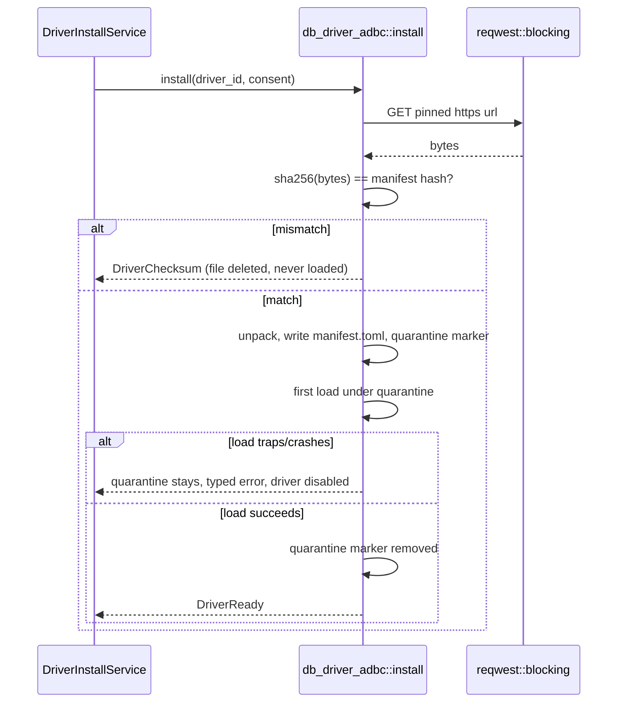

# Database Tools architecture

Target design; kept truthful to the code as each phase lands (CLAUDE.md "fix drift when you see it").
A section describing not-yet-built code carries a one-line note to that effect; F9 does the final truth-up against the shipped code.
See [`database-tools-plan.md`](database-tools-plan.md) for the phased delivery, the parity matrix, the NFR table and the risk register this document does not repeat, and ADR-0058..0061 for the *why* behind the decisions this document states as *what*.

## 1. Context and scope

*Target design; updated by phase F1-F8.*

Database Tools is a built-in plugin, `database-tools`, giving this IDE JetBrains-parity database tooling: data sources, a Database tool window, query consoles, a result grid and data editor, import/export, ER diagrams, schema/data compare, object dialogs, and schema-aware SQL assistance — across relational engines (native drivers, ADBC, ODBC) and NoSQL stores (MongoDB, Redis, Cassandra/Scylla).
Out of scope: a PL/SQL debugger (an Ultimate-only JetBrains feature with no equivalent planned here), a geo viewer and charts in the result grid, grid-level data-compare (text diff only), Kerberos/IAM/proxy authentication, and CQL parsing (Scylla gets keyword+schema completion only, no query parser).

The plugin boundary (C4 level 1):



## 2. Building blocks

*Target design; updated by phase F1-F8. F1 landed `secret-store`, `db-core`, `db-drivers` (sqlite+postgres), the `plugin-api`/`plugin-host` contribution points, and the `ui-shell::bridge::database` slice this phase needs (`AppSettings` source-list accessors, `DataSourceEditor`, `data_source_dialog.cpp`, `database_settings_page.cpp`) — no dock/console/result-grid yet (F3/F4), so `DatabaseService`, `SessionWorker`, `ConsoleService`, `ResultProvider`, `DriverInstallService`, `ExchangeService` and every other `cpp/` view below remain target design.*

Seven new Qt-free crates, additions to `plugin-api`/`plugin-host`, and a `ui-shell::bridge::database` module tree plus `database_*.cpp` views.
The component diagram mirrors `layering.md`'s rows exactly — the same dependency edges, drawn once here for orientation:



`app-core` gains no dependency: a console's source-of-tab join is a pure path rule in `db_core::console`, and an ER diagram rides `app_core::preview::PreviewService::render` with a synthetic `.mmd` path rather than a new join crate needing to know about databases.

Module trees (see `database-tools-plan.md` §4 for the authoritative, kept-in-sync copy):

```
crates/db-core/src/      value.rs  schema.rs  driver.rs  dialect.rs  dml.rs  result.rs
                         datasource.rs  tunnel.rs  console.rs  history.rs  session.rs  readonly.rs  error.rs
crates/db-sql/src/       split.rs  classify.rs  parse.rs  completion.rs  inspections.rs  format.rs  ddl.rs  navigation.rs  mongo.rs
crates/db-exchange/src/  export/*.rs  import/*.rs  dump.rs  copy_table.rs  schema_compare.rs  data_compare.rs  er_diagram.rs
crates/db-drivers/src/   lib.rs  postgres.rs  mysql.rs  sqlite.rs  mongodb.rs  redis.rs  cassandra.rs  introspect/*.sql  testsupport.rs  tunnel.rs
crates/db-driver-adbc/src/  driver.rs  arrow.rs  install.rs  locate.rs
crates/db-driver-odbc/src/  driver.rs  introspect.rs
```

`ui-shell::bridge::database`: `mod.rs` (`DatabaseService`), `sessions.rs` (`SessionWorker`), `console.rs` (`ConsoleService`), `results.rs` (`ResultProvider`), `settings.rs` (`DataSourceEditor`), `drivers.rs` (`DriverInstallService`), `exchange.rs` (`ExchangeService`), `bridge/language/database.rs`.
`cpp/`: `database_panel`, `database_results_panel`, `result_table_model`, `result_grid_view`, `value_editor_dialog`, `database_console_bar`, `data_source_dialog`, `database_settings_page`, `db_object_dialogs`, `db_exchange_dialogs`, `database_wiring`, `database_menu`.

## 3. Driver seam

*Target design; updated by phase F1, F7, F8.*

`db_core::driver` defines the contract every backend implements:

- `Driver { id, capabilities, connect }` — a driver descriptor plus the entry point that produces a `Connection`.
- `Connection { dialect, server_info, introspect, execute, begin/commit/rollback, set_read_only, cancel_handle, ddl_of, apply(DmlPlan), close }` — blocking; every method returns once its work (or its first batch) is ready.
- `Execution { Rows(RowStream) | Affected | Multi | Ok }`, `RowStream::next_batch` — a statement's result shape and how rows are pulled, page by page.
- `CancelHandle` (obtained before `execute`, server-side cancel: PG `cancel_query`, MySQL `KILL QUERY` on a second connection, SQLite `interrupt`, Mongo `killOp`) and `CancelToken` (`Arc<AtomicBool>`, consumer-side, stops pulling regardless of server support).
- `Capabilities` — a bitflag set (transactions, `RETURNING`, server-side cancel, schemas-within-catalog, …) a consumer checks before offering a UI affordance the backend cannot honour, the same "an unsupported capability is absent" rule `dap-core` already applies.
- `ExecOptions { fetch_size: 200, max_rows, timeout, read_only }`.

Three backends implement it (ADR-0058):

| Backend | Crate | Serves |
|---|---|---|
| native | `db-drivers` | PostgreSQL, MySQL/MariaDB, SQLite, MongoDB, Redis, Cassandra/Scylla |
| adbc | `db-driver-adbc` | SQL Server (foundry `mssql`), DuckDB, Oracle, Snowflake, BigQuery, ClickHouse, Databricks, Trino, Presto, HANA, Teradata, Redshift, Spark, SingleStore, Exasol, Druid, Flight SQL |
| odbc | `db-driver-odbc` | anything with a system DSN |

`db_core::value::Value` is the one row/document shape every backend converts into: `Null, Bool, Int, Float, Decimal(String), Text, Bytes, Date, Time, DateTime, DateTimeTz, Uuid, Json, Array, Document(Vec<(String,Value)>), Other{type_name,display}`.
Per-driver type mapping tables (e.g. PostgreSQL `numeric` → `Decimal(String)`, MongoDB `ObjectId` → `Other`, Redis's typed keys → `Value` variants keyed by `RedisType`) live beside each driver's own module and are fixture-tested against real wire samples, not hand-derived.

## 4. Runtime views

*Target design; updated by phase F1, F3, F4, F7, F8.*

**Connect** (secrets → tunnel → TLS → session thread):



**Execute, page, cancel** (two cancellation layers, generation counter):



A `generation` counter on the session guards a race between a cancel and a result that was already in flight: a batch tagged with a stale generation is dropped rather than appended, the same "late answer to a question nobody's asking anymore" guard `search-everywhere`'s own popup already uses for its ranked tiers.

**Data-editor submit** (EditBuffer → DmlPlan → apply → refresh):



**Driver install** (download → sha256 → quarantine → probe):



## 5. Threading and lifetimes

*Target design; updated by phase F1, F3.*

One session thread per open console and per source-tree connection (`SessionWorker`), the same "one blocking call per background operation" shape `ContainerService`/`BuildToolsService` already use; every result crosses back to the Qt thread through `CxxQtThread::queue()`, never a callback invoked from the worker thread directly.
`db-drivers` owns a single private `tokio::Runtime` (`OnceLock`, 2 workers named `"db-io"`) that every async native driver's calls are `block_on`'d against; SQLite and Redis bypass it, since both have synchronous APIs.
A connection is idle-closed after 30 minutes (configurable, `idle_close_minutes`) unless something pins it: an open manual transaction, an open result cursor still being paged, or a running statement.
Startup carries zero connections and loads zero drivers — the NFR table (ADR-0058) requires an E2E assertion that no `db-io` thread exists before the first connect.

## 6. Schema model

*Target design; updated by phase F1, F2, F7.*

`db_core::schema::ObjectKind`:

| Kind | Applies to | Typical actions |
|---|---|---|
| `Catalog`, `Schema` | every relational backend | refresh, filter |
| `Table`, `View`, `MaterializedView` | relational | Go to DDL, edit data, rename/drop/truncate, SQL generator |
| `Column` | relational | Go to DDL, rename, comment |
| `Index`, `Constraint`, `Trigger` | relational | Go to DDL, drop |
| `Routine`, `Sequence`, `Type` | relational | Go to DDL |
| `Role`, `User` | relational, server-scoped | Go to DDL (where the engine supports it) |
| `Collection`, `Field` | MongoDB | Go to DDL (schema inferred from a sample), edit data (document grid) |
| `Keyspace` | Cassandra/Scylla | refresh |
| `KeyNamespace`, `Key(RedisType)` | Redis | edit value (typed by `RedisType`) |
| `Group` | user-defined grouping (not backend-reported) | rename, recolor |

`IntrospectLevel { Names, Columns, Full }` controls how much of a subtree is fetched eagerly versus lazily on expand (`Node::children: NotLoaded | Loaded`) — the 5 000-table NFR target depends on `Names` staying a cheap, near-instant query even on a large catalog.

## 7. Plugin contract

*Target design; updated by phase G1, F1.*

Four contribution points, all additive (`api_version` stays 1):

- `database-drivers` — `DatabaseDriverContribution { id, name, family, backend, native-id?, default-port?, url-template?, dump-tool?, icon?, adbc: {...}? }`.
- `sql-dialects` — `SqlDialectContribution { id, name, parser, identifier-quote, param-style, keywords }`.
- `tool-windows` — `ToolWindowContribution { id, title, area }` (shared with `jvm-build-tools`/`containers`, see ADR-0059).
- `settings-pages` — `SettingsPageContribution { id, title, scope }` (shared with `jvm-build-tools`/`containers`, see ADR-0059).

Validation (no filesystem, `plugin-api`): id charset + per-point uniqueness, `backend`/quote/param-style/`area`/`scope` enums, port range, url-template placeholder allow-list, sha256 hex format, `https://`-only, `native` requires `native-id`, `adbc` requires `manifest-name` or an artifact.
Cross-plugin checks (a driver's `family` names a real dialect) run in `plugin-host` at registry build, fail-soft to a `PluginLoadError` row.

Consumer join points: `ui-shell` maps a `DatabaseDriverContribution`/`SqlDialectContribution` to `db_core` plain strings at the seam (never crossing `plugin-api` into the driver crates); `cpp/tool_window_factories.{h,cpp}` and `settings_dialog.cpp`'s page-factory table read `tool-windows`/`settings-pages` rows through one loop each (ADR-0059).
A disabled plugin's rows are simply absent from the registry, so its dock, menu entry and settings page disappear with it.
A wasm plugin may declare a `tool-windows` row; nothing renders it yet (no `render-tool-window` WIT export) — skipped with a Plugins-page explanation, deferred to a future `api_version` 2.

## 8. Persistence

*Target design; updated by phase F1.*

```toml
[database]
page_size = 500   memory_cap_mib = 256   idle_close_minutes = 30   history_cap = 1000   allow_third_party_drivers = false
[[database.sources]]
id = "3f0c…"  name = "prod-replica"  driver = "postgresql"  group = "work/analytics"  color = "#3a7bd5"
host = "db.internal"  port = 5432  database = "shop"  user = "florian"  auth = "password"  read_only = true  history = false  url = ""
[database.sources.ssl]  mode = "verify-full"  ca_file = "…"
[database.sources.ssh]  host = "bastion"  port = 22  user = "florian"  auth = "agent"  key_file = ""
[database.sources.options]  application_name = "ide"
# project .ide/settings.toml additionally:
[database]  file_sources = { "sql/reports.sql" = "3f0c…" }
```

`ScopedField::Database`; sources merge by id, project shadows global (ADR-0045's union rule).
Secrets: keychain service `ide.database`, keys `<id>`, `<id>/ssh`, `<id>/ssl-key` (never in TOML, structurally).
Consoles: `<config_dir>/consoles/<source-id>/console*.sql`.
History: `<config_dir>/database/history/<id>.jsonl`, capped at `history_cap` entries.
Drivers: `<config_dir>/database/drivers/<id>/<version>/{manifest.toml,<lib>,.sha256}` (ADBC manifest format).
Dock state: ADS `saveState`, unchanged from every other dock.

## 9. Security posture

*Target design; updated by phase F1, F4, F7, F8. Full detail in [ADR-0061](decisions/0061-database-security-posture.md).*

Secrets only in the OS keychain, never in `settings.toml` or history.
TLS defaults `Prefer`, tightens to `VerifyFull` once a CA is configured, no verification-skip flag exists.
Read-only enforced twice (client classifier + server session flag); the data editor is hidden, not merely disabled, on a read-only source.
ADBC/ODBC drivers are quarantined on first load, downloaded only from a pinned `https://` URL with a manifest-shipped sha256, gated by a consent dialog and `allow_third_party_drivers = false` by default.
SSH tunnels prefer the CLI (the user's own config/agent/ProxyJump for free) and fall back to in-process `russh` only where the CLI cannot do the job.
Dump tools receive credentials via environment or a mode-restricted file, never argv.
Imports are parameterised and batched; XLSX reads cached values only.

## 10. Verification

Per-PR: `make test`, `make lint` (+ the `aws-lc-rs` empty-tree gate once F1 lands it), the layering greps, the file-size gate, patch coverage ≥ 80% on Qt-free crates, one `e2e_database` flow on SQLite (budget 13 of 16 per-PR flows).
Nightly/on-demand: `docs/architecture/db-integration.md` — the `linux-db` image, `docker/db-compose.yml`'s real servers, `make test-db`/`make e2e-db`, mirroring `docs/architecture/jvm-integration.md`'s shape exactly.
Windows: a cross-link spike per phase that adds a new crate (the P0 spike is the first of these, see below), plus a manual matrix in F9.

**P0 cross-link spike result** (full detail in `database-tools-plan.md` §13): every crate in the driver catalogue compiles and links on both `x86_64-unknown-linux-gnu` and `x86_64-pc-windows-gnu`, with three findings that correct the plan's original assumptions rather than confirm them —
(1) `mongodb` 3.9.1 does not currently compile under this repo's pinned rustc 1.98.1 at all (`E0659`, a `macro_magic`/`bson::doc` glob-import ambiguity, 1226 downstream errors) — new risk R11, blocks F7 until resolved upstream or worked around;
(2) `aws-lc-rs` enters the dependency tree transitively through `russh`/`redis`/`scylla`/`tokio-postgres-rustls`'s own default features despite a workspace-level `rustls` override — R2 corrected from "pin and forget" to "an active per-driver-crate feature audit," a task in F1/F7/F8;
(3) `odbc-api` needs `unixodbc-dev` installed in `linux-builder` to link at all on Linux (R3, confirmed, the Dockerfile change lands in F8.6), and the `ide-windows-builder` image is stale relative to its own Dockerfile's pinned Rust version (a pre-flight task before the next Windows-affecting phase, not fixed by this spike).

## 11. Known gaps and debt

*From `database-tools-plan.md` §7, restated here for one-document orientation; triggers are authoritative there.*

No CQL parser (keyword+schema completion only for Scylla; revisit if a maintained crate appears).
Data compare is a text diff, not a cell-level grid (revisit on a navigation request or datasets over 100k rows).
The migration script covers tables/columns/indexes/constraints; routines/views are text-diffed rather than semantically compared.
No prepared-statement cache (revisit if benching shows > 20% of execute time there).
The `containers` built-in plugin manifest (ADR-0059) is manifest-only — no code moved.
A wasm plugin cannot yet render a tool window it declares (deferred to `api_version` 2).
`mongodb` 3.9.1's build failure under this repo's pinned rustc (R11, found by the P0 spike) blocks F7 until resolved.
`aws-lc-rs` exclusion is not automatic and needs a per-driver-crate audit (R2, corrected by the P0 spike) before the `cargo tree -i aws-lc-rs` gate can be added to `make lint`.
