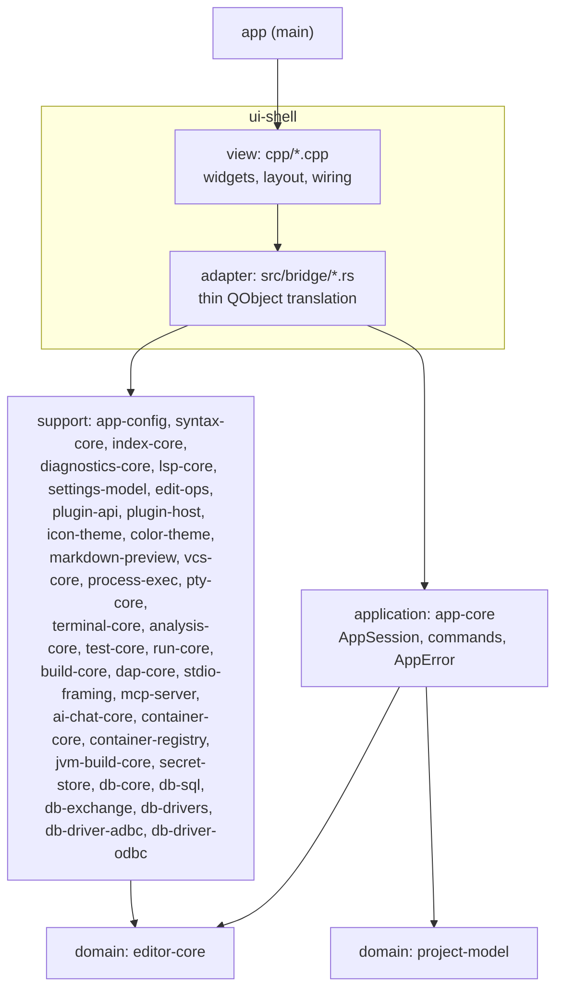

# Architecture overview

Arc42-lite overview of the current system.
The binding rules live in [layering.md](layering.md) and the ADRs; this page orients a new contributor.

## 1. Context

The project is a cross-platform IDE with a JetBrains-like layout.
It is a Rust Cargo workspace with a Qt6 Widgets UI, bridged via `cxx-qt` per [ADR-0001](decisions/0001-core-tech-stack.md).

It has grown past the original MVP (open a folder, browse a tree, edit and save tabs — see the [MVP proposal](../product/mvp-proposal.md)).
Shipped since: a settings window and keymap, ADS-based docking, colour themes as a plugin contribution point — three built-in themes plus nine vendored GitHub/Primer themes, and a third-party VS Code theme JSON installable the same way as any other plugin ([ADR-0050](decisions/0050-color-themes-as-a-contribution-point.md)) — tree-sitter syntax highlighting and folding, a Structure outline, an embedded terminal, a project-wide text and symbol index, find and replace, code navigation (Go to Declaration, Find Usages, Go to Implementation, jump history), a language platform with 30 bundled tree-sitter grammar crates covering roughly 36 languages (see `crates/syntax-core/Cargo.toml`) and an LSP client, refactoring (rename, Extract Method/Class through code actions), editor ergonomics — multi-caret and column selection, comment toggle, line operations (duplicate/move/delete/join), expand/shrink selection, auto-close/type-over/smart backspace, bracket match, reformat through the LSP client, and editing settings a project can override ([ADR-0023](decisions/0023-multi-caret.md)), with the settings dialog gaining a global/project scope selector, per-area origin badges, a `File > Project Settings...` entry, and project-scoped index excludes and language servers, all resolved by `settings_model::scope` ([ADR-0022](decisions/0022-per-project-settings.md)), and the rest of the LSP surface — Alt+Enter's grouped intentions (quick fixes and refactorings merged from the diagnostic- and range-scoped `codeAction` requests), organize imports, signature help, occurrence highlighting, inlay hints, and file-creating/renaming/deleting quick fixes applied through the same refactor preview a rename uses ([ADR-0029](decisions/0029-resource-operations.md)), and a Git-free `DiffView` component now backing that refactor preview's per-file diff and a real before/after preview for project-wide Replace in Files ([ADR-0030](decisions/0030-diff-view.md)), and Git v1 ([ADR-0031](decisions/0031-git-backend.md)) — gutter change markers against `HEAD` with a click-through popup to revert a hunk (spliced into the open buffer, one Ctrl+Z), show its diff, or stage the whole file, a Changes dock (staged/unstaged/untracked trees, per-file stage/unstage, commit/commit-and-push/amend), a status-bar branch widget and menu (checkout, create, delete with an unmerged-branch confirmation), a File History dock, an off-by-default blame gutter, and a VCS menu with fetch/pull/push, show-diff, hunk rollback and next/previous-change navigation, hidden for a project that is not a Git repository, and F4, run configurations and console ([ADR-0032](decisions/0032-run-configurations.md)) — a PTY-backed Run menu/toolbar/console dock with per-configuration tabs of ANSI-stripped output, Cargo/npm/pnpm/yarn/Makefile detection, a Run Configurations dialog persisted per project, Ctrl+Click file:line jumping from console output, and, riding the same PTY transport, a terminal dock that now holds N independent sessions as tabs instead of one, each opening in the project root and picking its shell — WSL distros, PowerShell and cmd on Windows, `$SHELL` and `/etc/shells` elsewhere — from an instantly-opening "+" dropdown (the catalogue is cached and refreshed off the Qt thread) or a project-scoped Settings > Terminal page, rendering JetBrains Mono by default (Settings > Terminal can override family/size) through coalesced, run-based repaints, a theme-following 256-colour ANSI palette, full xterm key translation (arrows, Home/End, F-keys, app-cursor mode), and scrollback via the mouse wheel, a scrollbar, and Shift+PgUp/PgDn ([ADR-0007](decisions/0007-embedded-terminal.md)). A Markdown and Mermaid preview dock ([ADR-0033](decisions/0033-markdown-preview.md)), the plugin host's third contribution point and its first content-returning sandboxed export — comrak/merman/resvg rendering off the Qt thread, scroll sync and click-to-jump, link resolution that never opens an external scheme, extended since by a standalone Mermaid file type — previewed and tree-sitter highlighted — and an in-tab edit/view toggle built as an overlay on the editor ([ADR-0043](decisions/0043-preview-mode-and-mermaid-documents.md)).
In progress: an in-IDE AI assistant — a docked chat panel with attachable context, four configurable providers, an Ask mode whose code blocks apply through the refactoring preview, and a policy-gated Agent mode that drives the editor and the index through the same tools the MCP server exposes ([ADR-0021](decisions/0021-ai-chat.md)).
Also shipped: Database Tools, a built-in plugin giving JetBrains-parity database tooling — data sources over native drivers (PostgreSQL, SQLite, MongoDB, Redis, Cassandra/Scylla), ADBC and ODBC (DuckDB, Snowflake, BigQuery, SQL Server, ClickHouse, Trino, and any system DSN), a Database tool window with schema-aware introspection, query consoles stored as ordinary files, a windowed result grid and data editor, import/export, dump/restore, an ER-diagram/schema-compare/data-compare trio riding the existing preview and diff views, and object-creation dialogs — all over one blocking driver seam and generic `tool-windows`/`settings-pages` contribution points shared with `jvm-build-tools`/`containers` (see [`database-tools.md`](database-tools.md), ADR-0058..0061).

## 2. Quality goals

1. **Testability without a display.**
   All business logic lives in Qt-free crates and runs under plain `cargo test`, with no Qt runtime or display server.
2. **View swappability.**
   The view is Qt Widgets today; QML is the planned future view (re-evaluated and deferred for the blend chrome in ADR-0038).
   Because the view holds zero rules ([ADR-0002](decisions/0002-application-layer-and-humble-view.md)), swapping it must not touch `app-core` or the domain crates.
3. **Performance** (from ADR-0001): typing latency and large-file handling drive the Rust-core decision.

## 3. Building-block view

Four layers plus the binary crate, per [layering.md](layering.md).
Only `ui-shell` and `app` touch Qt; every other crate is Qt-free and unit-tested with no display.

| Crate | Layer | Responsibility | Qt |
|-------|-------|----------------|----|
| `editor-core` | domain | Rope-backed `Document`, tab list, load/save/dirty state, find/replace matching | No |
| `project-model` | domain | `ProjectSession`, directory tree, `notify` watcher, last-project persistence | No |
| `app-core` | application | `AppSession`: orchestration, command methods, typed `AppError`, jump history; the icon-theme join ([ADR-0027](decisions/0027-icon-themes.md)), the colour-theme join ([ADR-0050](decisions/0050-color-themes-as-a-contribution-point.md)), and the previews join ([ADR-0033](decisions/0033-markdown-preview.md)), each handing a row's language id, contribution or extension to the crate that renders it | No |
| `app-config` | support | `settings.toml` load/save, theme, editor font/colors, keymap | No |
| `syntax-core` | support | tree-sitter parsing: highlighting, folding, outline, occurrences, supertype edges | No |
| `index-core` | support | Project index: text search (tantivy + ripgrep crates) and symbols/references, plus declaration resolution ([ADR-0011](decisions/0011-code-navigation.md)) | No |
| `diagnostics-core` | support | The one Problems model: `Diagnostic`, `Severity`, and a `DiagnosticStore` keyed by `(source, uri)` so a build's and a language server's rows for the same file coexist ([ADR-0046](decisions/0046-one-diagnostics-model.md)) | No |
| `lsp-core` | support | LSP client: framing, supervised server processes, diagnostics, hover, navigation, completion, server catalog ([ADR-0016](decisions/0016-lsp-client.md)); code actions, rename, workspace edits and resource operations ([ADR-0019](decisions/0019-lsp-refactoring.md), [ADR-0029](decisions/0029-resource-operations.md)); intentions, organize imports, signature help, document highlights, inlay hints | No |
| `settings-model` | support | The settings pages' rules: syntax-colour draft and override origin, language load errors as sentences, language-server draft ([ADR-0017](decisions/0017-settings-model-crate.md)), and the Plugins page's rows including what a load error or a sandbox trap means in English | No |
| `edit-ops` | support | Language-aware editing operations that need the text *and* the grammar at once: comment toggle, expand/shrink selection over the tree-sitter node tree, indentation, auto-close/type-over/smart backspace, bracket match ([ADR-0023](decisions/0023-multi-caret.md)) | No |
| `plugin-api` | support | The plugin contract: `plugin.toml`, contribution points, typed load errors, the WebAssembly component world ([ADR-0026](decisions/0026-plugin-host.md)) | No |
| `plugin-host` | support | Which plugins exist and which may run: the `<config_dir>/plugins` scan, the built-ins embedded in the binary, the disabled list, quarantine and duplicate-id resolution ([ADR-0026](decisions/0026-plugin-host.md)); the sandboxed wasmtime tier with fuel, epoch and memory limits ([ADR-0028](decisions/0028-wasm-plugin-tier.md)) | No |
| `icon-theme` | support | Icon packs: the resolution order from a file name to an icon id, light/dark art, and `resvg` rasterisation to premultiplied RGBA8 ([ADR-0027](decisions/0027-icon-themes.md)) | No |
| `color-theme` | support | Colour theme parsing: `Rgba`/`ColorTheme` and friends, native TOML plus VS Code theme JSON import, no resolution logic of its own ([ADR-0050](decisions/0050-color-themes-as-a-contribution-point.md)) | No |
| `markdown-preview` | support | Markdown → the HTML subset `QTextDocument` understands (comrak, `render.r#unsafe = false`), Mermaid fences → SVG → premultiplied RGBA8 (merman, resvg, a bundled font), a diagram cache, link classification ([ADR-0033](decisions/0033-markdown-preview.md)) | No |
| `vcs-core` | support | Git v1: `gix` for pure reads (discovery, HEAD, status, branches, log), the `git` binary for anything touching credentials/hooks/config (staging, commit, branch create/checkout/delete, fetch/pull/push), gutter hunks and blame ([ADR-0031](decisions/0031-git-backend.md)) | No |
| `process-exec` | support | Piped subprocess execution: spawn, concurrent stdout/stderr drain threads, optional stdin, a wall-clock timeout with kill-on-timeout, and `host::ExecHost` (local/WSL) argv translation for a remote project root ([ADR-0052](decisions/0052-remote-wsl-execution.md)); extracted from `vcs-core` so `analysis-core`/`test-core`/`build-core`/`dap-core`/`container-core` share one mechanism rather than five | No |
| `pty-core` | support | Cross-platform PTY transport, plus the catalogue of shells a machine offers | No |
| `terminal-core` | support | VT100/grid state over `alacritty_terminal` | No |
| `analysis-core` | support | Static-analysis integration (the PHP tooling plan's B phase): an `AnalyzerContribution`-driven analyzer run over `process-exec`'s piped mechanism, checkstyle-XML parsing into the shared `Diagnostic` model, one `std::thread` per run ([ADR-0046](decisions/0046-one-diagnostics-model.md)) | No |
| `test-core` | support | The Tests tool window's Qt-free half (the PHP tooling plan's D phase): a live per-node `TestTree` filled incrementally by two output-format parsers, and a failing test becoming a `Diagnostic` ([ADR-0048](decisions/0048-test-runner.md)) | No |
| `run-core` | support | Run configurations: the `LaunchSpec` seam, project-scoped detection (Cargo/npm/pnpm/yarn/Makefile), the PTY-backed supervisor, output batching, and the `file:line` link catalogue console output resolves through ([ADR-0032](decisions/0032-run-configurations.md)); run targets (C8, [ADR-0056](decisions/0056-container-run-configurations.md)): `container_target` resolves a plain-process configuration's `run_on` against `[containers.target]` and wraps its `LaunchSpec` through `container_core::target::wrap_launch` to run inside a container image/Dockerfile build/compose service, `LaunchSpec::path_map` carries the resulting local-root <-> mount-root map so console links and build diagnostics resolve an in-container path back to the project file | No |
| `build-core` | support | Building a project (B1): invoking the project's own build tool (cargo/cmake/mvn/gradle, through `run_core::toolchain`'s one table) and turning what it prints into diagnostics — build is delegated, never modelled, so this owns no notion of a compiler or artifact of its own ([ADR-0040](decisions/0040-build-core.md)) | No |
| `dap-core` | support | Debug Adapter Protocol client (D1): a supervised child process framed through `stdio-framing`, blocking request/response on plain threads, and a catalog of adapters (codelldb, debugpy, java-debug) layered under the project's own overrides — shaped like `lsp-core` deliberately ([ADR-0041](decisions/0041-dap-core.md)) | No |
| `stdio-framing` | support | `Content-Length: N\r\n\r\n` + `N` bytes of UTF-8 JSON — the one framing both the LSP and DAP base protocols use, shared rather than written twice by `lsp-core` and `dap-core` ([ADR-0041](decisions/0041-dap-core.md)) | No |
| `mcp-server` | support | MCP server (protocol + transport) so an agent can read and drive the editor and query the project index ([ADR-0004](decisions/0004-mcp-transport.md), [ADR-0012](decisions/0012-mcp-protocol-index-and-lifecycle.md)) | No |
| `ai-chat-core` | support | AI assistant rules: provider dialects and capabilities, the conversation block model, token accounting, context assembly and its budget, the tool catalog and approval policy, the agent loop, conversation history, and turning a code block into an edit ([ADR-0021](decisions/0021-ai-chat.md)) | No |
| `container-core` | support | CLI-driven Docker/Podman integration: connection kinds → `Invocation` (argv/env), discovery of contexts/connections/machines/socket presets, engine probing, lenient `inspect` models, the per-engine snapshot with compose grouping and filter/search, the per-connection `events` watcher (300 ms debounce, backoff reconnect), the dock's flattened tree rows and per-status node-actions matrix, and (C3) container lifecycle operations (`ops`: start/stop/restart/remove/pause/unpause/prune, `top` parsing), the Files tab (`files`: `ls -la` GNU/busybox parsing, a tar-stream single-file reader) and Log/Terminal/Exec/Attach session commands plus `inspect` pretty-printing (`session`, over `pty-core`) ([ADR-0055](decisions/0055-cli-driven-container-integration.md)), run configurations (C5, `run_config`, [ADR-0056](decisions/0056-container-run-configurations.md)) and editor assistance (C6: `compose_file` services/lines over tree-sitter-yaml, `image_ref` parsing and the `FROM`/`image:` completion trigger, `completion` ranking, `lenses` per-service status and published ports), registries (C7: `registry_ref` reference formatting/login-push-pull argv, `tree`'s `Registry`/`RegistryRepo`/`RegistryTag` nodes, `session`'s one-PTY-session login+pull/tag+push scripts, `completion`'s `registry_match`/`registry_repo_completions`), and run targets (C8, `target`: `PathMap`, `wrap_launch` — image/containerfile/compose-service sources, `before_launch_for`'s build task), and (C9) Dashboard editing (`recreate`: `RunSpec::from_inspect`/`recreate_argv`/`recreate`, compose-managed refusal), the shared SELinux `:z` rule (`selinux::relabel_suffix`, now applied by `run_config`, `target::wrap_launch` and `recreate` alike), Podman pods/machines (`pods`, `machine`) and `podman`-then-`podman-remote` `PATH` resolution, and the Layers tab's "Analyze image" (`layer_fs`: a headers-only, seek-past-data tar reader over `save -o` output, `manifest.json` layer mapping, added/modified/deleted classification) | No |
| `container-registry` | support | The container integration's HTTP clients: Docker Hub search/tags behind image-name completion (C6); C7's `registry` module (the V2 bearer-token dance, paginated catalog/tags, Hub and GitLab-project browsing, `test_connection`) and `secrets::SecretStore` (the OS-keychain credential store, `keyring`'s `linux-native` backend — no D-Bus, unlike the backend ADR-0021 already rejected for `ai-chat-core`). Its own crate so `reqwest`'s private tokio runtime stays out of `container-core`'s tree beneath `run-core` ([ADR-0055](decisions/0055-cli-driven-container-integration.md)) | No |
| `jvm-build-core` | support | Gradle and Maven support: a project model synced from a Gradle init-script run or a static/effective-pom Maven read (`model`, `gradle`, `maven`), a trust-gated sync policy with three auto-reload modes (`sync`), a task/goal run configuration (`run`), and build-file editing assistance for `pom.xml`/`build.gradle(.kts)`/`libs.versions.toml` — coordinate completion, "newer version" hints and their quick fix, and a dependency analyzer (`editing`, phase D). Read-only: no IDE-owned notion of an output path or a "correct" dependency version the tool did not itself report ([ADR-0057](decisions/0057-jvm-build-tools.md)) | No |
| `secret-store` | support, leaf | OS-keychain credential storage (`keyring`, `linux-native`/`windows-native`/`apple-native`), service name given by the caller; extracted from `container-registry`'s own secret store so a second/third keychain consumer (`db-core`'s Data Source secrets) shares one tested crate ([ADR-0058](decisions/0058-database-driver-seam.md)) | No |
| `db-core` | support | Database Tools' backend-agnostic seam: the `Driver`/`Connection`/`RowStream`/`Capabilities` trait contract, the `Value` row/document model, `Dialect`, `EditBuffer`/`DmlPlan`, `SchemaSnapshot`/tree flattening, SSH tunnel selection, consoles-as-files, history, session/transaction state, the read-only guard, typed `DbError` ([ADR-0058](decisions/0058-database-driver-seam.md)) | No |
| `db-sql` | support | SQL/Mongo-shell/RESP assistance over `db-core`'s schema model: statement split/classify, `sqlparser`-backed parse/format/inspections, completion, navigation, Mongo sugar parsing, RESP command tokenizing — no language server, injected directly into `LanguageService` | No |
| `db-exchange` | support | Import/export (csv/tsv/json/sql/html/markdown/xlsx), `dump`/`restore` argv builders for each engine's own CLI tool, copy-table, the ER-diagram/schema-compare/data-compare trio's own fully-fetched `schema_model` | No |
| `db-drivers` | support, leaf | Native blocking drivers over a private tokio runtime: PostgreSQL, SQLite, MongoDB, Redis, Cassandra/Scylla, plus the SSH tunnel fallback (`RusshTunnel`) | private runtime |
| `db-driver-adbc` | support, leaf | The Arrow Database Connectivity backend: driver locate/install/quarantine, sha256-verified pinned downloads, Arrow-to-`Value` conversion — the only Arrow code in the workspace | `reqwest`'s, tolerated |
| `db-driver-odbc` | support, leaf | The ODBC backend: any system DSN or driver entry (SQL Server, ClickHouse, Trino, …), catalog introspection over `SQLTables`/`SQLColumns`/`SQLPrimaryKeys`/`SQLForeignKeys` | No |
| `ui-shell` | adapter + view | `src/bridge/*.rs`: cxx-qt QObject translation, one module per feature (ADR-0025); `cpp/`: Widgets, layout, menus, dialogs, `QApplication` | Yes |
| `app` | main | Thin binary; hands off to `ui-shell` | Yes |

The view never decides, it only displays and forwards intent.
Rules crossing the FFI seam (typed errors, `TabId`, Rust-owned dirty state) are fixed by [ADR-0003](decisions/0003-ffi-conventions.md).

`crates/e2e` sits outside the table above: it depends on no workspace crate, drives the *built* `app` binary over X11 and the filesystem the way a user does, and asserts only against state the app published (the marker stream, MCP, or disk) — never against a screenshot or the internals under test ([ADR-0024](decisions/0024-verification-foundation.md)). Its own tests live in `crates/app/tests/` (`CARGO_BIN_EXE_app` is only defined for the crate that declares the binary).

## 4. Cross-boundary communication

- UI actions call invokable slots on the `cxx-qt` QObjects; the adapter translates and delegates to `AppSession`.
- Rust-side changes (dirty flags, watcher events) surface as Qt signals; tree data is exposed via a `QAbstractItemModel` backed by Rust data.
- Filesystem watcher events arrive on a background thread and are marshalled onto the Qt event loop via `CxxQtThread` queuing — no shared-mutex model.
- Long-running work (index build, search, symbol resolution, PTY reads) runs on a plain `std::thread` and streams results back through the same `CxxQtThread::queue()` hop, so the UI thread never blocks on it.
- The filesystem watcher also drives incremental re-indexing, which is what keeps navigation targets from drifting after an edit.

## 5. Build and deployment

`docker/Dockerfile` is a single multi-stage file: a `linux-builder` stage (apt Qt6) and a `windows-builder` stage cross-compiling with MXE's mingw-w64 + Qt6 toolchain.
The MXE toolchain is built by the `mxe-base` stage from a pinned upstream commit (`ARG MXE_COMMIT`), which compiles `qt6-qtbase` for `x86_64-w64-mingw32.shared` from source.
That first build takes hours and is then served from the Docker layer cache; it exists so the Windows toolchain is reproducible from the repo rather than depending on a hand-built local image.
Artifacts land in `dist/`.
A third stage, `linux-jvm` (`FROM linux-builder`, Temurin 21, Gradle, Maven, fixture projects pre-warmed at image build), verifies `jvm-build-core` against real toolchains; like `lsp-conformance`, it runs nightly and on demand (`make test-jvm`), never as part of the per-PR `make test`/`make lint` gate ([ADR-0057](decisions/0057-jvm-build-tools.md) §6).

## 6. Future scope (not implemented)

The following are documented direction per ADR-0001 but have no code and no crates today; add them when the work starts, not before:

- **Debugger adapter (DAP)** — a Qt-free core crate, same placement rationale as the shipped LSP client (`lsp-core`, [ADR-0016](decisions/0016-lsp-client.md)).
- **Plugin host** — *built.* [The plugin host and icon themes plan](plugin-host-and-icon-themes-plan.md) delivered the contract crate `plugin-api`, discovery and the registry in `plugin-host` ([ADR-0026](decisions/0026-plugin-host.md)), and the sandboxed wasmtime tier with fuel, epoch and memory limits ([ADR-0028](decisions/0028-wasm-plugin-tier.md)).
  A plugin declares contributions in `plugin.toml`; the Material icon pack ships as the first built-in and the Plugins settings page turns any of them off.
  ADR-0001's other half — a native dylib loader over a stable C ABI — remains unbuilt and unscheduled, and the sandbox is the reason it is not missed.
- **Document preview** — *built.* [The markdown preview plan](markdown-preview-plan.md) delivered the plugin host's third contribution point, `previews`, with built-in native renderers for Markdown, Mermaid, and Carve, plus a second, additive wasm world (`preview-plugin`) a sandboxed component may implement instead ([ADR-0033](decisions/0033-markdown-preview.md)).
  The Preview dock renders the active tab's Markdown, with inline Mermaid diagrams, off the Qt thread.
- **QML view** — the planned replacement for the Widgets view; the humble-view split exists so this swap stays cheap.

Each of these gets its own ADR under `decisions/` when it becomes real.

## Related

- [Layering rules](layering.md) — binding dependency and logic-placement rules.
- [ADR-0001](decisions/0001-core-tech-stack.md), [ADR-0002](decisions/0002-application-layer-and-humble-view.md), [ADR-0003](decisions/0003-ffi-conventions.md) — the binding stack, layering and FFI decisions.
- The remaining ADRs under `decisions/` cover MCP (transport, then protocol/index/lifecycle), docking, the terminal, the project index, find and replace, code navigation, the LSP client, and refactoring over LSP.
- [MVP implementation plan](mvp-implementation-plan.md) — historical.
